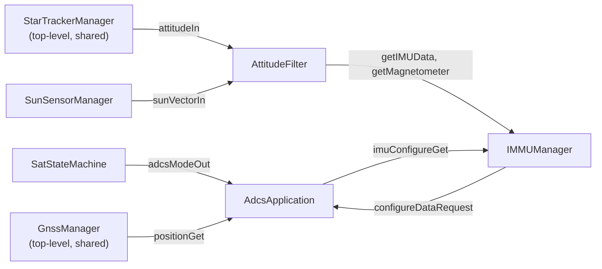
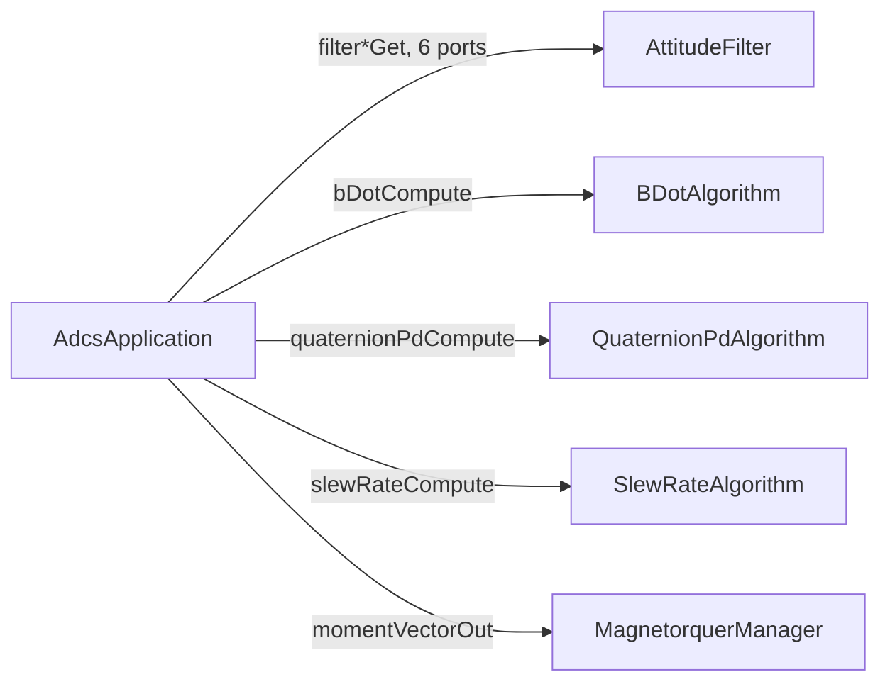
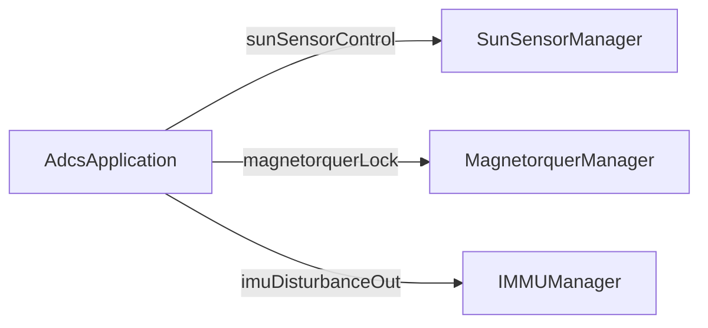

### AdcsApplication

#### 1. Overview {.unnumbered .unlisted}

`AdcsApplication` is the Layer 3 Active component for the ADCS subsystem. It owns the attitude control loop and switches operating mode on command from `SatStateMachine`. It dispatches sensor requests and actuator commands to Layer 2 hardware managers (`IMMUManager`, `SunSensorManager`, `MagnetorquerManager`) and consumes attitude from `StarTrackerManager` and timing from `GnssManager` (both top-level).

---

#### 2. Requirements {.unnumbered .unlisted}

| ID | Requirement | Verification |
|----|-------------|--------------|
| HS2-ADC-001 | AdcsApplication shall detumble the spacecraft | Inspection |
| HS2-ADC-002 | AdcsApplication shall point the spacecraft at a commanded target quaternion | Inspection |
| HS2-ADC-003 | AdcsApplication shall maintain a slew rate under 0.04 degrees per second upon command | Inspection |
| HS2-ADC-004 | AdcsApplication shall respond to health pings within the required deadline | Inspection |
| HS2-ADC-005 | AdcsApplication shall assert WARNING_HI events followed by a FATAL if hardware is unable to recover from errors | Inspection |
| HS2-ADC-006 | AdcsApplication shall answer IMMUManager's `configureDataRequest` with connection port name, accel/gyro and magnetometer data rates, and startup wait time | Inspection |
| HS2-ADC-007 | AdcsApplication shall lock MagnetorquerManager and assert the IMMUManager magnetic disturbance flag together, and unlock/clear them together | Inspection |

---

#### 3. Design {.unnumbered .unlisted}

##### 3.1 Component Type {.unnumbered .unlisted}

Active component with internal hierarchical F' state machine (`Fw::Sm`).

##### 3.2 Mode Interface {.unnumbered .unlisted}

`AdcsApplication` receives its operating mode from `SatStateMachine` via a typed port:

```fpp
sync input port modeIn: Sat.AdcsModePort   # carries Adcs.Mode
```

Mode enum (owned by this component's module):

```fpp
module Adcs {
    enum Mode { Off, Detumble, SunPointing, AntennaPointing, EarthLimbPointing, AttitudeHold }
}
```

If the incoming mode matches the current mode, the handler returns immediately (idempotent).

##### 3.3 Ports {.unnumbered .unlisted}

| Port | Direction | Type | Purpose |
|------|-----------|------|---------|
| `modeIn` | Input | `Sat.AdcsModePort` | Mode command from SatStateMachine |
| `schedIn` | Input | `Svc.Sched` | Rate group tick (10 Hz) |
| `imuConfigureGet` | Input (sync) | `immuConfigurationParameters_p` → `Adcs.ConfigureParameters` | Answers IMMUManager's `configureDataRequest` |
| `sunSensorControl` | Output | `Adcs.ManagerControlPort` | ON/OFF command to SunSensorManager |
| `magnetorquerLock` | Output | `mtToggle_p` with is_locked boolean | Lock/unlock command to MagnetorquerManager |
| `imuDisturbanceOut` | Output | `mtToggle_p` with is_locked boolean | Magnetic disturbance flag to IMMUManager; asserted/cleared together with `magnetorquerLock` |
| `filterAttitudeGet` | Output | `Adcs.AttitudePort` | Query AttitudeFilter for estimated attitude quaternion |
| `filterAngularRateGet` | Output | `Adcs.AngularRatePort` | Query AttitudeFilter for estimated angular rate |
| `filterBFieldGet` | Output | `Adcs.BFieldPort` | Query AttitudeFilter for previous B-field measurement |
| `filterImuTimestampGet` | Output | `Adcs.TimestampPort` | Query AttitudeFilter for IMU data staleness |
| `filterSunTimestampGet` | Output | `Adcs.TimestampPort` | Query AttitudeFilter for sun vector staleness |
| `filterStarTimestampGet` | Output | `Adcs.TimestampPort` | Query AttitudeFilter for star tracker staleness |
| `bDotCompute` | Output | `Adcs.BDotInputPort` | Call BDotAlgorithm; returns a magnetic moment vector |
| `quaternionPdCompute` | Output | `Adcs.QuaternionPdInputPort` | Call QuaternionPdAlgorithm; returns a magnetic moment vector |
| `slewRateCompute` | Output | `Adcs.SlewRateInputPort` | Call SlewRateAlgorithm; returns a slew-limited magnetic moment vector |
| `momentVectorOut` | Output | `Adcs.MomentVectorPort` | Send computed moment vector to MagnetorquerManager |
| `positionGet` | Output | `Fw.Dp` | Request position/timing from GnssManager |
| `pingIn` / `pingOut` | In/Out | `Svc.Ping` | Health monitoring |
| `logOut` | Output | `Fw.Log` | Event logging |
| `tlmOut` | Output | `Fw.Tlm` | Telemetry (attitude estimate, mode, error state) |

##### 3.4 Commands {.unnumbered .unlisted}

| Mnemonic | Args | Description |
|----------|------|-------------|
| `RESET` | — | Force transition back to current mode's initial substate |

---

#### 4. State Machine {.unnumbered .unlisted}

`AdcsApplication` uses a hierarchical F' state machine. Mode is the top-level state; operational substates are nested inside each mode. A single `switchMode: Adcs.Mode` signal defined at the top level is inherited by all leaf states, making mode switches valid from any nested substate.

Entry/exit actions follow the FPP Least Common Ancestor rule. Every mode re-entry starts from its `initial` substate — no history.

```
OFF
  entry: send ManagerControl.OFF via sunSensorControl
         call magnetorquerLock(true) and imuDisturbanceOut(true)
  exit:  send ManagerControl.ON  via sunSensorControl
         call magnetorquerLock(false) and imuDisturbanceOut(false)

DETUMBLE
  └─ RUNNING
       on tick: query filterAngularRateGet, filterBFieldGet, filterImuTimestampGet
                call bDotCompute(currentBField, previousBField, angularRate) → momentVector
                send momentVectorOut

SUN_POINTING
  ├─ ACQUIRING       (on tick: check filterSunTimestampGet; wait for valid sun vector)
  └─ TRACKING
       on tick: query filterAttitudeGet, filterAngularRateGet, filterSunTimestampGet
                call slewRateCompute(attitude, angularRate, targetQuaternion, 0.04°/s) → momentVector
                call quaternionPdCompute(attitude, angularRate, targetQuaternion) → momentVector
                send momentVectorOut

ANTENNA_POINTING
  ├─ ACQUIRING       (on tick: compute ground station quaternion via GNSS ephemeris)
  └─ TRACKING
       on tick: query filterAttitudeGet, filterAngularRateGet
                call slewRateCompute(attitude, angularRate, targetQuaternion, 0.04°/s) → momentVector
                call quaternionPdCompute(attitude, angularRate, targetQuaternion) → momentVector
                send momentVectorOut

EARTH_LIMB_POINTING
  ├─ ACQUIRING       (on tick: acquire lit Earth limb target + solar optimization)
  └─ TRACKING
       on tick: query filterAttitudeGet, filterAngularRateGet, filterStarTimestampGet
                call slewRateCompute(attitude, angularRate, targetQuaternion, 0.04°/s) → momentVector
                call quaternionPdCompute(attitude, angularRate, targetQuaternion) → momentVector
                send momentVectorOut

ATTITUDE_HOLD
  └─ HOLDING
       on tick: query filterAttitudeGet, filterAngularRateGet
                call slewRateCompute(attitude, angularRate, targetQuaternion, 0.04°/s) → momentVector
                call quaternionPdCompute(attitude, angularRate, targetQuaternion) → momentVector
                send momentVectorOut

# Inherited by all leaf states:
on switchMode(Adcs.Mode.Off)               enter OFF
on switchMode(Adcs.Mode.Detumble)          enter DETUMBLE
on switchMode(Adcs.Mode.SunPointing)       enter SUN_POINTING
on switchMode(Adcs.Mode.AntennaPointing)   enter ANTENNA_POINTING
on switchMode(Adcs.Mode.EarthLimbPointing) enter EARTH_LIMB_POINTING
on switchMode(Adcs.Mode.AttitudeHold)      enter ATTITUDE_HOLD
```

`switchMode` is inherited by every leaf state, so any of the 6 modes can reach any other directly, not just from `OFF`. On entry to `OFF`, `AdcsApplication` locks `MagnetorquerManager` and asserts `ImmuManager`'s disturbance flag; `DETUMBLE` alone runs `bDotCompute`, while `SUN_POINTING`, `ANTENNA_POINTING`, `EARTH_LIMB_POINTING`, and `ATTITUDE_HOLD` all run the same `slewRateCompute` + `quaternionPdCompute` → `momentVectorOut` pipeline each tick, differing only in target source.

`SUN_POINTING`, `ANTENNA_POINTING`, and `EARTH_LIMB_POINTING` also each nest the same `ACQUIRING` → `TRACKING` substate pattern, moving to `TRACKING` once that mode's target is acquired: `SUN_POINTING` waits for a valid sun vector; `ANTENNA_POINTING` computes the ground station quaternion from GNSS ephemeris; `EARTH_LIMB_POINTING` acquires the lit Earth limb target. `DETUMBLE` and `ATTITUDE_HOLD` each have a single unconditional substate (`RUNNING`, `HOLDING` respectively) with no internal transition.

Reference: [FPP inherited transitions](https://github.com/nasa/fpp/blob/main/docs/users-guide/Defining-State-Machines.adoc#inherited-transitions), [FPP substates](https://github.com/nasa/fpp/blob/main/docs/users-guide/Defining-State-Machines.adoc#substates)

---

#### 5. Notes {.unnumbered .unlisted}

**Subtopology wiring - sensor inputs:**



**Subtopology wiring - control loop dispatch:**



**Subtopology wiring - hardware power/lock sequencing:**



- `StarTrackerManager` and `GnssManager` are top-level components shared with `DataCollectionApplication`; connections are wired at the top-level topology.
- Hardware managers (`IMMUManager`, `SunSensorManager`, `MagnetorquerManager`) and Layer 2.5 components (`AttitudeFilter`, `BDotAlgorithm`, `QuaternionPdAlgorithm`, `SlewRateAlgorithm`) are all instantiated inside the ADCS subtopology.
- `AdcsApplication` controls `SunSensorManager` via `ManagerControlPort` ON/OFF. `MagnetorquerManager` and `IMMUManager` are controlled via the lock/disturbance pair instead; neither has an ON/OFF port.
- `EarthLimbPointing` uses star tracker for precision attitude knowledge — `StarTrackerManager` must be operational and `filterStarTimestampGet` must return a fresh timestamp.
- Mid-operation mode switch behavior (e.g., mode switch arriving mid-maneuver) to be defined during detailed design.
- `BDotAlgorithm`, `QuaternionPdAlgorithm`, and `SlewRateAlgorithm` each return a magnetic moment vector; `QuaternionPdAlgorithm` computes a PD torque internally and converts it to moment itself using its own B-field input before returning. `momentVectorOut` sends this moment to `MagnetorquerManager`.
- `MagnetorquerManager`'s own design (per Senuka's update) expects a torque vector on `getDesiredTorque` and does its own torque-to-moment conversion via `getCurrentB`. Sending it the moment `momentVectorOut` already produces would run that conversion a second time. This is unresolved and needs to be reconciled before the two are wired together — either `MagnetorquerManager` accepts a moment directly, or the algorithm components stop converting internally and return the raw PD torque instead.
