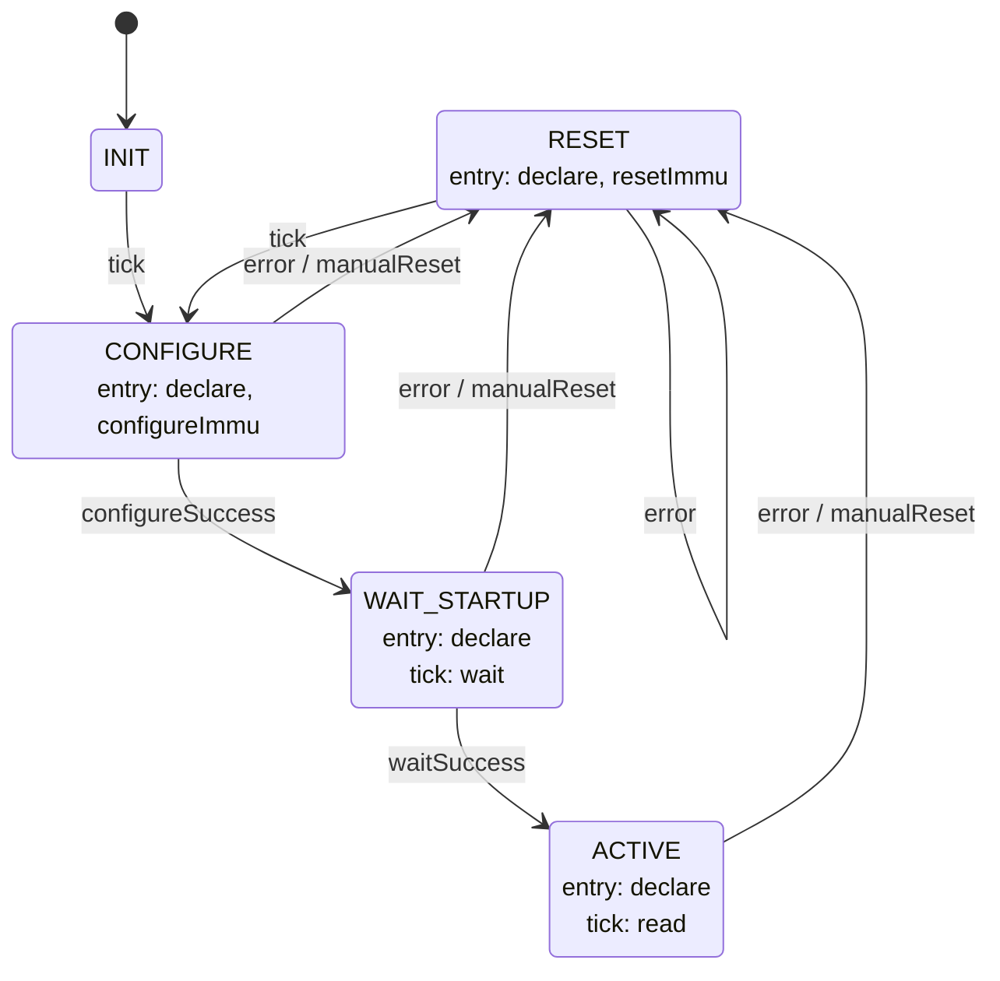
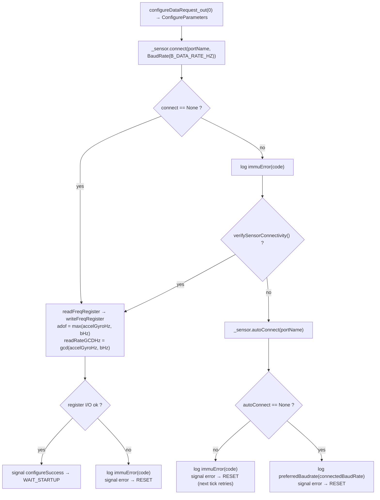
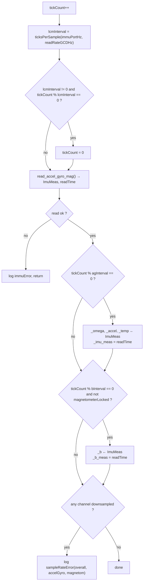

# Adcs::IMMUManager

IMMUManager is a Layer 2 Queued worker component in the ADCS subtopology. It owns the VN-100 IMU/AHRS sensor, bringing it up over a serial link through an internal state machine and serving cached accel/gyro/magnetometer/temperature readings to the rest of ADCS.

## Introduction

The component is driven by two asynchronous input ports:

- `run` (`Svc.Sched`) — rate-group tick; every call sends `tick` to the state machine.
- `Reset` (`Fw.Signal`) — zeroes `tickCount` and sends `manualReset` to the state machine, forcing it back to `RESET` (only `CONFIGURE`, `WAIT_STARTUP`, and `ACTIVE` handle `manualReset`).

Three synchronous input ports let other components pull the most recently cached readings without touching the sensor: `getIMUData` (accel + gyro + temperature), `getTemp` (temperature alone), and `getMagnetometer` (magnetic field). A fourth sync port, `magnetorquerEnabled`, is used by whatever owns the magnetorquers to tell the VN-100's onboard AHRS filter to stop trusting the magnetometer while a magnetic disturbance (i.e. the magnetorquers) is active.

The sensor itself is a VectorNav VN-100, accessed through the vendor `VN::Sensor` C++ SDK over a serial (RS-232/UART) connection. Rather than calling `VN::Sensor` directly, IMMUManager talks to an `IImmuSensor` interface: `VnSensorAdapter` is the production implementation (it owns the real `VN::Sensor` plus its 64 KiB main / 2 KiB FB byte buffers and forwards each call), while unit tests inject a gmock `IImmuSensor` through the test-only constructor. `configureDataRequest` asks the owning application for the connection parameters to use.

## Requirements

| Name | Description | Validation |
|---|---|---|
| IMU-001 | While entering `CONFIGURE`, the component shall request connection parameters via `configureDataRequest` and connect to the VN-100 at the requested port / baud rate. | Unit Test |
| IMU-002 | While in `CONFIGURE`, the component shall set the sensor's `AsyncOutputFreq` register to the faster of the requested accel/gyro and magnetometer data rates. | Unit Test |
| IMU-003 | While in `WAIT_STARTUP`, the component shall wait until `WAIT_SECONDS` seconds have elapsed before advancing to `ACTIVE`. | Unit Test |
| IMU-004 | While in `ACTIVE`, the component shall read the VN-100 IMU register every tick and refresh its cached accel/gyro/temperature at `ACCEL_GYRO_DATA_RATE_HZ` and its cached magnetic field at `B_DATA_RATE_HZ`. | Unit Test |
| IMU-005 | The component shall serve the most recently cached reading, with its measurement timestamp, on `getIMUData`, `getTemp`, and `getMagnetometer`. | Unit Test |
| IMU-006 | The component shall forward `magnetorquerEnabled` requests to the sensor. | Unit Test |
| IMU-007 | If a requested data rate meets or exceeds the rategroup tick rate, the component shall clamp it to one sample per tick and log `sampleRateError`. | Unit Test |
| IMU-008 | On any VN-100 register read/write or connect failure, the component shall log `immuError` with the SDK error code and drive the state machine back to `RESET` via `error`. | Unit Test |

## Design

### Ports

| Port | Kind | Direction | Type | Usage |
|---|---|---|---|---|
| `run` | async | input | `Svc.Sched` | Rate-group tick; sends `tick` to the state machine on every call. |
| `Reset` | async | input | `Fw.Signal` | Zeroes `tickCount` and sends `manualReset` to the state machine. |
| `getIMUData` | sync | input | `imuDataRead_p` → `Adcs.RawIMUData` | Returns cached accel, gyro, and temperature with the accel/gyro measurement timestamp. |
| `getTemp` | sync | input | `tempDataRead_p` → `Adcs.RawTempData` | Returns cached temperature with the `_temp_measure` timestamp (see Open Items). |
| `getMagnetometer` | sync | input | `bDataRead_p` → `Adcs.RawBData` | Returns cached magnetic field with its measurement timestamp. |
| `magnetorquerEnabled` | sync | input | `mtToggle_p` (`is_locked: bool`) | Latches `magnetometerLocked` and forwards `Present` / `NotPresent` to the sensor's `knownMagneticDisturbance`. |
| `configureDataRequest` | — | output | `immuConfigurationParameters_p` → `Adcs.ConfigureParameters` | Asks the owning application for port name, data rates, and startup wait time; called once per `CONFIGURE` entry. |
| `timeCaller`, `Fw.Command`, `Fw.Event`, `Fw.Channel` | standard AC ports | — | — | Boilerplate command/event/telemetry/time wiring. |

### State Machine

`immuStateMachine` (`Adcs_IMMUStateMachine_t`, defined in `IMMUStateMachine.fpp`) owns bring-up and fault recovery. Its telemetered state is the `Adcs.ImmuState` enum, mirrored into the `SMstate` member by the `declare` action.

| State | Meaning | Entry actions | On `tick` |
|---|---|---|---|
| `INIT` | Idle until the first `run` tick. | — | proceed to `CONFIGURE` |
| `RESET` | Disconnects from the sensor, then retries bring-up. | `declare`, `resetImmu` | proceed to `CONFIGURE` (paces reconnect retries at the tick rate) |
| `CONFIGURE` | Requests connection parameters, connects, and configures the sensor's output-frequency register. | `declare`, `configureImmu` | ignored |
| `WAIT_STARTUP` | Holds for `WAIT_SECONDS` seconds to let the VN-100 finish its own boot sequence. | `declare` | `wait` |
| `ACTIVE` | Steady state: reads the IMU register every tick, downsampling the cached values to the configured per-signal rates. | `declare` | `read` |

Handler / action logic:

| Function | Behavior |
|---|---|
| `run_handler` | Sends `tick` to `immuStateMachine` on every rate-group call; nothing else. |
| `Reset_handler` | Zeroes `tickCount` and sends `manualReset` to the state machine. |
| `getIMUData_handler` / `getTemp_handler` / `getMagnetometer_handler` | Return the cached accel+gyro+temp / temp / magnetic-field values with their measurement timestamp; no sensor access. |
| `magnetorquerEnabled_handler` | Latches `magnetometerLocked` and forwards `Present` / `NotPresent` to `_sensor.knownMagneticDisturbance`. |
| `declare` | Derives the new `ImmuState` from the *signal* being handled (`tick` → `CONFIGURE`, `resetSuccess` → `CONFIGURE`, `configureSuccess` → `WAIT_STARTUP`, `waitSuccess` → `ACTIVE`, `error` / `manualReset` → `RESET`), caches it in `SMstate`, writes the `State` telemetry channel, and logs `immuStTrans`. An unrecognized or initial-transition signal logs `SMsignalInvalid`. |
| `resetImmu` | Calls `_sensor.disconnect()`. |
| `configureImmu` | Requests connection parameters and brings up the sensor — see the `configureImmu` flow below. |
| `wait` | Increments `tickCount`; once `tickCount >= WAIT_SECONDS * immuPortHz`, signals `waitSuccess`. |
| `read` | Polls the VN-100 and refreshes the downsampled caches — see the `read` flow below. |
| `read_accel_gyro_mag` | Single register read via `_sensor.readImuMeas`; on SDK error logs `immuError` and returns `false`, otherwise stamps `readTime` from `getTime()`. |

#### CONFIGURE

#### ACTIVE

`ticksPerSample(tickHz, sampleHz)` returns `0` when `sampleHz == 0`, `1` (with the downsampled flag set) when `sampleHz >= tickHz`, and `tickHz / sampleHz` otherwise. The VN-100 register is polled on *every* `ACTIVE` tick; only the cache stores are gated by `agInterval` / `bInterval`. `read_accel_gyro_mag` also stamps `readTime` from `getTime()` and, on an SDK error, logs `immuError` and returns `false`.

### Configuration parameters

These are not F´ parameters — they arrive at runtime from the owning application as an `Adcs.ConfigureParameters` struct returned by `configureDataRequest`, and are cached in the `config` member on each `CONFIGURE` entry.

| Field | Type | Meaning |
|---|---|---|
| `PORT_NAME` | `string` | Serial port to connect the VN-100 on. |
| `ACCEL_GYRO_DATA_RATE_HZ` | `U16` | Target rate for cached accel/gyro/temperature updates. |
| `B_DATA_RATE_HZ` | `U16` | Target rate for cached magnetic-field updates; **also** passed to `VN::Sensor::BaudRate(...)` as the connection baud rate (see Open Items). |
| `WAIT_SECONDS` | `U8` | Post-configure hold time before `ACTIVE`. |

`immuPortHz` (the `run` port's tick rate) is currently hardcoded to `16` in the constructor, pending a shared constants file.

### Telemetry

| Name | Type | Notes |
|---|---|---|
| `rawIMU` | `Adcs.RawIMUData` | Cached linear acceleration, angular velocity, temperature, and the accel/gyro measurement timestamp. |
| `rawTemp` | `Adcs.RawTempData` | Cached temperature and timestamp. |
| `rawB` | `Adcs.RawBData` | Cached magnetic field and timestamp. |
| `State` | `Adcs.ImmuState` | Mirrors the state machine's current state (written by `declare`). |

> `rawIMU` / `rawTemp` / `rawB` are declared as telemetry channels but are currently only populated into the cache members; they are surfaced primarily through the `getIMUData` / `getTemp` / `getMagnetometer` request ports.

### Events

| Name | Severity | Purpose |
|---|---|---|
| `immuStTrans` | activity low | The state machine entered a new state; carries the `ImmuState`. |
| `immuError` | warning high | Carries a `VN100Error` code; raised on connect and register read/write failures. |
| `sampleRateError` | warning high | One or more of the overall / accel-gyro / magnetometer rates could not be honored and was clamped to one sample per tick; carries a bool per channel. |
| `preferredBaudrate` | warning high | The sensor did not respond at the requested baud rate but was found via `autoConnect` at a different one; carries the discovered rate. |
| `SMsignalInvalid` | warning high | An unrecognized or initial-transition signal reached the `declare` action — indicates a state-machine bug, not a sensor fault. |

## Open Items / Known TODOs

- **Baud rate is derived from `B_DATA_RATE_HZ`.** `configureImmu` builds the connection `BaudRate` from the magnetometer data-rate field; there is no dedicated baud-rate field in `ConfigureParameters`. A mismatch here is what forces the `autoConnect` / `preferredBaudrate` fallback path.
- **`_temp_measure` is never assigned.** `read` writes `_imu_meas` and `_b_meas` but temperature is sampled alongside accel/gyro without stamping `_temp_measure`, so `getTemp` returns a stale/zero timestamp.
- **Fault recovery is a tick-paced retry loop with no backoff.** Every `configureImmu` failure path (including a failed `autoConnect`) now signals `error` → `RESET`, and `RESET` advances back to `CONFIGURE` on the next rate-group tick. With the sensor genuinely absent this retries once per tick indefinitely; there is no exponential backoff or give-up-after-N-attempts. (`resetSuccess` is now unused — `RESET` no longer waits on it.)
- **`Reset` during `INIT` / `RESET` is dropped.** `manualReset` is only handled in `CONFIGURE`, `WAIT_STARTUP`, and `ACTIVE`.
- **`immuPortHz` is hardcoded to `16`** (`tag:move` comments) pending a constants file
