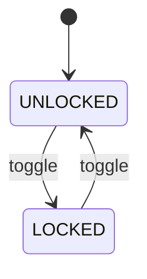
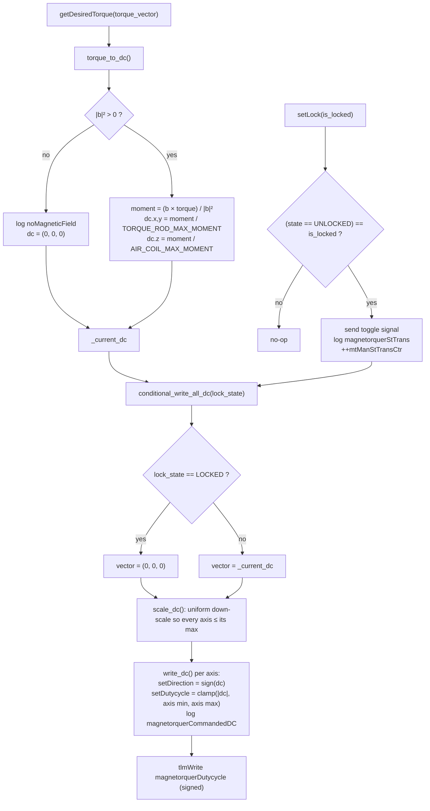

# Adcs::MagnetorquerManager

MagnetorquerManager is a Layer 2 Queued worker component in the ADCS subtopology. It owns the satellite's three magnetorquer actuators (two torque rods and one air coil), converting a desired torque vector into a per-actuator direction/duty-cycle command and enforcing a lock that zeroes all output while the actuators are disabled.

## Introduction

The component has no rate group and no `Reset` port; it does work only when one of its two synchronous input ports is called:

- `desiredTorqueInput` (`torqueVector_p`) — a desired torque vector from the ADCS control loop. On every call the component recomputes and re-sends all three actuators' commands.
- `setLock` (`mtToggle_p`) — requests the actuators be locked (all outputs forced to zero) or unlocked.

Actuator index `2` is treated as the air coil; indices `0` and `1` are the torque rods. 

## Requirements

| Name | Description | Validation |
|---|---|---|
| MTM-001 | The component shall maintain a lock state via `mtManStateMachine`, toggling between `UNLOCKED` and `LOCKED` only when a `setLock` request differs from the current state. | Unit Test |
| MTM-002 | While `LOCKED`, the component shall drive all three actuators to zero duty cycle regardless of the last commanded torque. | Unit Test |
| MTM-003 | On `getDesiredTorque`, the component shall attempt to produce the requested torque through the magnetorquers, maintaining torque direction even if full magnitude cannot be achieved.| Unit Test |
| MTM-004 | The component shall log `invalidDutycycleParam` if any of the six parameters fails to load or update validly. | Unit Test |
| MTM-005 | If the current measured B-field is zero, the component shall log `noMagneticField` and command all three actuators to zero duty cycle. | Unit Test |

## Design

### Ports

| Port | Kind | Direction | Type | Usage |
|---|---|---|---|---|
| `setLock` | sync | input | `mtToggle_p` (`is_locked: bool`) | Requests the actuators be locked (`true`) or unlocked (`false`). |
| `desiredTorqueInput` | sync | input | `torqueVector_p` (`torque_vector: Vector3DBase`) | Desired torque vector; triggers a full recompute and re-send of all three actuator commands. |
| `getCurrentB` | — | output | `bState_p` → `Adcs.BState` | Current measured B-field (`b`, `bDot`), used to project out the non-actuatable component of torque. |
| `setDutycycle` | — | output, array `[3]` | `mtDutycycle_p` (`dc: F32`) | Commanded duty-cycle magnitude for each actuator, clamped to its configured `[min, max]`. |
| `setDirection` | — | output, array `[3]` | `mtDirection_p` (`is_high: bool`) | Commanded current direction for each actuator (`true` for a non-negative computed duty cycle). |

### State Machine

| State | Meaning |
|---|---|
| `UNLOCKED` | `desiredTorqueInput` commands are written to the actuators. |
| `LOCKED` | All three actuators are held at zero duty cycle, regardless of the last commanded torque. |

### Processing pipeline

### Parameters

| Name | Type | Default | Applies to |
|---|---|---|---|
| `TORQUE_ROD_ABS_DUTYCYCLE_MIN` | `F32` | `0.0` | Actuators `0`, `1` |
| `TORQUE_ROD_ABS_DUTYCYCLE_MAX` | `F32` | `1.0` | Actuators `0`, `1` |
| `AIR_COIL_ABS_DUTYCYCLE_MIN` | `F32` | `0.0` | Actuator `2` |
| `AIR_COIL_ABS_DUTYCYCLE_MAX` | `F32` | `7.5 / 12.0` (`0.625`) | Actuator `2` |
| `TORQUE_ROD_MAX_MOMENT` | `F32` | `1.0` (placeholder) | Actuators `0`, `1` |
| `AIR_COIL_MAX_MOMENT` | `F32` | `1.0` (placeholder) | Actuator `2` |

`TORQUE_ROD_MAX_MOMENT` / `AIR_COIL_MAX_MOMENT` are the dipole moment (A·m²) each actuator type produces at 100% duty cycle;

### Telemetry

| Name | Type | Notes |
|---|---|---|
| `mtManStTransCtr` | `U64` | Count of lock/unlock transitions; increments only when a `setLock` request actually changes the lock state, not on every call. |
| `magnetorquerDutycycle` | `Vector3DBase` | The signed duty cycle currently commanded to each of the three actuators (as returned by `write_dc`). |

### Events

| Name | Severity | Purpose |
|---|---|---|
| `magnetorquerStTrans` | activity low | The lock state actually changed; carries whether it ended up `LOCKED`. |
| `magnetorquerCommandedDC` | activity low | A new signed duty cycle was sent to an actuator; carries its 0-indexed number and value. |
