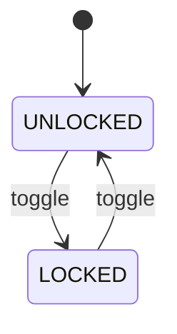
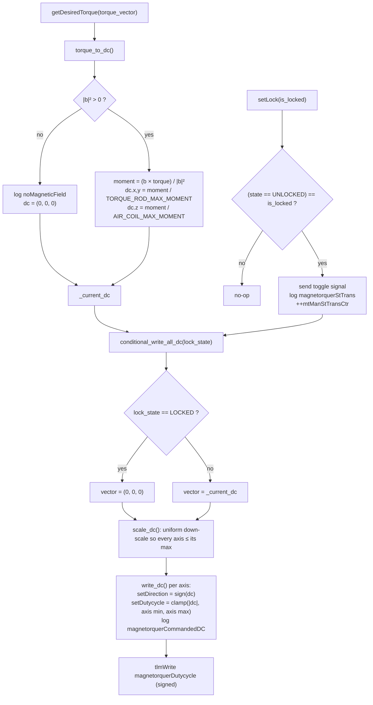

# Adcs::MagnetorquerManager

MagnetorquerManager is a Layer 2 Queued worker component in the ADCS subtopology. It owns the satellite's three magnetorquer actuators (two torque rods and one air coil), converting a desired torque vector into a per-actuator direction/duty-cycle command and enforcing a lock that zeroes all output while the actuators are disabled.

## Introduction

The component has no rate group and no `Reset` port; it does work only when one of its two synchronous input ports is called:

- `getDesiredTorque` (`torqueVector_p`) — a desired torque vector from the ADCS control loop. On every call the component recomputes and re-sends all three actuators' commands.
- `setLock` (`mtToggle_p`) — requests the actuators be locked (all outputs forced to zero) or unlocked. Locking is driven entirely through `mtManStateMachine`'s `UNLOCKED`/`LOCKED` state.

Actuator index `2` is treated as the air coil; indices `0` and `1` are the torque rods. 

## Requirements

| Name | Description | Validation |
|---|---|---|
| MTM-001 | The component shall maintain a lock state via `mtManStateMachine`, toggling between `UNLOCKED` and `LOCKED` only when a `setLock` request differs from the current state. | Unit Test |
| MTM-002 | While `LOCKED`, the component shall drive all three actuators to zero duty cycle regardless of the last commanded torque. | Unit Test |
| MTM-003 | On `getDesiredTorque`, the component shall attempt to produce the requested torque through the magnetorquers, maintaining torque direction even if full magnitude cannot be achieved.| Unit Test |
| MTM-004 | The component shall log `invalidDutycycleParam` if any of the six parameters fails to load or update validly. | Unit Test |
| MTM-005 | If the current measured B-field is zero, the component shall log `noMagneticField` and command all three actuators to zero duty cycle. | Unit Test |

## Design

### Ports

| Port | Kind | Direction | Type | Usage |
|---|---|---|---|---|
| `setLock` | sync | input | `mtToggle_p` (`is_locked: bool`) | Requests the actuators be locked (`true`) or unlocked (`false`). |
| `getDesiredTorque` | sync | input | `torqueVector_p` (`torque_vector: Vector3DBase`) | Desired torque vector; triggers a full recompute and re-send of all three actuator commands. |
| `getCurrentB` | — | output | `bState_p` → `Adcs.BState` | Current measured B-field (`b`, `bDot`), used to project out the non-actuatable component of torque. |
| `setDutycycle` | — | output, array `[3]` | `mtDutycycle_p` (`dc: F32`) | Commanded duty-cycle magnitude for each actuator, clamped to its configured `[min, max]`. |
| `setDirection` | — | output, array `[3]` | `mtDirection_p` (`is_high: bool`) | Commanded current direction for each actuator (`true` for a non-negative computed duty cycle). |
| `timeCaller`, `Fw.Command`, `Fw.Event`, `Fw.Channel`, `prmGetOut`, `prmSetOut` | standard AC ports | — | — | Boilerplate command/event/telemetry/time and parameter wiring. |

### State Machine

| State | Meaning |
|---|---|
| `UNLOCKED` | `getDesiredTorque` commands are written to the actuators. |
| `LOCKED` | All three actuators are held at zero duty cycle, regardless of the last commanded torque. |

### Processing pipeline

Handler / helper logic:

| Function | Behavior |
|---|---|
| `setLock_handler` | Toggles `mtManStateMachine` only when the requested lock state differs from whether the machine is currently `UNLOCKED` (`(state == UNLOCKED) == locked`). Tracing all four `(current state, requested lock)` combinations shows it toggles exactly when a toggle is needed and is a no-op otherwise. After sending the (possible) `toggle`, it computes the state the machine will land in (the signal is queued, so it cannot just read it back), logs `magnetorquerStTrans` with that value, increments and telemeters `mtManStTransCtr`, and re-drives all three actuators via `conditional_write_all_dc` with the computed state. |
| `getDesiredTorque_handler` | Converts the incoming torque vector via `torque_to_dc`, caches the per-axis result in `_current_dc`, and re-drives all three actuators via `conditional_write_all_dc` using the current lock state. |
| `torque_to_dc` | Queries `getCurrentB_out(0)` for the current field `b`, then computes the magnetic dipole moment needed to produce the desired torque: `moment = (b × torque) / \|b\|²` (the standard inverse of `torque = moment × b`; a real magnetic dipole can only produce torque perpendicular to the ambient field, so this implicitly drops the non-achievable colinear component). If `\|b\|² <= 0` (no field reading available), logs `noMagneticField` and returns a zero vector instead of dividing by zero. Otherwise `moment.x` / `moment.y` are divided by `TORQUE_ROD_MAX_MOMENT` and `moment.z` by `AIR_COIL_MAX_MOMENT` to convert from a physical dipole moment to a normalized duty-cycle input. |
| `axis_max_dc(act_num)` | Returns the configured max abs duty cycle for one actuator: `_ac_dc_range[1]` for index `2`, `_tr_dc_range[1]` otherwise. |
| `scale_dc(dc)` | Walks all three axes, finds the largest per-axis overage vs. `axis_max_dc(i)`, and divides the whole vector by that factor if any axis exceeds its max. `max_overage` is seeded at `1.0`, so this only ever scales *down* — it preserves the direction of the resultant torque instead of just its magnitude, and never amplifies a small vector. |
| `write_dc(dc, act_num)` | Derives the direction bit from `dc`'s sign (`setDirection_out`), takes the absolute value, clamps it to `[min, axis_max_dc(act_num)]` (`_ac_dc_range` for index `2`, `_tr_dc_range` otherwise), sends it as the duty cycle, logs `magnetorquerCommandedDC` with the signed value, and returns that signed value. Since `scale_dc` already handled the max, this clamp's real job by this point is the per-axis minimum (a hardware deadzone floor). |
| `conditional_write_all_dc(lock_state)` | Builds the 3-axis vector to send (`_current_dc`, or all zeros when `lock_state == LOCKED`), runs it through `scale_dc`, calls `write_dc` for each axis, and writes the collected signed duty cycles to the `magnetorquerDutycycle` telemetry channel. |

### Parameters

| Name | Type | Default | Applies to |
|---|---|---|---|
| `TORQUE_ROD_ABS_DUTYCYCLE_MIN` | `F32` | `0.0` | Actuators `0`, `1` |
| `TORQUE_ROD_ABS_DUTYCYCLE_MAX` | `F32` | `1.0` | Actuators `0`, `1` |
| `AIR_COIL_ABS_DUTYCYCLE_MIN` | `F32` | `0.0` | Actuator `2` |
| `AIR_COIL_ABS_DUTYCYCLE_MAX` | `F32` | `7.5 / 12.0` (`0.625`) | Actuator `2` |
| `TORQUE_ROD_MAX_MOMENT` | `F32` | `1.0` (placeholder — not yet a real measured value) | Actuators `0`, `1` |
| `AIR_COIL_MAX_MOMENT` | `F32` | `1.0` (placeholder — not yet a real measured value) | Actuator `2` |

`TORQUE_ROD_MAX_MOMENT` / `AIR_COIL_MAX_MOMENT` are the dipole moment (A·m²) each actuator type produces at 100% duty cycle; `torque_to_dc` divides by these to convert a computed moment into a normalized duty-cycle input. `parametersLoaded` calls `parameterUpdated` for all six IDs on startup; `parameterUpdated` refreshes the corresponding `_tr_dc_range` / `_ac_dc_range` / `_tr_max_moment` / `_ac_max_moment` member whenever ground updates one at runtime, logging `invalidDutycycleParam` if the fetched value comes back non-`VALID`.

### Telemetry

| Name | Type | Notes |
|---|---|---|
| `mtManStTransCtr` | `U64` | Count of lock/unlock transitions; increments only when a `setLock` request actually changes the lock state, not on every call. |
| `magnetorquerDutycycle` | `Vector3DBase` | The signed duty cycle currently commanded to each of the three actuators (as returned by `write_dc`). |

### Events

| Name | Severity | Purpose |
|---|---|---|
| `magnetorquerStTrans` | activity low | The lock state actually changed; carries whether it ended up `LOCKED`. |
| `magnetorquerCommandedDC` | activity low | A new signed duty cycle was sent to an actuator; carries its 0-indexed number and value. |
| `invalidDutycycleParam` | warning high | One of the six duty-cycle-range / max-moment parameters failed to load or update validly. |
| `noMagneticField` | warning high | The current measured B-field is zero, so no dipole moment could be computed; all actuators are commanded to zero instead. |

## Open Items / Known TODOs

- **Actuator index `2` is hardcoded as "the air coil"** in `axis_max_dc` and `write_dc` (`act_num == 2`), not derived from any port or parameter. An inline `// ???` comment flags the open question of whether the z-axis magnetorquer is really the only air coil, and who owns the body-frame axis definition (ADCS).
- **The per-axis minimum (deadzone floor) can still distort direction**, since `write_dc` applies it independently per axis after `scale_dc`'s uniform scaling: an axis scaled down below its floor gets bumped back up on its own, unlike the max case. Only matters when a non-zero min is configured (defaults are `0`).
- **`TORQUE_ROD_MAX_MOMENT` / `AIR_COIL_MAX_MOMENT` both default to `1.0` as placeholders**, not measured values for the actual hardware — see the `TODO: PLACEHOLDER` comments on these parameters in the `.fpp`.
