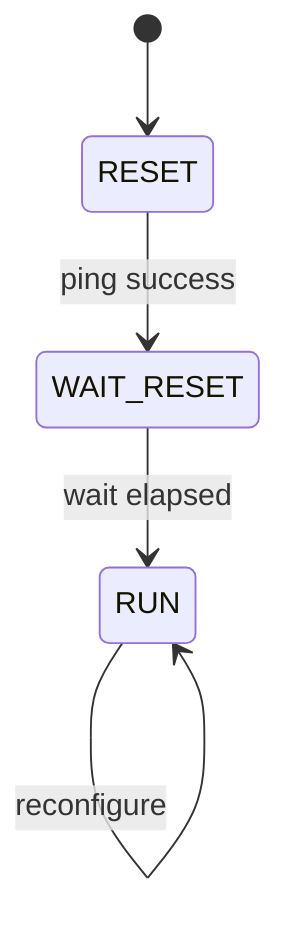
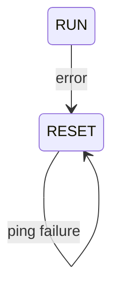
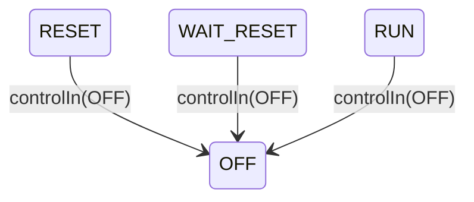

# SunSensorManager SDD

## 1. Overview

`SunSensorManager` is the Layer 2 hardware manager for the sun sensor array within the ADCS subtopology. It owns all bus communication with the sun sensors, confirming the ADC is alive and reading and calibrating each sensor channel, and publishes the calibrated intensities to `AdcsApplication` each rate-group tick.

`SunSensorManager` is a **Queued** component driven by `RateGroup1` (10 Hz). It has no satellite mode awareness; it runs its startup and read loop unconditionally once initialized. `AdcsApplication` (Layer 3) is responsible for computing the sun vector from the calibrated intensities, interpreting it, acting on failures, and, if necessary, commanding a power cut to the sensor array via EPS.

The HS2 sun sensor array consists of three photodiode sensors mounted on the solar panels read through an **MCP3204/3208 SPI ADC**. The MCP3204 is a 12-bit converter with no writable configuration registers of any kind (no reset, no enable/power, no resolution control; see datasheet DS21298E §5.0). Its entire interface is a single full-duplex SPI transaction: clock in a start bit + channel-select bits, clock back that channel's 12-bit conversion result in the same exchange. All bus access goes through the Layer 1 `LinuxSpiDriver`.

---

## 2. Requirements

| ID | Requirement | Verification |
|----|-------------|--------------|
| HS2-SSM-001 | SunSensorManager shall confirm the sun sensor ADC is present and responding before proceeding out of RESET | Inspection |
| HS2-SSM-002 | SunSensorManager shall wait for the reset stabilization period before proceeding to RUN | Inspection |
| HS2-SSM-003 | SunSensorManager shall pull the ADC's chip select pin low via GPIO before each SPI transaction (RESET ping and RUN channel reads) and release it high immediately afterward | Inspection |
| HS2-SSM-004 | SunSensorManager shall read all three sun sensor channels each rate-group tick while in RUN | Inspection |
| HS2-SSM-005 | SunSensorManager shall apply the calibration model (per-channel scale and offset) to each raw channel reading to produce a calibrated intensity value | Inspection |
| HS2-SSM-006 | SunSensorManager shall publish the three calibrated channel intensities to AdcsApplication after each successful read cycle | Inspection |
| HS2-SSM-007 | SunSensorManager shall log a WARNING_HI event and transition to RESET on any SPI read or write failure | Inspection |
| HS2-SSM-008 | SunSensorManager shall track consecutive failure count and report it as a telemetry channel | Inspection |
| HS2-SSM-009 | SunSensorManager shall apply updated F' parameter values by reloading them from PrmDb while remaining in RUN, without a full reset | Inspection |
| HS2-SSM-010 | SunSensorManager shall not perform any bus operations while in WAIT_RESET | Inspection |
| HS2-SSM-011 | SunSensorManager shall expose the most recently cached calibrated channel intensities via a synchronous getter port, so a consumer can obtain the current values on demand rather than waiting for the next RUN publish cycle | Inspection |
| HS2-SSM-012 | SunSensorManager shall transition to OFF from any state on receipt of an OFF command via controlIn | Inspection |
| HS2-SSM-013 | SunSensorManager shall perform no bus operations while in OFF | Inspection |
| HS2-SSM-014 | SunSensorManager shall re-enter RESET on receipt of an ON command via controlIn while in OFF | Inspection |
| HS2-SSM-015 | SunSensorManager OFF entry hardware shutdown sequence is TBD pending ADC hardware selection | Deferred |

---

## 3. Design

### 3.1 Component Type

Queued component with internal flat F' state machine (`Fw::Sm`). Has a message queue but no dedicated thread; it executes on the `RateGroup1` caller thread each 10 Hz tick.

### 3.2 Parameters

`SunSensorManager` is not satellite-mode-aware and receives no mode commands. Configuration is entirely parameter-driven. Parameters are loaded from `Svc::PrmDb` during the `WAIT_RESET`-to-`RUN` transition. A parameter update at runtime reloads all parameters from `PrmDb` in place while remaining in `RUN`.

| Parameter | Type | Description |
|-----------|------|-------------|
| `CALIBRATION_SCALE_0`…`CALIBRATION_SCALE_2` | `F32` (×3) | Per-channel sensitivity scale factors |
| `CALIBRATION_OFFSET_0`…`CALIBRATION_OFFSET_2` | `F32` (×3) | Per-channel dark-current offset corrections |
| `RESET_WAIT_TICKS` | `U32` | Number of rate-group ticks to wait after reset before proceeding |


### 3.3 Ports

| Port | Direction | Type | Purpose |
|------|-----------|------|---------|
| `schedIn` | Input | `Svc.Sched` | 10 Hz rate group tick that drives the SM step |
| `getSunIntensities` | Input (sync) | Custom port (`intensityGetter_p`) | Returns the most recently cached calibrated channel intensities on demand, independent of the tick cycle |
| `csOut` | Output | `Drv.GpioWrite` | Pulls the ADC's chip select pin low before each SPI transaction; released high immediately after |
| `spiWriteRead` | Output | `Drv.SpiWriteRead` | SPI transaction with the ADC, used for the RESET ping and channel reads. One transaction per channel. |
| `sunIntensitiesOut` | Output | `Adcs.SunIntensityPort` | Publish the three calibrated channel intensities + timestamp to AttitudeFilter (queried by AdcsApplication via its `filter*Get` ports, not read directly from SunSensorManager) |
| `controlIn` | Input (async) | `Adcs.ManagerControlPort` | ON/OFF command from AdcsApplication |
| `prmGet` | Output | `Fw.PrmGet` | Load parameters from PrmDb during the WAIT_RESET-to-RUN transition, and on parameter updates thereafter |
| `logOut` | Output | `Fw.Log` | Event logging (state transitions, errors) |
| `tlmOut` | Output | `Fw.Tlm` | Telemetry (SM state, consecutive failure count, raw and calibrated channel intensities) |

### 3.4 Commands

`SunSensorManager` accepts no ground commands. It is not health-monitored. All recovery is handled autonomously by the self-healing SM or escalated via telemetry to `AdcsApplication`.

---

## 4. State Machine

`SunSensorManager` uses a single flat F' state machine following the `fprime-community/fprime-sensors` `ImuManager` reference pattern. All states are peers; there is no nesting.

```
OFF
  entry: zero all channel intensity buffers [further shutdown protocol TBD - see HS2-SSM-015]
  on tick: no action (no bus operations)
  on controlIn(ON) → RESET

RESET
  entry: zero all channel intensity buffers
         reset wait-tick counter
         pull csOut low, ping channel 0 over SPI to confirm the ADC is
         present and responding, release csOut high
  on ping success → WAIT_RESET
  on ping failure → log WARNING_HI, increment failure count, retry

WAIT_RESET
  on tick: increment wait-tick counter
           if counter >= RESET_WAIT_TICKS:
             load CALIBRATION_SCALE_0-2, CALIBRATION_OFFSET_0-2 from PrmDb
             → RUN
           (no bus operations performed in this state)

RUN
  on tick: for each of the 3 channels:
             pull csOut low, one SPI transaction (clock out start +
             channel-select bits, clock in the 12-bit conversion result),
             release csOut high
           if any spiWriteRead error or lost conversion framing:
             log WARNING_HI (throttled), increment failure count → RESET
           if all reads OK:
             apply CALIBRATION_SCALE/OFFSET to each channel
             publish sunIntensitiesOut (3 calibrated intensities, timestamp)
             reset consecutive-failure counter
  on reconfigure signal: reload CALIBRATION_SCALE_0-2, CALIBRATION_OFFSET_0-2
                          from PrmDb in place (no state transition)

# Global signals - reachable from any state:
on error signal       → RESET   # existing - self-healing fallback
on controlIn(OFF)     → OFF     # new - immediate from any state, including mid-startup
on controlIn(ON)      → RESET   # new - only meaningful from OFF; no-op from all other states
```



**Error recovery:** `RESET` retries itself on a ping failure; `RUN` returns to `RESET` on a read error.



**OFF power control:**



**Powering back on:** `OFF --> RESET` on `controlIn(ON)`, from any state.

**Error self-healing:** Any SPI error or ADC framing loss from `RESET` or `RUN` emits a throttled `WARNING_HI` event, increments the `consecutiveFailures` telemetry channel, and re-enters `RESET`. The SM retries the full startup sequence automatically.

**Repeated failure escalation:** `consecutiveFailures` is only cleared on a fully successful RUN read and publish cycle, so entering `RESET` again does not reset it. `SunSensorManager` does not cut power to itself. If `consecutiveFailures` exceeds a threshold observable by `AdcsApplication` via telemetry, `AdcsApplication` is responsible for commanding an EPS power rail cut. `SunSensorManager` continues attempting self-healing until then.

**Parameter reconfiguration:** When `parameterUpdated()` is called while `SunSensorManager` is in `RUN`, it reloads `CALIBRATION_SCALE_0-2` and `CALIBRATION_OFFSET_0-2` from `PrmDb` in place. While in `RESET` or `WAIT_RESET`, the signal is ignored, since parameters are freshly loaded on the next `WAIT_RESET`-to-`RUN` transition.

Reference: [`fprime-community/fprime-sensors/ImuManager`](https://github.com/fprime-community/fprime-sensors/tree/devel/fprime-sensors/MpuImu/Components/ImuManager), [FPP flat state machines](https://github.com/nasa/fpp/blob/main/docs/users-guide/Defining-State-Machines.adoc), MCP3204/3208 datasheet DS21298E §3.7 (CS/SHDN behavior) and §5.0 (transaction framing)

---

## 5. Notes

- `SunSensorManager` is instantiated inside the ADCS subtopology. Its `spiWriteRead` port connects to a `LinuxSpiDriver` instance and its `csOut` port connects to a `LinuxGpioDriver` instance, both at the top-level topology.
- `sunIntensitiesOut` connects to `AttitudeFilter` within the ADCS subtopology, not to `AdcsApplication` directly. `AdcsApplication` reads the fused result back out via its `filter*Get` ports.
- `SunSensorManager` is **excluded from health monitoring** (`Svc::Health`). Only `AdcsApplication` is health-checked.
- The `Adcs.SunIntensityPort` type (carrying the three calibrated channel intensities and a timestamp) is defined in the ADCS module and shared with `AdcsApplication`.
- Deferred: exact `consecutiveFailures` threshold that triggers `AdcsApplication` to cut sensor power is a system-level parameter to be defined during detailed design.
- Deferred: OFF entry hardware shutdown sequence beyond zeroing the intensity buffers depends on the selected ADC hardware (HS2-SSM-015).
- `controlIn` is driven by `AdcsApplication`'s `sunSensorControl` output port; `AdcsApplication` sends `OFF` on entry to its own `Off` mode and `ON` on exit, per `docs/superpowers/specs/2026-05-05-adcs-hardware-manager-off-state-design.md`.
