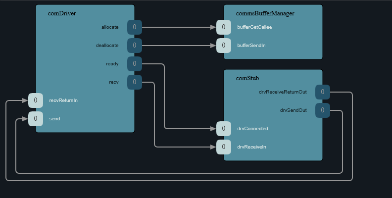
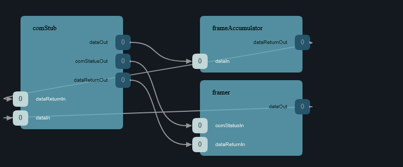
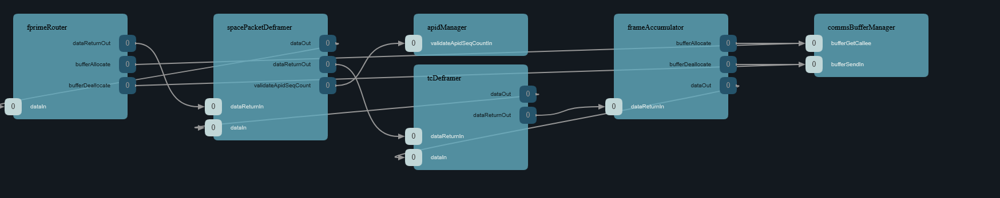
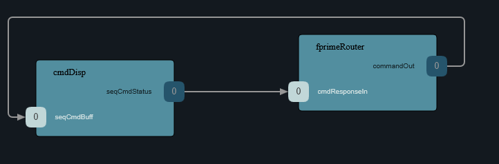
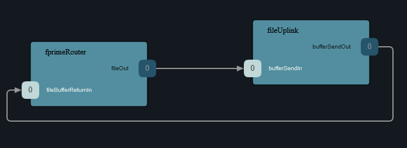
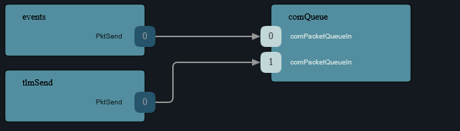
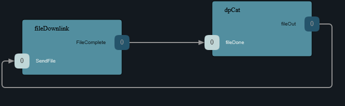

# ComApplication SDD

## 1. Overview

`ComApplication` is the Layer 3 Active component for the Comms subtopology. It manages the EnduroSat S-band radio operating mode — switching between `BEACON` to transmit real-time SOH telemetry at 1Hz, `STANDARD_DOWNLINK` mode to transmit all real-time telemetry including payload experiment data, `STORED_PLAYBACK` mode to downlink stored and real-time SOH telemetry concurrently, and `NO_DOWNLINK` to cease transmission upon command.

---

## 1.1 Terminology
| Term | Definition |
|------|------------|
| Telemetry| Information that is downlinked to the HS-2 ground station including: F' events, images/files, and data packets |

## 2. Requirements

| ID | Requirement | Verification |
|----|-------------|--------------|
| HS2-COM-001 | ComApplication shall activate `BEACON` downlink mode when commanded by `SatStateMachine` | Inspection |
| HS2-COM-002 | ComApplication shall activate `STANDARD_DOWNLINK` downlink mode when commanded by `SatStateMachine` | Inspection |
| HS2-COM-003 | ComApplication shall activate `STORED_PLAYBACK` downlink mode only when commanded | Inspection |
| HS2-COM-004 | ComApplication shall respond to health ping within the required deadline | Inspection |
| HS2-COM-005 | ComApplication shall enable the transmission of stored telemetry along with real-time telemetry when `STORED_PLAYBACK` downlink mode is activated | Inspection |
| HS2-COM-006 | ComApplication shall enable the transmission of SOH telemetry only at a 1Hz rate when `BEACON` downlink mode is activated | Inspection |
| HS2-COM-007 | ComApplication shall enable the transmission of all real-time telemetry when `STANDARD_DOWNLINK` downlink mode is activated | Inspection |

---

## 3. Design

### 3.1 Component Type

Active component with internal hierarchical F' state machine (`Fw::Sm`).

### 3.2 Mode Interface

`ComApplication` receives its operating mode from `SatStateMachine` via a typed port:

```fpp
sync input port modeIn: Sat.CommsModePort   # carries Comms.Mode
```

Mode enum (owned by this component's module):

```fpp
module Comms {
    enum Mode { BEACON, STANDARD_DOWNLINK, STORED_PLAYBACK, NO_DOWNLINK }
}
```

If the incoming mode matches the current mode, the handler returns immediately (idempotent).

#### 3.2.1 `Beacon` Mode

During this mode, only SOH telemetry shall be transmitted. This mode is intended for the satellite to establish a connection with the ground station, particularly when detumbling or when outside of a communication window. In `Beacon` mode, the satellite shall only transmit a single SOH telemetry packet at 1Hz to ensure minimum power draw.

This mode will set all packets, except SOH, in the `TlmPacketizer` to have a `RateLogic` of `SILENCED`. 

#### 3.2.2 `STANDARD_DOWNLINK` mode

During this mode, all real-time telemetry shall be downlinked to the ground station at 1Hz.

This mode will set all packets, except SOH, in the `TlmPacketizer` to have a `RateLogic` of `ON_CHANGE_MIN`. 

#### 3.2.3 `STORED_PLAYBACK` mode

During this mode, all stored telemetry, which includes payload experiment data, will be downlinked to the ground station. The priority in this mode is to downlink images and payload data captured during experiments. Real-time SOH telemetry will be downlinked at a rate of 1 Hz.

This mode will set SOH telemetry in the `TlmPacketizer` to have a `RateLogic` of `EVERY_MAX` to ensure stored telemetry is given priority. The `Svc::DpCatalog` component can be used to downlink generated data products (such as images and stored telemetry) that exist within a specified set of directories.

#### 3.2.4 `NO_DOWNLINK` mode

During this mode, nothing will be transmitted from the satellite. Refer to requirement `UNP12-91` within the RVM.

### 3.3 Ports

| Port | Direction | Type | Purpose |
|------|-----------|------|---------|
| `modeIn` | Input | `Sat.CommsModePort` | Mode command from SatStateMachine |
| `schedIn` | Input | `Svc.Sched` | Rate group tick |
| `pingIn` | Input | `Svc.Ping` | Health monitoring input ping from `Svc::Health` to component |
| `pingOut` | Output | `Svc.Ping` | Health monitoring ping response from component to `Svc::Health` |
| `logOut` | Output | `Fw.Log` | Event logging |
| `tlmOut` | Output | `Fw.Tlm` | Telemetry (current mode) that will be used in SOH packets |
| `configureGroupRate` | Output | `Svc.ConfigureGroupRate`| Configure rate at which certain telemetry sections are transmitted as per the `Svc.TlmPacketizer` component |
---

### 3.4 Parameters
Only the downlink mode in the `ComApplication` will be changing at run time.

| Parameter | Type | Description |
|-----------|------|-------------|
| `RESET_WAIT_TICKS` | `U32` | Ticks to wait reconfiguring the UART connection between the `TmtcRadioManager` and the Endurosat Transceiver |

### 3.5 ComApplication Telemetry
The following telemetry will be used for the `ComApplication`:

| Mnemonic | Type | Description |
|----------|------|-------------|
| `downlink_mode` | `Comms.Mode` | Downlink mode that will be set by `SatStateMachine`. Can be one of the following values: `BEACON`, `STORED_PLAYBACK`, `STANDARD_DOWNLINK` |

---

## 4. State Machine

`ComApplication` uses a hierarchical F' state machine with the following states: `RESET`, `BEACON`, `STORED_PLAYBACK`, and `STANDARD_DOWNLINK`. All states, aside from `RESET`, will only be commanded by the `SatStateMachine` as the `ComApplication` does not follow a traditional state-machine like a hardware-manager.

```
RESET
  entry: Log RESET event

BEACON
  entry: Set all packets, except SOH, in the `TlmPacketizer` to have a `RateLogic` of `SILENCED`. Set `downlinkMode` telemetry to be `BEACON`.

STORED_PLAYBACK
  entry: Set SOH telemetry in the `TlmPacketizer` to have a `RateLogic` of `EVERY_MAX`. Set `downlinkMode` telemetry to be `STORED_PLAYBACK`

STANDARD_DOWNLINK
  entry: set all packets, except SOH, in the `TlmPacketizer` to have a `RateLogic` of `ON_CHANGE_MIN`. Set `downlinkMode` telemetry to be `STANDARD_DOWNLINK`.


```

Reference: [FPP inherited transitions](https://github.com/nasa/fpp/blob/main/docs/users-guide/Defining-State-Machines.adoc#inherited-transitions), [FPP substates](https://github.com/nasa/fpp/blob/main/docs/users-guide/Defining-State-Machines.adoc#substates)

---

## 5. Telemetry Groups

[TBD] on Telemetry Groups.

## 6. Communications Connections
The following diagrams highlight the routes in which uplink/downlink data (packets, data products, and events) are handled within our design:

---
### 6.1 TmtcRadioManager Connections
Beginning with the `TmtcRadioManager` (replacing `comStub` in the diagram), it will be responsible for delivering uplink/downlink data packets to/from the rest of the flight software.

The `comDriver` is the Linux UART driver responsible for delivering the uplinked bytes from the S-Band Transceiver over serial, to the `TmtcRadioManager` through its `recv` port into the `drvReceiveIn` input port. The `TmtcRadioManager` component will send downlink bytes through its `drvSendOut` to the `comDriver`'s `send` port.



---

### 6.2 Uplinked Data Connection Route
The following diagrams detail the route of downlink data through the port topology of the software subsystems.

---

#### 6.2.1 Receiving data from Transceiver
The following diagrams outline the 


For uplinked data, after it has passed through the S-Band Transceiver and into the `TmtcRadioManager`, it is then passed to the `FrameAccumulator` component which is responsible for extracting full CCSDS TC Transfer Frames. The `TmtcRadioManager` will transmit these received frames over the `dataOut` port into the `frameAccumulator`'s `dataIn` port for it to handle.

---

#### 6.2.2 FrameAccumulator



Once the `frameAccumulator` has received enough data to recognize a frame, it is then passed to the `Svc::Ccsds::TcDeframer` for handling. The frame is passed from the `frameAccumulator`'s `dataOut` port into the `TcDeframer`'s `dataIn` port.

Next, the `TcDeframer` will unwrap CCSDS Space Packets from the CCSDS TC frame. The unwrapped Space Packet is sent from the `dataOut` port into the `svc::Ccsds::SpacePacketDeframer`'s `dataIn` port. From here, the `SpacePacketDeframer` component extracts the uplinked data (command or file) after validating the packet. The extracted payload is sent out on the `dataOut` port and into the `Svc::FPrimeRouter`'s `dataIn` port.

The `Svc::FPrimeRouter` supports two kinds of packets: `Fw::ComPacketType::FW_PACKET_COMMAND` and `Fw::ComPacketType::FW_PACKET_FILE`. Unknown packet types are forwarded on the `unknownDataOut` port.

---
#### 6.2.3 Command Dispatching



Commands are sent from the `commandOut` port and to the `Svc::CmdDispatcher`'s `seqCmdBuff` input port.

---
#### 6.2.4 Uplinked Files



Uplinked file packets are sent from the `fileOut` port to the `Svc::FileUplink`'s `bufferSendIn` input port for processing.

---

### 6.3 Downlinked Data Connection Route
The following diagrams detail the route of downlink data through the port topology of the software subsystems.

---

#### 6.3.1 Events and Telemetry Packets



Events are sent through the `Svc::EventManager`'s `PktSend` port as `ComBuffer` types into the `ComCCSDS::ComQueue`'s `comPacketQueueIn` port.

Telemetry packets are sent from the `Svc::TlmPacketizer`'s `PktSend` output port into the `ComCCSDS::ComQueue`'s `comPacketQueueIn` port.

---
#### 6.3.2 Downlinked Files


The `Svc.DpCatalog` component is responsible for maintaining catalogues of generated data products (files) that can be built and downlinked upon command from the operators. Downlinked files are passed from the `fileOut` output port into the `Svc.FileDownlink`'s `SendFile` input port to be enqueued for downlink.

---


## 7. Notes

- The `ComApplication` will be a part of another subtopology, titled [TBD], that also wraps the `ComCCSDS` framing subtopology and the `TmtcRadioManager` component.
- `STANDARD_DOWNLINK` and `STORED_PLAYBACK` require `AdcsApplication` to be in `AntennaPointing` mode. `SatStateMachine` is responsible for commanding both simultaneously via the translation table — `ComApplication` does not check ADCS state directly.
- `TmtcRadioManager` interface to be defined during detailed design.  
- The `TlmPacketizer` component gives the `ComApplication` capabilities to configure the rate at which certain packets are sent for the various operating modes.
- For downlinking event, there are two log files to maintain: The first is for the last [TBD] minutes of events (refreshed/overwritten every [TBD] / 2 minutes) and the other which stores the last [TBD] minutes of events after the most recent `FATAL` exception. Ground can send commands to the `Svc::FileDownlink` component to retrieve these logs files held in non-volatile memory.
- The "Health" pings will be incoming from the `Svc::Health` component which will send WARN/FATAL events if a certain number of configurable ticks have elapsed before a `pingOut` is sent from the `ComApplication` component.
