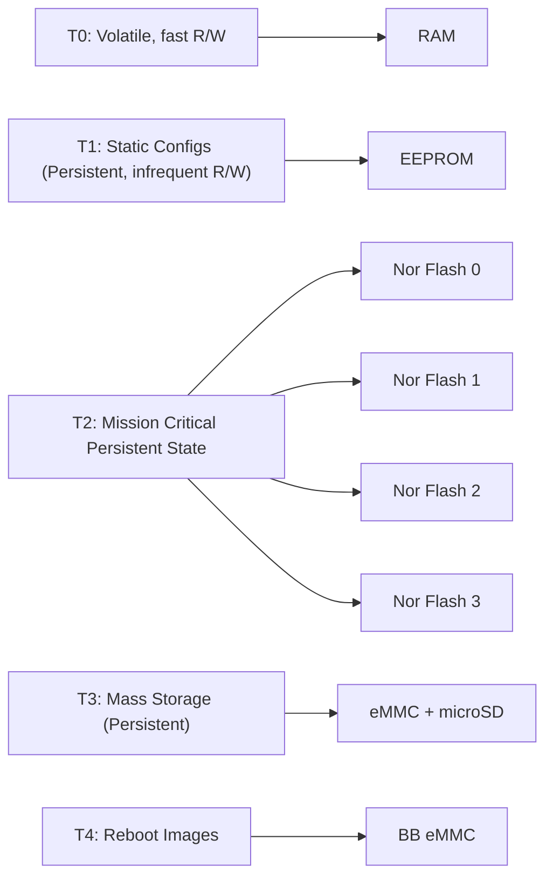
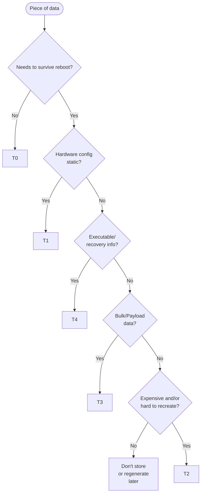
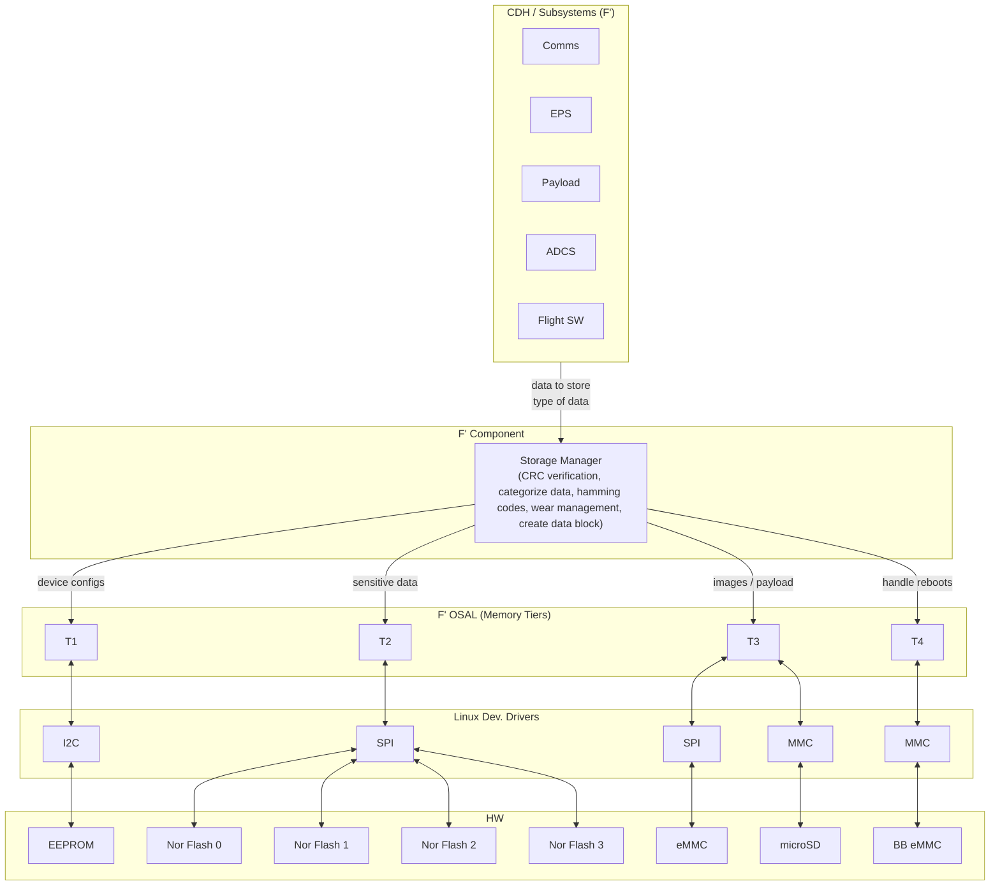

# FlightComputerMemory SDD

## 1. Overview

This document details the memory storage architecture, flow, and tiering for the CubeSat flight computer.

## 2. Requirements

This document is informational and does not contain formal requirements. It describes the memory architecture design for the HS2 CubeSat flight computer.

## 3. Design

### 3.1 Memory Tiers and Hardware Mapping

### Tier Definitions and Contents

- **T0 (RAM):** Image buffers, DMA buffers, sensor readings, temp, telemetry packets, command buffers, thread space.
- **T1 (EEPROM):** Board serial no, Sensor/I2C/SPI/T2/T3 device configs, manufacturing constants.
- **T2 (NOR Flash):** Four NOR flash chips (only one active at a time via SPI chip select); stores satellite state (safe mode, current operating mode, mission phase), Sun sensor calibration, magnetometer bias, Battery SOC/Health estimates, Fault management (watchdog, fault log), LOST/FOUND processing results (w/ reference to image), info about chip state (bitmap, wear stats per chip), payload logs, status of FC software copy; health monitoring per chip.
- **T3 (eMMC + microSD):** Images, Science data, payload logs.
- **T4 (BB eMMC):** Linux kernel, bootloader, root/base FS, factory configs, FC SW.

### 3.2 Data Storage Decision Flowchart

### 3.3 System Architecture and Interfaces

## 4. State Machine

This document does not describe a state machine as it is not an F' component. The memory architecture is managed by the Storage Manager component and OSAL layers.

## 5. Notes
- This document is intended to aid understanding of the memory storage design and is not an F' component specification.
- **Integrations:** This memory architecture is implemented by the Storage Manager F' component (Layer 2), which interfaces with the CDH subsystems (Comms, EPS, DataCollection, ScienceInference, ADCS) via the F' framework, and with the Linux drivers and hardware for the memory tiers. Related documentation includes the subsystem SDDs and driver specifications.
