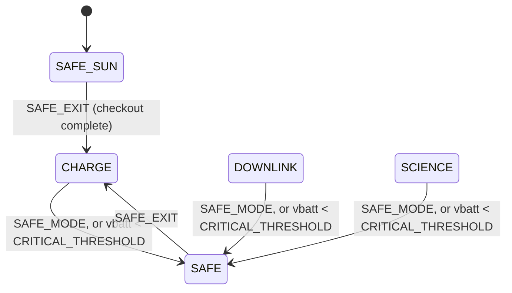
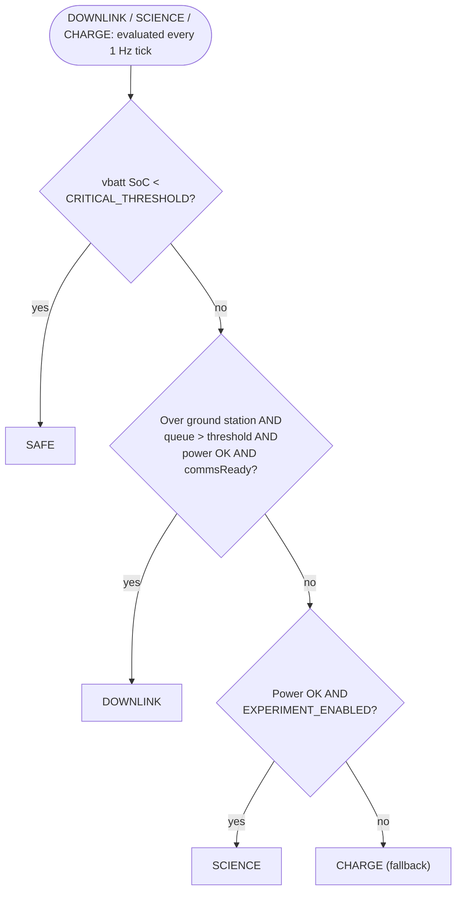
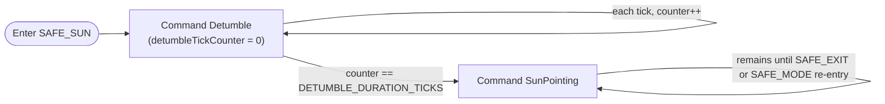

# SatStateMachine SDD

## 1. Overview

`SatStateMachine` is the Layer 4 "Mission Orchestration" component. It is an **Active** component, instantiated at the **top-level topology** since it is not scoped to any single subtopology.
 It evaluates the satellite's top level operating mode among five sibling states, SafeSun, Safe, Downlink, Science, and Charge, reevaluated every 1 Hz tick. All condition inputs
arrive precomputed via typed ports from Layer 3 applications.

`SatStateMachine` owns the mode to mode translation table On every mode
transition it is intended to command each Layer 3 application component's own operating
mode via a dedicated typed port. 

## 2. Requirements

| ID | Requirement | Verification |
|----|-------------|---------------|
| HS2-SAT-001 | SatStateMachine shall boot into SafeSun mode on deploy/reboot | Inspection |
| HS2-SAT-002 | SatStateMachine shall enter SafeSun mode from any state on ground command `SAFE_MODE` if `checkoutComplete` is not set, else enter Safe mode | Inspection |
| HS2-SAT-003 | SatStateMachine shall enter SafeSun mode from any state when EPS reported battery state of charge falls below `CRITICAL_THRESHOLD` if `checkoutComplete` is not set, else enter Safe mode, evaluated each 1 Hz tick | Inspection |
| HS2-SAT-004 | SatStateMachine shall exit SafeSun to Charge only on ground command `SAFE_EXIT`, and only after the `CHECKOUT_COMPLETE` ground command has been received at least once. SatStateMachine shall exit Safe to Charge on ground command `SAFE_EXIT` unconditionally | Inspection |
| HS2-SAT-005 | SatStateMachine shall evaluate which of Downlink, Science, or Charge to enter every 1 Hz tick while not in SafeSun or Safe mode, in strict priority order: Downlink, then Science, then Charge (fallback) | Inspection |
| HS2-SAT-006 | SatStateMachine shall log an event on every mode entry and exit | Inspection |
| HS2-SAT-007 | SatStateMachine shall report its current mode, checkout status, and cached condition inputs as telemetry each tick | Inspection |
| HS2-SAT-008 | SatStateMachine shall command each Layer 3 application component's operating mode per its translation table | Inspection |
| HS2-SAT-009 | SatStateMachine shall respond to `Svc.Health` pings | Inspection |
| HS2-SAT-010 | SatStateMachine shall support a `RESET` command that forces reentry to `SAFE_SUN` (from `SAFE_SUN`), to `SAFE` (from `SAFE`), or to `CHARGE` (from `DOWNLINK`/`SCIENCE`/`CHARGE`) | Inspection |
| HS2-SAT-011 | SatStateMachine shall not enter Downlink unless `ComApplication` reports downlink readiness via `commsReadyIn` | Inspection |
| HS2-SAT-012 | SatStateMachine shall command `AdcsApplication` into `Detumble` on entry to `SafeSun`, then into `SunPointing` once `DETUMBLE_DURATION_TICKS` ticks have elapsed in `SafeSun`. SatStateMachine shall command `AdcsApplication` into `Detumble` for the entire duration of `Safe` | Inspection |

---

## 3. Design

### 3.1 Component Type

Active component. Internal `Fw::Sm` state machine with five top level sibling states
(`SAFE_SUN`, `SAFE`, `DOWNLINK`, `SCIENCE`, `CHARGE`). `schedIn` is driven by `RateGroup2` (1 Hz).

### 3.2 Parameters

| Parameter | Type | Description |
|-----------|------|--------------|
| `POWER_THRESHOLD` | `F32` | Minimum EPS state of charge (%) required for Downlink or Science |
| `EXPERIMENT_ENABLED` | `bool` | Ground set boolean enabling Science |
| `DOWNLINK_QUEUE_THRESHOLD` | `U32` | Minimum downlink queue depth (bytes) required to enter Downlink |
| `CRITICAL_THRESHOLD` | `F32` | Battery state of charge (%) below which Safe/SafeSun mode is forced. |
| `DETUMBLE_DURATION_TICKS` | `U32` | Ticks after entering `SafeSun` before commanding `AdcsApplication` from `Detumble` to `SunPointing`. Approximates the mission's estimated detumble duration (~110 minutes per CONOPS, TBR). |

### 3.3 Ports

| Port | Direction | Type | Purpose |
|------|-----------|------|---------|
| `schedIn` | Input | `Svc.Sched` | RateGroup2 (1 Hz) tick. Drives mode evaluation. |
| `sunEclipseIn` | Input (async) | `Sat.SunEclipseInPort` | In eclipse classification, from sun sensors + GNSS. |
| `orbitStateIn` | Input (async) | `Sat.OrbitStateInPort` | Flag for being over the ground station, from `GnssManager` |
| `downlinkQueueDepthIn` | Input (async) | `Sat.DownlinkQueueDepthInPort` | Current downlink queue depth in bytes, from `ComQueue` |
| `commsReadyIn` | Input (async) | `Sat.CommsReadyInPort` | Downlink readiness/permission flag from `ComApplication`; gates `DOWNLINK` entry. |
| `powerStateGet` | Output (sync get) | `Sat.PowerStateGetPort` | Pulls the latest power state from `EPSApplication` each tick |
| `pingIn` / `pingOut` | Input / Output | `Svc.Ping` | Health monitoring |
| `adcsModeOut` | Output | `Sat.AdcsModePort` | Mode command to `AdcsApplication` |
| `dataColModeOut` | Output | `Sat.DataColModePort` | Mode command to `DataCollectionApplication` |
| `scienceInferenceModeOut` | Output | `Sat.ScienceInferenceModePort` | Mode command to `ScienceInferenceApplication` |
| `commsModeOut` | Output | `Sat.CommsModePort` | Mode command to `ComApplication` |
| `thermalModeOut` | Output | `Sat.ThermalModePort` | Mode command to `ThermalApplication` |
| `prmGet` | Output | `Fw.PrmGet` | Load parameters from PrmDb |
| `logOut` | Output | `Fw.Log` | Event logging |
| `tlmOut` | Output | `Fw.Tlm` | Telemetry |

### 3.4 Commands

| Mnemonic | Args | Description |
|----------|------|-------------|
| `SAFE_MODE` | - | Forces immediate transition to `SAFE_SUN` (if checkout not yet complete) or `SAFE` (if checkout complete) from any state |
| `SAFE_EXIT` | - | Requests transition to Charge. From `SAFE_SUN` this is denied unless checkout has completed; from `SAFE` it always succeeds |
| `CHECKOUT_COMPLETE` | - | Ground commands subsystem verification and OKs the transition. Once set, never clears, including across later Safe re-entries. |
| `RESET` | - | Forces reentry to `SAFE_SUN` (from `SAFE_SUN`), `SAFE` (from `SAFE`), or `CHARGE` (from `DOWNLINK`/`SCIENCE`/`CHARGE`) |


---

## 4. State Machine

`SAFE_SUN`, `SAFE`, `DOWNLINK`, `SCIENCE`, and `CHARGE` are flat top-level sibling states; there is no wrapping "Standby" state. `SAFE_SUN` is the boot/first-deploy state and the only one of the five that commands `AdcsApplication` through two phases over its own lifetime, using only `AdcsApplication`'s existing `Detumble` and `SunPointing` modes, no new ADCS mode or port is introduced. `SAFE` is the plain post-checkout safe state, reached from `DOWNLINK`/`SCIENCE`/`CHARGE` on a critical-battery trip or `SAFE_MODE`; `SAFE_SUN` is never re-entered once checkout has completed, since `checkoutComplete` is a one-way latch. The 1 Hz priority evaluation is defined identically on `DOWNLINK`, `SCIENCE`, and `CHARGE`; neither `SAFE_SUN` nor `SAFE` runs it.

```
SAFE_SUN
  entry: log SatModeSafeSunEntered
         reset detumbleTickCounter to 0
         command AdcsApplication Detumble
  exit:  log SatModeSafeSunExited
  on tick: cache condition inputs
           increment detumbleTickCounter
           if detumbleTickCounter == DETUMBLE_DURATION_TICKS:
             command AdcsApplication SunPointing
  on groundCommand(SAFE_MODE): reenter SAFE_SUN
  on groundCommand(SAFE_EXIT): enter CHARGE only if checkoutComplete is set,
                                else remain in SAFE_SUN
  on reset: reenter SAFE_SUN

SAFE
  entry: log SatModeSafeEntered
         command AdcsApplication Detumble
  exit:  log SatModeSafeExited
  on tick: cache condition inputs
  on groundCommand(SAFE_MODE): reenter SAFE
  on groundCommand(SAFE_EXIT): enter CHARGE   (checkoutComplete is
                                guaranteed set; SAFE is unreachable
                                before checkout)
  on reset: reenter SAFE

DOWNLINK / SCIENCE / CHARGE
  entry: log SatMode<Name>Entered + command Layer 3 apps
  exit:  log SatMode<Name>Exited
  on groundCommand(SAFE_MODE): enter SAFE   (checkoutComplete is
                                guaranteed set here; never SAFE_SUN)
  on groundCommand(SAFE_EXIT): ignored (already out of Safe/SafeSun;
                                does not disrupt the active mode)
  on reset: enter CHARGE
  on tick (defined identically on all three):
    cache condition inputs, then evaluate in priority order:
      1. if vbatt SoC < CRITICAL_THRESHOLD                     -> SAFE
      2. else if downlinkConditionMet (over ground station AND
         queue depth > DOWNLINK_QUEUE_THRESHOLD AND power OK
         AND commsReady)                                       -> DOWNLINK
      3. else if scienceConditionMet (power OK AND
         EXPERIMENT_ENABLED)                                   -> SCIENCE
      4. else                                                  -> CHARGE
    (no-op, no exit/re-entry logged, if the winning state is the
     one already active)
```



**Downlink / Science / Charge selection, evaluated every 1 Hz tick:**



**SafeSun's own two-phase AdcsApplication command, over its lifetime:**



**Mode-to-app translation table**

| Satellite State | `AdcsApplication` | `DataCollectionApplication` | `ScienceInferenceApplication` | `ComApplication` | `ThermalApplication` |
|----------------|-------------------|------------------------------|-------------------------------|----------------------|----------------------|
| SafeSun | Detumble, then SunPointing after `DETUMBLE_DURATION_TICKS` | Off | Off | Beacon | NoHeating |
| Safe | Detumble | Off | Off | Beacon | NoHeating |
| Downlink | AntennaPointing | Off | Off | StandardDownlink | ActiveHeating |
| Science | EarthLimbPointing | RunExperiment | ProcessImages | Beacon | ActiveHeating |
| Charge | SunPointing | Off | Off | Beacon | ActiveHeating |

---

## 5. Notes

- **Checkout mechanism** (`CHECKOUT_COMPLETE`) is this document's proposed design for an
 unspecified requirement in the top level `sdd.md` §3
- `SafeSun` and `Safe` reuse the existing `checkoutComplete` latch rather than introducing a separate first-deploy flag: `checkoutComplete` is one-way (set once, never clears) and is definitionally false only during the very first safe session after deploy, so it doubles as the "is this the first deploy" condition without new state. `SafeSun` is unreachable once checkout has completed.
- `SafeSun`'s detumble-then-sun-point sequencing is timer based (`DETUMBLE_DURATION_TICKS`), not rate based. `SatStateMachine` has no port carrying ADCS angular-rate telemetry, so this deliberately reuses `AdcsApplication`'s existing `Detumble` and `SunPointing` modes on a fixed schedule instead of adding a new cross-component feedback port or a new ADCS mode.
- `Standby` no longer exists as a state. `Downlink`, `Science`, and `Charge` are commanded and evaluated exactly as before, just as flat siblings of `SafeSun`/`Safe` instead of nested inside a `Standby` parent.
- Reference: [FPP flat/hierarchical state machines, choice pseudostates, inherited
  transitions](https://github.com/nasa/fpp/blob/main/docs/users-guide/Defining-State-Machines.adoc)
