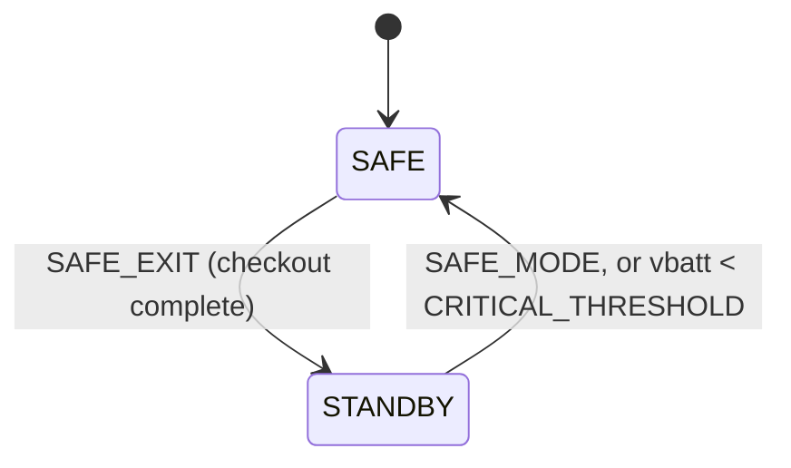
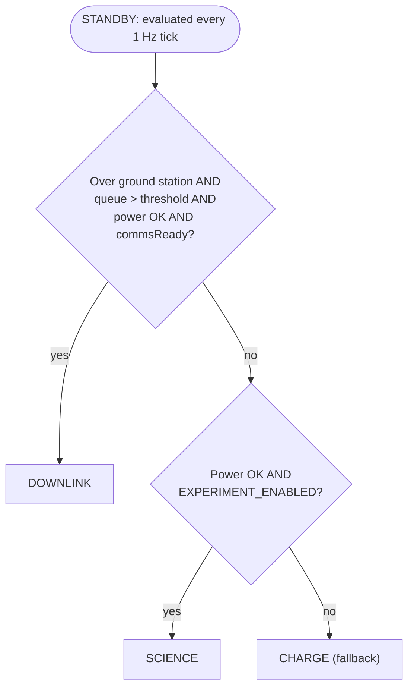

# SatStateMachine SDD

## 1. Overview

`SatStateMachine` is the Layer 4 "Mission Orchestration" component. It is an **Active** component, instantiated at the **top-level topology** since it is not scoped to any single subtopology.
 It evaluates the satellite's top level operating mode (Safe / Standby) and, within Standby, one of three submodes (Downlink / Science / Charge), reevaluated every 1 Hz tick. All condition inputs
arrive precomputed via typed ports from Layer 3 applications.

`SatStateMachine` owns the mode to mode translation table On every mode or submode
transition it is intended to command each Layer 3 application component's own operating
mode via a dedicated typed port. 

## 2. Requirements

| ID | Requirement | Verification |
|----|-------------|---------------|
| HS2-SAT-001 | SatStateMachine shall boot into Safe mode on deploy/reboot | Inspection |
| HS2-SAT-002 | SatStateMachine shall enter Safe mode from any state on ground command `SAFE_MODE` | Inspection |
| HS2-SAT-003 | SatStateMachine shall enter Safe mode from any state when EPS reported battery state of charge falls below `CRITICAL_THRESHOLD`, evaluated each 1 Hz tick | Inspection |
| HS2-SAT-004 | SatStateMachine shall exit Safe mode to Standby only on ground command `SAFE_EXIT`, and only after the `CHECKOUT_COMPLETE` ground command has been received at least once | Inspection |
| HS2-SAT-005 | SatStateMachine shall evaluate the active Standby submode every 1 Hz tick in strict priority order: Downlink, then Science, then Charge (fallback) | Inspection |
| HS2-SAT-006 | SatStateMachine shall log an event on every mode and submode entry and exit | Inspection |
| HS2-SAT-007 | SatStateMachine shall report its current mode, submode, checkout status, and cached condition inputs as telemetry each tick | Inspection |
| HS2-SAT-008 | SatStateMachine shall command each Layer 3 application component's operating mode per its translation table | Inspection |
| HS2-SAT-009 | SatStateMachine shall respond to `Svc.Health` pings | Inspection |
| HS2-SAT-010 | SatStateMachine shall support a `RESET` command that forces reentry to the current top level state's initial substate | Inspection |
| HS2-SAT-011 | SatStateMachine shall not enter the Downlink submode unless `CommsApplication` reports downlink readiness via `commsReadyIn` | Inspection |

---

## 3. Design

### 3.1 Component Type

Active component. Internal `Fw::Sm` state machine with two top level sibling states
(`SAFE`, `STANDBY`), with `STANDBY` containing three submode states
(`DOWNLINK`, `SCIENCE`, `CHARGE`). `schedIn` is driven by `RateGroup2` (1 Hz).

### 3.2 Parameters

| Parameter | Type | Description |
|-----------|------|--------------|
| `POWER_THRESHOLD` | `F32` | Minimum EPS state of charge (%) required for Downlink or Science |
| `EXPERIMENT_ENABLED` | `bool` | Ground set boolean enabling the Science submode |
| `DOWNLINK_QUEUE_THRESHOLD` | `U32` | Minimum downlink queue depth (bytes) required to enter Downlink |
| `CRITICAL_THRESHOLD` | `F32` | Battery state of charge (%) below which Safe mode is forced. |

### 3.3 Ports

| Port | Direction | Type | Purpose |
|------|-----------|------|---------|
| `schedIn` | Input | `Svc.Sched` | RateGroup2 (1 Hz) tick. Drives mode evaluation. |
| `sunEclipseIn` | Input (async) | `Sat.SunEclipseInPort` | In eclipse classification, from sun sensors + GNSS. |
| `orbitStateIn` | Input (async) | `Sat.OrbitStateInPort` | Flag for being over the ground station, from `GnssManager` |
| `downlinkQueueDepthIn` | Input (async) | `Sat.DownlinkQueueDepthInPort` | Current downlink queue depth in bytes, from `ComQueue` |
| `commsReadyIn` | Input (async) | `Sat.CommsReadyInPort` | Downlink readiness/permission flag from `CommsApplication`; gates `DOWNLINK` entry. |
| `powerStateGet` | Output (sync get) | `Sat.PowerStateGetPort` | Pulls the latest power state from `EPSApplication` each tick |
| `pingIn` / `pingOut` | Input / Output | `Svc.Ping` | Health monitoring |
| `adcsModeOut` | Output | `Sat.AdcsModePort` | Mode command to `AdcsApplication` |
| `dataColModeOut` | Output | `Sat.DataColModePort` | Mode command to `DataCollectionApplication` |
| `scienceInferenceModeOut` | Output | `Sat.ScienceInferenceModePort` | Mode command to `ScienceInferenceApplication` |
| `commsModeOut` | Output | `Sat.CommsModePort` | Mode command to `CommsApplication` |
| `thermalModeOut` | Output | `Sat.ThermalModePort` | Mode command to `ThermalApplication` |
| `prmGet` | Output | `Fw.PrmGet` | Load parameters from PrmDb |
| `logOut` | Output | `Fw.Log` | Event logging |
| `tlmOut` | Output | `Fw.Tlm` | Telemetry |

### 3.4 Commands

| Mnemonic | Args | Description |
|----------|------|-------------|
| `SAFE_MODE` | - | Forces immediate transition to Safe mode from any state |
| `SAFE_EXIT` | - | Requests transition from Safe to Standby. This is denied unless checkout has completed |
| `CHECKOUT_COMPLETE` | - | Ground commands subsystem verification and OKs the transition. Once set, never clears, including across later Safe re-entries. |
| `RESET` | - | Forces reentry to the current top level state's initial substate (`SAFE` reenters `SAFE`; any `STANDBY` submode reenters `CHARGE`) |


---

## 4. State Machine

```
SAFE
  entry: log SatModeSafeEntered
  exit:  log SatModeSafeExited
  on tick: cache condition inputs
  on groundCommand(SAFE_MODE): reenter SAFE
  on groundCommand(SAFE_EXIT): enter STANDBY only if checkoutComplete is set,
                                else remain in SAFE
  on reset: reenter SAFE

STANDBY
  initial enter CHARGE
  entry: log SatModeStandbyEntered
  exit:  log SatModeStandbyExited
  on reset: enter CHARGE
  on groundCommand(SAFE_MODE): enter SAFE
  on groundCommand(SAFE_EXIT): ignored (already in STANDBY;
                                does not disrupt the active submode)
  on tick (inherited by all three submodes below):
    cache condition inputs, then evaluate in priority order:
      1. if vbatt SoC < CRITICAL_THRESHOLD                     -> SAFE
      2. else if downlinkConditionMet (over ground station AND
         queue depth > DOWNLINK_QUEUE_THRESHOLD AND power OK
         AND commsReady)                                       -> DOWNLINK
      3. else if scienceConditionMet (power OK AND
         EXPERIMENT_ENABLED)                                   -> SCIENCE
      4. else                                                  -> CHARGE

  DOWNLINK / SCIENCE / CHARGE
    entry: log SatSubmode<Name>Entered + command Layer 3 apps
    exit:  log SatSubmode<Name>Exited
```



**STANDBY submode selection:**



**Mode/submode-to-app translation table** 

| Satellite State | `AdcsApplication` | `DataCollectionApplication` | `ScienceInferenceApplication` | `CommsApplication` | `ThermalApplication` |
|----------------|-------------------|------------------------------|-------------------------------|----------------------|----------------------|
| Safe | Detumble | Off | Off | Beacon | ActiveHeating |
| Standby/Downlink | AntennaPointing | Off | Off | StandardDownlink | NoHeating |
| Standby/Science | EarthLimbPointing | RunExperiment | ProcessImages | Beacon | NoHeating |
| Standby/Charge | SunPointing | Off | Off | Beacon | NoHeating |

---

## 5. Notes

- **Checkout mechanism** (`CHECKOUT_COMPLETE`) is this document's proposed design for an
 unspecified requirement in the top level `sdd.md` §3
- Reference: [FPP flat/hierarchical state machines, choice pseudostates, inherited
  transitions](https://github.com/nasa/fpp/blob/main/docs/users-guide/Defining-State-Machines.adoc)
