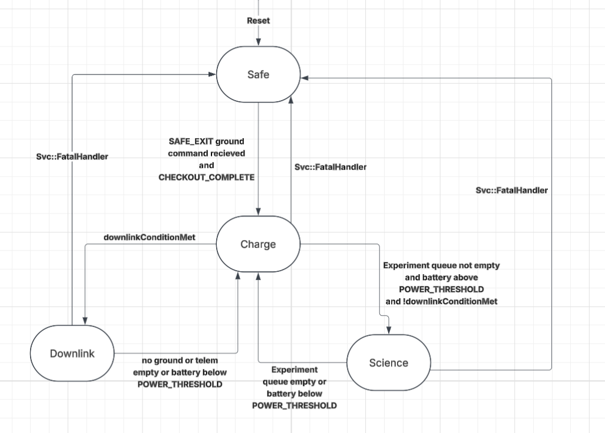

# SatStateMachine SDD

## 1. Overview

`SatStateMachine` is the Layer 4 "Mission Orchestration" component. It is an **Active** component, instantiated at the **top-level topology** since it is not scoped to any single subtopology.
 It evaluates the satellite's top level operating mode among four sibling states, Safe, Downlink, Science, and Charge, reevaluated every 1 Hz tick. All condition inputs
arrive precomputed via typed ports from Layer 3 applications.

`SatStateMachine` owns the mode to mode translation table On every mode
transition it is intended to command each Layer 3 application component's own operating
mode via a dedicated typed port. 

## 2. Requirements

| ID | Requirement | Verification |
|----|-------------|---------------|
| HS2-SAT-001 | SatStateMachine shall boot into Safe mode on deploy/reboot | Inspection |
| HS2-SAT-002 | SatStateMachine shall enter Safe mode from any state on ground command `SAFE_MODE` if `checkoutComplete` is not set, else enter Safe mode | Inspection |
| HS2-SAT-003 | SatStateMachine shall exit Safe to Charge only on ground command `SAFE_EXIT`, and only after the `CHECKOUT_COMPLETE` ground command has been received at least once; otherwise the command is denied and SatStateMachine remains in Safe | Inspection |
| HS2-SAT-004 | SatStateMachine shall evaluate which of Downlink, Science, or Charge to enter every 1 Hz tick while not in Safe mode, in strict priority order: Downlink, then Science, then Charge (fallback) | Inspection |
| HS2-SAT-005 | SatStateMachine shall log an event on every mode entry and exit | Inspection |
| HS2-SAT-006 | SatStateMachine shall report its current mode, checkout status, and cached condition inputs as telemetry each tick | Inspection |
| HS2-SAT-007 | SatStateMachine shall command each Layer 3 application component's operating mode per its translation table | Inspection |
| HS2-SAT-008 | SatStateMachine shall respond to `Svc.Health` pings | Inspection |
| HS2-SAT-009 | SatStateMachine shall support a `RESET` command that forces reentry to `SAFE`. | Inspection |
| HS2-SAT-010 | SatStateMachine shall not enter Downlink unless `ComApplication` reports downlink readiness via `commsReadyIn` | Inspection |
| HS2-SAT-011 | SatStateMachine shall command `AdcsApplication` into `Detumble` on entry to `Safe`, then into `SunPointing` once `DETUMBLE_DURATION_TICKS` ticks have elapsed in `Safe`, checking the persisted `PANELS_DEPLOYED` parameter at that point to determine whether panel deployment is still needed | Inspection |

---

## 3. Design

### 3.1 Component Type

Active component. Internal `Fw::Sm` state machine with four top level sibling states
(`SAFE`, `DOWNLINK`, `SCIENCE`, `CHARGE`). `schedIn` is driven by `RateGroup2` (1 Hz).

### 3.2 Parameters

| Parameter | Type | Description |
|-----------|------|--------------|
| `POWER_THRESHOLD` | `F32` | Minimum EPS state of charge (%) required for Downlink or Science |
| `EXPERIMENT_ENABLED` | `bool` | Ground set boolean enabling Science |
| `DOWNLINK_QUEUE_THRESHOLD` | `U32` | Minimum downlink queue depth (bytes) required to enter Downlink |
| `DETUMBLE_DURATION_TICKS` | `U32` | Ticks after entering `Safe` before commanding `AdcsApplication` from `Detumble` to `SunPointing`. |
| `PANELS_DEPLOYED` | `bool` | Set once solar panel deployment has completed. Read by `SatStateMachine` at the `DETUMBLE_DURATION_TICKS` boundary to determine whether deployment is still needed, so a completed deployment is not requested again. |

### 3.3 Ports

| Port | Direction | Type | Purpose |
|------|-----------|------|---------|
| `schedIn` | Input | `Svc.Sched` | RateGroup2 (1 Hz) tick. Drives mode evaluation. |
| `orbitStateIn` | Input (async) | `Sat.OrbitStateInPort` | Flag for being over the ground station, from `GnssManager` |
| `downlinkQueueDepthIn` | Input (async) | `Sat.DownlinkQueueDepthInPort` | Current downlink queue depth in bytes, from `ComQueue` |
| `commsReadyIn` | Input (async) | `Sat.CommsReadyInPort` | Downlink readiness/permission flag from `ComApplication`; gates `DOWNLINK` entry. |
| `powerStateGet` | Output (sync get) | `Sat.PowerStateGetPort` | Pulls the latest power state from `EPSApplication` each tick |
| `pingIn` / `pingOut` | Input / Output | `Svc.Ping` | Health monitoring |
| `adcsModeOut` | Output | `Sat.AdcsModePort` | Mode command to `AdcsApplication` |
| `dataColModeOut` | Output | `Sat.DataColModePort` | Mode command to `DataCollectionApplication` |
| `scienceInferenceModeOut` | Output | `Sat.ScienceInferenceModePort` | Mode command to `ScienceInferenceApplication` |
| `commsModeOut` | Output | `Sat.CommsModePort` | Mode command to `ComApplication` |
| `thermalModeOut` | Output | `Sat.ThermalModePort` | Mode command to `ThermalApplication` |
| `prmGet` | Output | `Fw.PrmGet` | Load parameters from PrmDb |
| `logOut` | Output | `Fw.Log` | Event logging |
| `tlmOut` | Output | `Fw.Tlm` | Telemetry |

### 3.4 Commands

| Command Name | Parameters | Description | Postcondition |
|--------------|------------|-------------|----------------|
| `SAFE_MODE` | — | Forces immediate transition to `SAFE` from any state | `SatStateMachine` is in `SAFE`; `AdcsApplication` commanded into `Detumble` |
| `SAFE_EXIT` | — | Requests transition to Charge | If `checkoutComplete` is set transitions to `CHARGE`. Otherwise denied, remains in `SAFE` |
| `CHECKOUT_COMPLETE` | — | Ground commands subsystem verification and OKs the transition | `checkoutComplete` latch is set |
| `RESET` | — | Forces reentry to `SAFE` | `SatStateMachine` is in `SAFE`; `detumbleTickCounter` reset to 0 |


---

## 4. State Machine



**Diagram terms:**

| Term | Meaning |
|---|---|
| `SAFE_EXIT` ground command received and `CHECKOUT_COMPLETE` | The `SAFE_EXIT` command is only honored once the `CHECKOUT_COMPLETE` ground command has latched the `checkoutComplete` flag. |
| `downlinkConditionMet` | True when all of: over the ground station (`orbitStateIn`), downlink queue depth above `DOWNLINK_QUEUE_THRESHOLD` (`downlinkQueueDepthIn`), state of charge above `POWER_THRESHOLD`, and `ComApplication` reports link readiness (`commsReadyIn`). |
| `POWER_THRESHOLD` | EPS state of charge parameter "Battery ok" / "battery above `POWER_THRESHOLD`" means the last `powerStateGet` reading is above this value. |
| `Experiment queue not empty` | Depth of the pending-experiment queue. |

`SAFE`, `DOWNLINK`, `SCIENCE`, and `CHARGE` are flat top-level sibling states. `SAFE` is the plain safe state, reached from `DOWNLINK`/`SCIENCE`/`CHARGE` on the `SAFE_MODE` ground command, on startup, or after any reset. The 1 Hz priority evaluation is defined identically on `DOWNLINK`, `SCIENCE`, and `CHARGE`; `SAFE` does not run it.

```

SAFE
  entry: log SatModeSafeEntered
         reset detumbleTickCounter to 0
         command AdcsApplication Detumble
  exit:  log SatModeSafeExited
  on tick: cache condition inputs
           increment detumbleTickCounter
           if detumbleTickCounter == DETUMBLE_DURATION_TICKS:
             command AdcsApplication SunPointing
             if PANELS_DEPLOYED parameter is not set: flag panel deployment
               as still required
  on groundCommand(SAFE_MODE): reenter SAFE
  on groundCommand(SAFE_EXIT): enter CHARGE only if checkoutComplete is set,
                                else remain in SAFE
  on reset: reenter SAFE

DOWNLINK / SCIENCE / CHARGE
  entry: log SatMode<Name>Entered + command Layer 3 apps
  exit:  log SatMode<Name>Exited
  on groundCommand(SAFE_MODE): enter SAFE
  on groundCommand(SAFE_EXIT): ignored (already out of Safe;
                                does not disrupt the active mode)
  on reset: enter CHARGE
  on tick (defined identically on all three):
    cache condition inputs, then evaluate in priority order:
      1. if downlinkConditionMet (over ground station AND
         queue depth > DOWNLINK_QUEUE_THRESHOLD AND power OK
         AND commsReady)                                       -> DOWNLINK
      2. else if scienceConditionMet (power OK AND
         EXPERIMENT_ENABLED)                                   -> SCIENCE
      3. else                                                  -> CHARGE
    (low power alone never forces SAFE; it just fails the "power OK"
     clause above and falls through to CHARGE)
    (no-op, no exit/re-entry logged, if the winning state is the
     one already active)
```

**Mode to app translation table**
| Mode | Safe | Downlink | Science | Charge |
|---|---|---|---|---|
| `AdcsApplication` | Detumble | AntennaPointing | EarthLimbPointing | SunPointing |
| `DataCollectionApplication` | Off | Off | RunExperiment | Off |
| `ScienceInferenceApplication` | Off | Off | ProcessImages | Off |
| `ComApplication` | Beacon | StandardDownlink | Beacon | Beacon |
| `ThermalApplication` | NoHeating | ActiveHeating | ActiveHeating | ActiveHeating |

---


**Hardware in each Mode**
| Mode | Safe | Charge | Downlink | Science |
|---|---|---|---|---|
| ADCS |   |   |   |   |
| IMMU | 1 | 1 | 1 | 1 |
| SunSensor | 1 | 1 | 1 | 1 |
| Magnetorquer | 1 | 1 | 1 | 1 |
| StarTracker | 0 | 0 | 1 | 1 |
| Payload |   |   |   |   |
| GNSS | 0 | 0 | 0 | 1 |
| LOST Camera | 0 | 0 | 0 | 1 |
| FOUND Camera | 0 | 0 | 0 | 1 |
| Comms |   |   |   |   |
| Endurosat Radio | Beacon | Beacon | Downlink | Beacon |
| EPS |   |   |   |   |
| Current Sensors | 1 | 1 | 1 | 1 |
| Panel Deploy | 1* | 0 | 0 | 0 |
| Battery | 1 | 1 | 1 | 1 |
| Thermal |   |   |   |   |
| Temperature Sensors | 1 | 1 | 1 | 1 |
| Heaters | 0 | 1 | 1 | 1 |

---

'*' indicates that the panel deployment is not always on in safe mode but that that is the only time that could happen 
## 5. Notes

- Reference: [FPP flat/hierarchical state machines, choice pseudostates, inherited
  transitions](https://github.com/nasa/fpp/blob/main/docs/users-guide/Defining-State-Machines.adoc)
