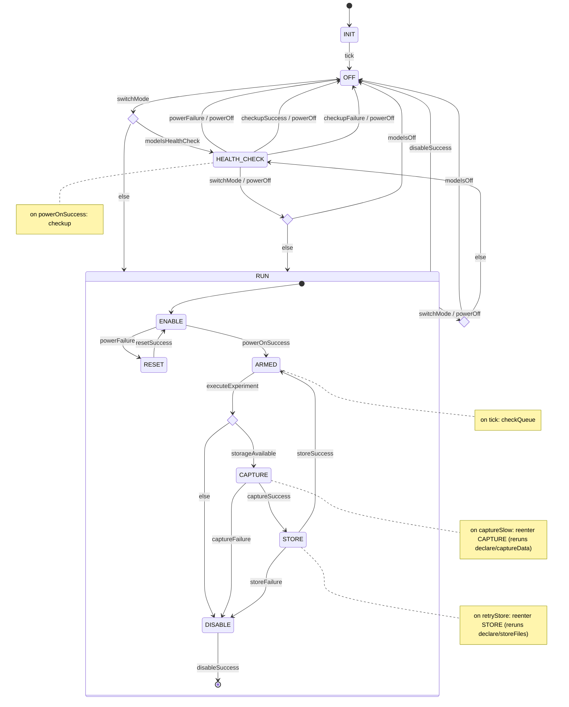

# DataCollection::DataCollectionApplication

`DataCollectionApplication` is the Layer 3 active component for the DataCollection subtopology.
Every image capture is a ground-commanded event: ground sends `RUN_EXPERIMENT` with a complete set
of experiment parameters, and the component powers on the cameras, captures LOST/FOUND imagery
together with attitude and position, writes the results into Science's image partition, and powers
everything back off. There is no autonomous or scheduled capture — entering `RunExperiment` mode
by itself does nothing; a capture happens if and only if ground sends `RUN_EXPERIMENT`.

It coordinates `lostCameraManager` and `foundCameraManager` — two instances of the same
`DataCollection.CameraManager` component, distinguished only by instance name/config, not by
type — within its subtopology, and consumes attitude from `StarTrackerManager` and position from
`GnssManager` (both top-level).

## Introduction

The component is driven by two synchronous input ports:

- `schedIn` (`Svc.Sched`) — a rate-group tick, used only for `pingIn`/`pingOut` liveness and (in
  `HealthCheck`) polling camera status; it never initiates a capture on its own.
- `modeIn` (`DataCollection.DataColModePort`, carrying `Types.DataColMode`) — mode commands from
  `SatStateMachine`. `Off` holds the component idle; `HealthCheck` runs a one-shot camera
  power/verify cycle; `Experiment` (the state machine's own top-level state for this mode is named
  `RUN`) is meant to arm the component to accept `RUN_EXPERIMENT` commands without capturing
  anything by itself — see the State Machine section for where the current `.fpp` doesn't yet fully
  achieve that.

**Every picture is commanded by ground, not scheduled or triggered automatically.** The original
design had `DataCollectionApplication` pull experiment parameters from `PrmDb` and treated
`RUN_EXPERIMENT` as a manual override of an implicit, mode-driven capture. That's gone: `PrmDb` may
still hold *default* parameter values ground can inspect, but nothing is read from it
automatically, and switching into `RunExperiment` mode never by itself takes a picture. The only
way an image is captured is `RUN_EXPERIMENT`, which carries the full parameter set (experiment ID,
target `Types.ImageType`, which camera(s) to use, exposure/gain if applicable) as command
arguments — the same command exists for both "the normal way to run an experiment" and "a ground
override," because under this design there is no other way, ever. This mirrors
`Science::ScienceApplication`'s own model, where ground explicitly configures *what* runs
(`SET_ALGORITHM`/`SET_ALGORITHM_PRESET`) rather than the component autonomously deciding to
process images.

**There is no flash/Data-Products storage component, and `Fw.Dp` isn't a usable generic
request/response port family in this F´ version** (see `Science::ScienceApplication`'s SDD, Open
Items) — `Fw.Dp*` is a family of specific ports tied to a `DpManager`/`DpCatalog` pair, and no such
pair is wired up for DataCollection. So, like `ScienceApplication`, this component talks to disk
directly via `Os::Directory`/`Os::File`/`Os::FileSystem` rather than through `Fw.Dp` ports:

- **Captured images are written directly into Science's image partition**, at
  `<imagePartitionDir>/<ImageType>/<prefix><fileName>` — the same directory layout, `fileName`
  derivation (`time`/`date` from the experiment, `:` replaced with `-`, joined with `_`), and
  `"L_"`/`"F_"` camera-prefix convention `Science::ScienceApplication` reads. `DataCollectionApplication`
  is the writer side of that convention; `ScienceApplication` is the reader side. `imagePartitionDir`
  is a component parameter, matching `ScienceApplication`'s, so both point at the same mount point
  in a real deployment (or the same scratch directory in tests).
- **`DataCollectionApplication` is "whatever onboard process logs imaging opportunities"**
  that `ScienceApplication`'s SDD names as out of scope for itself: on a successful capture, it
  appends one row to `<imagePartitionDir>/experiments.csv` (`time, date, positionKnown, position,
  attitude, availableImageTypes`), the same manifest `ScienceApplication` scans. This is the
  hand-off between the two subtopologies — there is no separate port or storage-query call, since
  the manifest file *is* the interface, exactly as it is for `ScienceApplication`'s own algorithm
  chains.
- **Attitude is read via a synchronous get port** (not `Fw.Dp`) from `StarTrackerManager` at
  capture time, formatted as the `"x:y:z:w"` quaternion text `ScienceApplication` already parses
  for its `SATELLITE_ATTITUDE` fallback value.
- **Position is read via a synchronous get port from `GnssManager` returning `Types.GnssFixData`**
  (PR #25, `hs2-software-design`/`HS2-CDH`) — not a bare `"x:y:z"` text value. `GnssFixData` carries
  ECEF position (`posXM`/`posYM`/`posZM: F64`, meters) and velocity, `gpsTimeS`/`gpsWeek`,
  `numSatsUsed`, `pdop`, a `GnssFixClass` (`INVALID`/`AUTONOMOUS`/`DROP_ESTIMATED`, derived from the
  receiver's GGA fix quality and GLL/RMC/VTG status letter), its own `valid: bool`
  (`false` iff `fixClass == INVALID`), and a cache `timestamp`. `DataCollectionApplication` derives
  the row's `positionKnown` from `GnssFixData.valid` (**not** always `true` as an earlier draft of
  this SDD implied) and, only when known, formats `position` as `"<posXM>:<posYM>:<posZM>"` —
  ECEF meters, matching `SATELLITE_ATTITUDE`'s `":"`-joined convention but *not* the same
  coordinate frame as attitude (ECEF vs. body/inertial quaternion) — `fixClass ==
  DROP_ESTIMATED` (dead-reckoned, no live satellite fix) is still `valid`, so a
  DROP-estimated position is logged as known, distinguished from `AUTONOMOUS` only via telemetry,
  not via the `experiments.csv` row itself.
- **`storageQuery` checks free space on the image-partition mount directly**
  (`Os::FileSystem::getFreeSpace` on `imagePartitionDir`) rather than querying a separate flash
  component that doesn't exist.

**The satellite's two cameras are LOST and FOUND**, matching `Types.Camera`'s `LOST`/`FOUND`
values — `Camera1Manager`/`Camera2Manager` are renamed to instance names `lostCameraManager`/
`foundCameraManager` of a single `DataCollection.CameraManager` component (there is one camera
manager implementation, instantiated twice with different config — a driver/mounting-orientation
identity, not two different components), so the camera identity is explicit rather than
positional, and so a captured image's filename prefix falls directly out of which instance
produced it (no separate mapping table to keep in sync with `Types.Camera`).

`pingIn`/`pingOut` provide the standard health-monitoring round trip.

## Requirements

| ID | Requirement | Verification |
|----|-------------|-------------|
| HS2-DCA-001 | DataCollectionApplication shall capture data only in response to a ground-issued `RUN_EXPERIMENT` command, using that command's own arguments — never automatically or on a schedule | Inspection |
| HS2-DCA-002 | DataCollectionApplication shall power on both cameras prior to a commanded experiment | Inspection |
| HS2-DCA-003 | DataCollectionApplication shall perform a health check on both cameras before running an experiment and reject the command with `WARNING_HI` if any check fails | Inspection |
| HS2-DCA-004 | DataCollectionApplication shall simultaneously acquire images, attitude, and position within 10ms of each other | Inspection |
| HS2-DCA-005 | DataCollectionApplication shall write each captured image into Science's image partition under its `Types.ImageType`/camera-prefix path, and append one row describing the opportunity to `experiments.csv` | Inspection |
| HS2-DCA-006 | DataCollectionApplication shall reject a `RUN_EXPERIMENT` command with `WARNING_HI` and take no images if the image-partition mount is at or above its configured full threshold | Inspection |
| HS2-DCA-007 | DataCollectionApplication shall power off both cameras upon experiment completion or error | Inspection |
| HS2-DCA-008 | DataCollectionApplication shall report experiment success or failure upon completion | Inspection |
| HS2-DCA-009 | DataCollectionApplication shall switch operating mode on command from SatStateMachine, and entering `RunExperiment` mode shall not, by itself, capture anything | Inspection |
| HS2-DCA-010 | DataCollectionApplication shall respond to health ping within the required deadline | Inspection |

---

## Design

### Component Type

Active component with an internal hierarchical F' state machine (`Fw::Sm`), matching the original
design's structure; see State Machine below for what changed.

### Mode Interface

`DataCollectionApplication` receives its operating mode from `SatStateMachine` via a typed port:

```fpp
sync input port modeIn: DataCollection.DataColModePort   # carries Types.DataColMode
```

Mode enum, as actually defined in `FlightComputer/Types/DataCollection/DataCollectionTypes.fpp`:

```fpp
module Types {
    enum DataColMode { Off, HealthCheck, Experiment }
}
```

(Note the third value is `Experiment`, not `RunExperiment` — an earlier draft of this SDD used the
latter name before the real type existed; the state machine's own top-level mode state is still
called `RUN` — see State Machine below.)

If the incoming mode matches the current mode, the handler returns immediately (idempotent).
Entering `RUN` mode is still meant as an *arming* transition, not an action in itself — see the
State Machine section below for how the actual scaffolded state machine currently handles (and, in
one respect, doesn't cleanly handle) that distinction.

### Ports

All types referenced below (`Camera`, `ImageType`, `CameraStatus`, `GnssFixData`, `GnssFixClass`,
`DataColMode`, `StorageStatus`) live in `Types` (`FlightComputer/Types/DataCollection/
DataCollectionTypes.fpp`) — a single shared module, not separate `Science`/`Gnss` modules as
earlier drafts of this SDD assumed before any of this was real.

| Port | Direction | Type | Purpose |
|------|-----------|------|---------|
| `modeIn` | Input | `DataCollection.DataColModePort` | Mode command from SatStateMachine, carrying `Types.DataColMode`. |
| `schedIn` | Input | `Svc.Sched` | Rate group tick; drives `pingIn`/`pingOut` and the state machine's own `tick` signal (`INIT`→`OFF`, and — while in `RUN_ARMED` — draining the experiment queue; see State Machine). |
| `cameraPower[2]` | Output | `DataCollection.CameraPower(camera, powerOn) -> Types.CameraStatus` | Power `lostCameraManager`/`foundCameraManager` (port index 0/1) on or off. Stub: `CameraManager` doesn't exist yet (see Open Items), but the port itself is real and wired into the state machine's `powerOn`/`powerOff` actions. |
| `cameraCheckup[2]` | Output | `DataCollection.CameraCheckup(camera) -> Types.CameraStatus` | Per-camera health check, used by `HealthCheck` mode's `checkup` action. Same stub caveat as `cameraPower`. |
| `cameraCapture[2]` | Output | `DataCollection.CameraCapture(camera, imageType) -> Types.CameraStatus` | Triggers one camera's capture of the current experiment's `imageType`. Same stub caveat. |
| `positionGet` | Output | `DataCollection.GnssFixGet() -> Types.GnssFixData` | Requests the cached GNSS fix (ECEF position/velocity, `GnssFixClass`, `valid`, `numSatsUsed`, `pdop`, GPS time — see Introduction). Stub: `Types.GnssFixData`/`GnssFixClass` are a field-for-field mirror of the GNSS branch's real `Payload.GnssFixData`/`GnssFixClass` (`em-gnss-pr`, not yet merged), so the port itself is real and only needs a topology connection once `GnssManager` exists in this branch. |
| `attitudeGet` | Output | `DataCollection.AttitudeGet() -> Types.Quaternion` | Requests the current estimated attitude quaternion. Stub: `Types.Quaternion` mirrors the ADCS branches' real `Adcs.Quaternion` (`ellie-ADCS`/`senuka/ADCS`, not yet merged) field-for-field, matching `AttitudeFilter`'s `estimatedAttitudeGet` port shape — only needs a topology connection once one of those branches merges. |
| `pingIn` / `pingOut` | In/Out | `Svc.Ping` | Health monitoring. |
| `logOut` | Output | `Fw.Log` | Event logging. |
| `tlmOut` | Output | `Fw.Tlm` | Telemetry (experiment state, storage status). |

`attitudeGet` now exists (see table above): the ADCS branches' `AttitudeFilter` component defines a
real `estimatedAttitudeGet: Adcs.AttitudePort -> Adcs.Quaternion` port, so — unlike when this section
previously said inventing an attitude port shape would just be a guess — there's now a real shape to
mirror. `action_captureData` still doesn't call it yet (see State Machine, Open Items).
`storageQuery`/`imageWrite`/`prmGet` from the original design remain removed: there's no
flash/Data-Products component or `PrmDb`-driven trigger to talk to (see Introduction) — free-space
checking and image writes are meant to go directly against the image-partition filesystem rather
than through a port, though the free-space check itself (`storageAvailable`) is still stubbed (see
Open Items). The shared `imagePartitionDir` param (see Introduction) is the actual integration point
with `Science::ScienceApplication` — a directory convention, not a port.

### Commands

| Mnemonic | Args | Description |
|----------|------|-------------|
| `RUN_EXPERIMENT` | `expId: U8`, `imageTypeCode: Types.ImageType`, `cameraCode: Types.Camera` | The only way a capture happens. If the state machine is `RUN_ARMED`, starts immediately; if an experiment is already in flight, queued instead (see Queueing below); otherwise rejected with `VALIDATION_ERROR`. |

There is deliberately only one command surface for taking a picture. The original design's framing
of `RUN_EXPERIMENT` as a "ground override" implied a second, non-ground-commanded path into the
same capture sequence (an implicit per-mode trigger driven by `PrmDb` parameters); removing that
path means `RUN_EXPERIMENT` is simply *the* command, not an override of anything.

#### Queueing

If `RUN_EXPERIMENT` arrives while a *different* experiment is already in flight (any of
`RUN_RESET`/`RUN_ENABLE`/`RUN_CAPTURE`/`RUN_STORE`/`RUN_DISABLE`), it's appended to a fixed-size
FIFO (`MAX_QUEUED_EXPERIMENTS`, currently 4) instead of being rejected — logged (`ExperimentQueued`,
carrying the resulting queue depth) and telemetered (`QueuedExperiments`), and the command still
responds `OK`. Only two things get `VALIDATION_ERROR`: the queue is already full
(`ExperimentQueueFull`), or the state machine isn't in `Experiment` mode at all
(`ExperimentRejectedNotArmed`) — queuing in that case would accept a command nothing will ever
drain. Every rate-group tick spent in `RUN_ARMED`, the state machine's `checkQueue` action checks
the front of the queue and, if non-empty, dequeues and starts it automatically — no further ground
command needed. The queue is cleared whenever the state machine leaves `RUN` mode entirely (a
`switchMode` to `Off`/`HealthCheck`, or a `powerFailure` during `HEALTH_CHECK`/`RUN_ENABLE`... only
the former actually drops queued entries, since `RUN_ENABLE`'s `powerFailure` stays inside `RUN`,
retrying via `RESET`) — nothing outside `RUN` mode will ever drain it. A queued experiment dropped
this way is not itself reported as failed; see Open Items.

**`RUN_EXPERIMENT` while one is already in flight is queued, not rejected.** If the state machine is
in `RUN_ARMED`, the command starts immediately (stashes its arguments, logs `ExperimentStarted`,
signals `executeExperiment`) exactly as before. If it arrives while a *different* experiment is
already in flight (any of `RUN_RESET`/`RUN_ENABLE`/`RUN_CAPTURE`/`RUN_STORE`/`RUN_DISABLE`), it's
appended to a fixed-size FIFO (`MAX_QUEUED_EXPERIMENTS`, currently 4) instead — logged
(`ExperimentQueued`, carrying the resulting queue depth) and telemetered
(`QueuedExperiments`), and the command still responds `OK` (it was accepted, just not started yet).
Only two things still get an outright `VALIDATION_ERROR`: the queue is already full
(`ExperimentQueueFull`), or the state machine isn't in `Experiment` mode at all
(`ExperimentRejectedNotArmed`) — queuing in that case would just accept a command nothing will ever
drain. The queued command's identity (`expId`) is preserved from ground's own numbering — this
component doesn't renumber or coalesce queued experiments.

Every time the state machine (re-)enters `RUN_ARMED` — after `STORE` succeeds, or after the initial
`ENABLE` — the front of the queue, if non-empty, is dequeued and started automatically the same way
a fresh `RUN_EXPERIMENT` would be, without waiting for another ground command. The queue is cleared
whenever the state machine leaves `RUN` mode entirely (a `switchMode` to `Off`/`HealthCheck`,
whether ground-commanded or already mid-flight): nothing outside `RUN` mode will ever drain it, and
silently starting a stale queued experiment on some unrelated future re-entry into `RUN` would be
surprising. A queued experiment that's dropped this way is not itself reported as failed (it never
started, so `ExperimentFailed`/`ExperimentsFailed` don't apply) — there is currently no dedicated
event for "queued experiment discarded by a mode switch"; see Open Items.

---

## State Machine

This section transcribes the actual scaffolded state machine,
`DataCollectionApplicationStateMachine_t` (`DataCollectionApplicationStateMachine.fpp`), rather
than the earlier `RESET`/`ENABLE`/`CONFIGURE`/`RUN`-per-mode design this SDD previously described.
It's a hierarchical F' state machine: `INIT`/`OFF`/`HEALTH_CHECK`/`RUN` are top-level states, `RUN`
has its own nested substates, and every state's `entry` re-runs `declare` (a bookkeeping action
common to every state, omitted from the per-state notes below for brevity).



```
[*] --> INIT
INIT --> OFF : tick

OFF
  entry: declare
  on switchMode --> OFF_SWITCH_MODE (choice)
    if modeIsHealthCheck --> HEALTH_CHECK
    else                 --> RUN          (only remaining mode is Experiment)

HEALTH_CHECK
  entry: powerOn                          (no `checkup` here anymore - see below)
  on powerOnSuccess: checkup              (internal - stays in HEALTH_CHECK)
  on powerFailure:   powerOff, --> OFF
  on checkupSuccess: powerOff, --> OFF
  on checkupFailure: powerOff, --> OFF
  on switchMode:     powerOff, --> HEALTH_CHECK_SWITCH_MODE (choice)
    if modeIsOff --> OFF
    else         --> RUN                  (only remaining mode is Experiment)

RUN
  initial --> ENABLE
  on switchMode: powerOff, --> RUN_SWITCH_MODE (choice)   [inherited by every substate below]
    if modeIsOff --> OFF                                   (leaves RUN entirely)
    else         --> HEALTH_CHECK                          (only remaining mode is HealthCheck)

  RESET
    entry: powerOff
    on resetSuccess --> ENABLE

  ENABLE
    entry: powerOn
    on powerOnSuccess --> ARMED
    on powerFailure   --> RESET

  ARMED
    entry: (none beyond declare)
    on tick               do checkQueue    (see Commands, Queueing - dequeues
                                             and starts a queued experiment,
                                             if any; otherwise a no-op)
    on executeExperiment --> STORAGE_CHECK

  STORAGE_CHECK (choice)
    if storageAvailable --> CAPTURE
    else                --> DISABLE

  CAPTURE
    entry: captureData
    on captureSuccess --> STORE
    on captureSlow    --> CAPTURE   (retry in place)
    on captureFailure --> DISABLE

  STORE
    entry: storeFiles
    on retryStore   --> STORE        (retry in place)
    on storeSuccess --> ARMED
    on storeFailure --> DISABLE

  DISABLE
    entry: declare (logs ExperimentFailed - see Actions below), powerOff
    on disableSuccess --> OFF        (leaves RUN entirely)
```

### Actions and signals

| Action | Meaning |
|---|---|
| `declare` | Runs on every state's `entry`. Telemeters/logs the newly-entered state (`State`/`SmStateChanged`), read from `getState()` directly rather than inferred from the triggering signal (unlike the equivalent action in `Thermal::HeaterManager`/`Thermal::TemperatureSensorManager`/`Adcs::IMMUManager`, that inference is unsafe here since e.g. `switchMode` alone can lead to three different states via a downstream choice pseudostate's guard). Additionally, on `RUN_DISABLE`'s entry specifically, logs/telemeters the just-abandoned experiment (`ExperimentFailed`) — the one point every path into `DISABLE` passes through exactly once. |
| `powerOn` / `powerOff` | Power both cameras on/off via `cameraPower_out` (port index 0 = LOST, 1 = FOUND). `powerOn` signals `powerOnSuccess`/`powerFailure` based on the returned `Types.CameraStatus`; `powerOff` doesn't gate on the result (no state in this machine represents "couldn't power off"). |
| `checkup` | Per-camera health check via `cameraCheckup_out` (HS2-DCA-003). Both cameras are always checked, never short-circuited on the first failure. Logs `CameraCheckupFailed` (once per failing camera) and signals `checkupFailure` if either camera reports `Types.CameraStatus.ERROR`; signals `checkupSuccess` only if both report `OK`. |
| `captureData` | Triggers LOST/FOUND capture via `cameraCapture_out` and reads the cached GNSS fix via `positionGet_out` (cached in `m_lastFix` for `storeFiles`); signals `captureSuccess`/`captureFailure` based on the cameras' returned status. Doesn't yet read attitude or enforce the 10ms window (HS2-DCA-004) — see Open Items. |
| `checkQueue` | `RUN_ARMED`-only (see State Machine diagram); on every `tick` spent there, dequeues and starts the front of the experiment queue if non-empty. See Commands, Queueing. |
| `storeFiles` | Writes both images into the image partition and appends the `experiments.csv` row (HS2-DCA-005); logs/telemeters `ExperimentCompleted` and signals `storeSuccess`. |

| Signal | Carries | Meaning |
|---|---|---|
| `switchMode` | `Types.DataColMode` | Mode command from `SatStateMachine`, via `modeIn`. |
| `tick` | — | `schedIn` rate-group tick. |
| `powerOnSuccess` / `powerFailure` | — | Result of `powerOn`. |
| `checkupSuccess` | — | Result of `checkup`: both cameras reported OK. |
| `checkupFailure` | — | Result of `checkup`: at least one camera reported `Types.CameraStatus.ERROR` (HS2-DCA-003). Routed to `OFF`, same as `powerFailure`. |
| `resetSuccess` | — | `RESET`'s `powerOff` finished; ready to try `ENABLE` again. |
| `executeExperiment` | — | Ground's `RUN_EXPERIMENT` command, dispatched to the state machine while in `ARMED` (directly, or via `checkQueue` for a queued one). |
| `captureSuccess` / `captureFailure` | — | Result of `captureData`. |
| `captureSlow` | — | Reserved for a future "missed the 10ms window, retry" path; nothing currently sends it (`captureData` doesn't measure timing yet — see Open Items). |
| `retryStore` | — | Reserved for a future retryable-`storeFiles`-failure path; nothing currently sends it. |
| `storeSuccess` | — | `storeFiles` succeeded; returns to `ARMED`. |
| `storeFailure` | `Types.StorageStatus` (`OK`/`STORAGE_FULL`/`WRITE_ERROR`/`OTHER`) | Reserved for a real `storeFiles` failure path; not yet sent by the stub implementation. |
| `disableSuccess` | — | `DISABLE`'s `powerOff` finished; both cameras confirmed off. |

| Guard | Meaning |
|---|---|
| `storageAvailable` | True if the image partition has room for another experiment's images; evaluated by `STORAGE_CHECK` before `CAPTURE` ever runs. Stubbed `true` — see Open Items. |
| `modeIsOff` / `modeIsHealthCheck` | Typed `Types.DataColMode`, evaluated against `switchMode`'s carried value; route `OFF_SWITCH_MODE`/`RUN_SWITCH_MODE`/`HEALTH_CHECK_SWITCH_MODE` to the requested mode (see Notes below). |

### Notes on this revision

- **`OFF` and `RUN` now actually act on `switchMode`.** Both previously had no `on switchMode`
  handler at all (`OFF` had none; `RUN`'s substates individually had none either, so a mode switch
  mid-experiment was unhandled). Each now routes through a `choice` pseudostate
  (`OFF_SWITCH_MODE`/`RUN_SWITCH_MODE`) guarded on the signal's carried `Types.DataColMode` value:
  `OFF` goes to `HEALTH_CHECK` or `RUN` depending on what was asked for; `RUN`'s handler is declared
  once at `RUN`'s own level (not per-substate) and is inherited by every nested substate — including
  mid-capture ones like `CAPTURE`/`STORE` — so a mode switch away from `Experiment` runs `powerOff`
  and leaves `RUN` for `OFF` or `HEALTH_CHECK` from wherever the machine currently is. Each choice is
  a **binary** decision (one guard, one `else`), not a three-way switch on all of `Types.DataColMode`
  — see the next bullet for why that's sufficient rather than a shortcut. FPP does not allow two
  separate `on switchMode if <guard>` clauses for the same signal in one state (confirmed: this
  produces `error: duplicate use of signal switchMode`), so the guard-and-`choice` pattern used for
  `STORAGE_CHECK` is reused here for the same structural reason, not by choice of style.
- **The binary choice relies on `modeIn`'s dispatch already being idempotent.** Per this SDD's Mode
  Interface section, "if the incoming mode matches the current mode, the handler returns
  immediately" — so `OFF` only ever receives `switchMode` carrying `HealthCheck` or `Experiment`
  (never `Off`, since it's already there), and `RUN` only ever receives `Off` or `HealthCheck`
  (never `Experiment`). That leaves exactly one guard's worth of ambiguity to resolve at each site
  (`modeIsHealthCheck` in `OFF`'s case, `modeIsOff` in `RUN`'s), with the `else` branch soundly
  covering the one remaining possibility — rather than needing a three-armed guard chain (which FPP
  would in any case require expressing as *chained* choices, since a `choice`'s own branches are
  binary `if`/`else`, not `if`/`else if`/`else`). If that idempotency guarantee ever changes (e.g., a
  future `modeIn_handler` starts resignaling the current mode), these two-way choices would need a
  third arm to stay correct.
- **`HEALTH_CHECK`'s `switchMode` now also routes via a choice** (`HEALTH_CHECK_SWITCH_MODE`),
  resolving the asymmetry an earlier draft of this SDD flagged here: a mode switch from
  `HEALTH_CHECK` straight to `Experiment` now goes directly to `RUN` instead of detouring through
  `OFF` first.
- **`HEALTH_CHECK` no longer runs `checkup` unconditionally in its entry sequence.** It's now gated
  behind `powerOnSuccess` (`on powerOnSuccess do { checkup }`, an internal transition that stays in
  `HEALTH_CHECK`), and a real `powerFailure` now has its own path (`on powerFailure do { powerOff }
  enter OFF`) instead of being silently ignored — the earlier `entry do { declare, powerOn, checkup
  }` ran `checkup` regardless of whether `powerOn` actually succeeded.
- **`STORAGE_CHECK` moves the storage-full check ahead of `CAPTURE`.** `ARMED`'s
  `executeExperiment` now enters the `STORAGE_CHECK` choice pseudostate rather than `CAPTURE`
  directly; only when the `storageAvailable` guard passes does it proceed to `CAPTURE`, otherwise it
  goes straight to `DISABLE` without powering the cameras into a capture. This makes HS2-DCA-006
  ("reject... and take no images if... full") true as stated — a full partition is now caught
  *before* anything is captured, not discovered afterward when `storeFiles` runs. The `choice`
  construct (`choice C { if g enter S5 else enter S6 }`) and the `guard` construct it depends on are
  standard FPP state-machine features (see `fprime`'s `FppTest/state_machine/internal/state`
  examples, `StateToChoice`/`BasicGuard`) — nothing new introduced here.
- **`STORE`'s failure transition now names the signal that's actually declared.** `on storeError
  enter DISABLE` is now `on storeFailure enter DISABLE`, matching `signal storeFailure:
  Types.StorageStatus` — previously `storeFiles`'s failure signal had no handler at all.
- **`DISABLE` now transitions to `OFF` on `disableSuccess`.** `disableSuccess` was already declared
  in the `.fpp` but unused; wiring `on disableSuccess enter OFF` inside `DISABLE` gives it a
  purpose and turns `DISABLE` from a dead end into a real terminal path: once both cameras are
  confirmed off, the machine falls all the way out of `RUN` back to `OFF`. This is a cross-hierarchy
  transition — `DISABLE` is nested two levels inside `RUN`, while `OFF` is a top-level sibling of
  `RUN` — which is valid FPP: a transition's `enter` target can name any state in the machine
  regardless of nesting depth, and the autocoder runs the correct sequence of exit/entry actions per
  the Least Common Ancestor rule (exiting `DISABLE` then `RUN`, then entering `OFF`). This is the
  same mechanism `HEALTH_CHECK`'s existing `on switchMode enter OFF` already relies on (there,
  `HEALTH_CHECK` and `OFF` happen to be at the same nesting level, but the underlying rule doesn't
  care); see `fprime`'s `FppTest/state_machine/internal/state/StateToState`/`StateToChild` examples
  for the general case of transitions crossing state-hierarchy boundaries.
- **`ENABLE` now goes to `ARMED`, not `CAPTURE`, on `powerOnSuccess`.** This was already fixed in
  the `.fpp` independent of this update (previously flagged here as a conflict with
  HS2-DCA-001/HS2-DCA-009, since it let the first capture after a mode switch skip
  `executeExperiment`); it's noted here because it changes the diagram above from what an earlier
  draft of this SDD showed. `RESET` also gained an `on resetSuccess enter ENABLE` transition in the
  same update, so it's no longer a dead end either.

### Open Items still remaining in this state machine

- **`checkup` now has a real failure path** (`checkupFailure`, routed to `OFF` via the same
  `do { powerOff } enter OFF` shape as `powerFailure` - see State Machine diagram/table above):
  `action_checkup` acts on the real `Types.CameraStatus` returned by `cameraCheckup_out` for each
  camera, logging `CameraCheckupFailed` (`WARNING_HI`, once per failing camera) rather than
  swallowing an `ERROR` result into an unconditional `checkupSuccess`. One caveat: HS2-DCA-003's
  literal wording ("reject the command with `WARNING_HI`") doesn't quite fit - `checkup` isn't
  triggered by a ground command at all (it's an internal action following `HEALTH_CHECK`'s
  `powerOn`), so there's no command response to reject. `WARNING_HI` is satisfied via the logged
  event; the state machine's response is to fall back to `OFF`, same as a power failure, rather
  than reject anything.
  `storeFailure`/`retryStore`/`captureSlow` are still declared and handled by the state machine but
  never actually sent by the stub actions — `captureData` doesn't measure the 10ms window, and
  `storeFiles` doesn't yet perform a real (possibly-failing, possibly-retryable) write.
- **Mid-capture mode switches now run `powerOff` immediately, from whichever of `CAPTURE`/`STORE`
  the machine is in, without waiting for that in-flight operation to reach a safe stopping point.**
  `RUN`'s inherited `on switchMode` fires (and exits the current substate) as soon as it's received,
  same as any other transition — there's no notion of "finish this capture/store first." Whether an
  in-flight `captureData`/`storeFiles` call can tolerate being interrupted by `powerOff` this way is
  a hardware/driver question this SDD doesn't resolve.

Reference: [FPP inherited transitions](https://github.com/nasa/fpp/blob/main/docs/users-guide/Defining-State-Machines.adoc#inherited-transitions), [FPP substates](https://github.com/nasa/fpp/blob/main/docs/users-guide/Defining-State-Machines.adoc#substates)

---

## Open Items / Known Deviations

- **`positionGet`/`attitudeGet`/`cameraPower`/`cameraCheckup`/`cameraCapture` are real ports, wired
  to real actions (except `attitudeGet`, not yet called from `action_captureData`), but connected to
  nothing.** `GnssFixData`/`GnssFixClass` and `Quaternion` are field-for-field mirrors of the real
  structs on the GNSS (`em-gnss-pr`) and ADCS (`ellie-ADCS`/`senuka/ADCS`) branches — none of these
  branches are merged into DataCollection yet, so `FlightComputer/Types/DataCollection/
  GnssFixTypes.fpp` and `AdcsAttitudeTypes.fpp` hold temporary copies under this component's own
  `Types` module rather than depending on `Payload`/`Adcs` directly. The ports themselves
  (`DataCollection.GnssFixGet`, `DataCollection.AttitudeGet`) are real and compile;
  `action_captureData` genuinely calls `positionGet_out` and caches the result (`m_lastFix`). But
  there's no `GnssManager`/`AttitudeFilter` instance anywhere in this topology to connect them to
  (same for the three `CameraPower`/`CameraCheckup`/`CameraCapture` ports and `CameraManager`, which
  doesn't exist on any branch yet) — every call currently goes to an unconnected port, which is safe
  (F´ output-port invocations on unconnected ports are no-ops with a default return value) but not
  yet meaningful. Once `GnssManager`/`AttitudeFilter`/`CameraManager` exist in this branch (merged
  from GNSS/ADCS, or implemented from scratch for `CameraManager`) and are wired up in
  `FlightComputer/Top/topology.fpp`, no type/port code should need to change — only the topology
  connections, since the mirrored types already match field-for-field. `RUN`'s "simultaneous...
  within 10ms" requirement (HS2-DCA-004) also isn't measured yet — `captureData` reads position and
  triggers both cameras back-to-back, not against a shared clock, and doesn't yet read attitude at
  all despite `attitudeGet` now existing (see the State Machine section's Open Items).
- **`Science::ScienceApplication` isn't a port dependency at all.** The GNSS/ADCS stubs above are
  ports without a connected instance; `ScienceApplication` (branch `senuka/scienceapp`) is different
  — by design (see Introduction) there is no port between the two components, only the shared
  `imagePartitionDir` param/directory-layout convention, now declared on this component
  (`imagePartitionDir`, defaulted to `ScienceApplication`'s own `IMAGE_PARTITION_DIR`,
  `"/mnt/science_images"`) so both sides agree on the mount point without any topology wiring.
  `ThermalApplication` (branch `senuka/thermals`) has no documented interface with
  `DataCollectionApplication` at all — thermal control is autonomous and self-contained, so there is
  nothing to stub here.
- **No autonomous or `PrmDb`-driven capture.** The original design read experiment parameters from
  `PrmDb` and described `RUN_EXPERIMENT` as an override; this revision removes the automatic path
  entirely so every image capture is traceable to a specific ground command. `PrmDb` may still hold
  reference/default parameter values for ground's convenience, but nothing in this component reads
  them to decide *when* or *what* to capture.
- **No flash storage or `Fw.Dp` ports**, matching `Science::ScienceApplication`'s own deviation from
  its original design (see that component's SDD, Open Items) — this codebase has no `DpManager`/
  `DpCatalog` instance for either subtopology, and `Fw.Dp` isn't usable as a generic request/response
  port here. Images and the `experiments.csv` manifest are written with direct `Os::File`/
  `Os::FileSystem` calls instead, sharing `ScienceApplication`'s `imagePartitionDir` parameter and
  on-disk layout so the two components agree on where things live without a port between them.
- **`Camera1Manager`/`Camera2Manager` collapsed into two instances of one `CameraManager`
  component** (`DataCollection.CameraManager`), instantiated as `lostCameraManager`/
  `foundCameraManager`, matching `Types.Camera`'s `LOST`/`FOUND` values so a captured file's
  `"L_"`/`"F_"` prefix falls directly out of which instance produced it. The two positionally-named
  managers in the original design already had identical responsibilities (power on/off, health
  check, capture-to-path) with no behavioral difference beyond which physical camera they drove —
  that's exactly what per-instance configuration (which driver/device path, which mounting
  orientation) is for, so there is no reason for two separate component types.
  `LOST_CAMERA_ORIENTATION`/`FOUND_CAMERA_ORIENTATION` (used by `ScienceApplication` for
  `CAMERA_ATTITUDE` fallback) are still placeholder quaternions on that side; nothing here depends
  on their real values.
  `DataCollectionApplication` itself is now implemented against this SDD (`.fpp`/`.hpp`/`.cpp`,
  building cleanly as part of the deployment): `modeIn`, `schedIn`, `pingIn`/`pingOut`,
  `RUN_EXPERIMENT`, the events/telemetry above, and the state machine transcribed above are all
  real. What's still a stub is everything that would need `CameraManager` (still nonexistent in any
  form) or `StarTrackerManager`/`GnssManager` read ports or the image partition's filesystem layout:
  `powerOn`/`powerOff`/`checkup`/`captureData`/`storeFiles` and the `storageAvailable` guard all
  synchronously "succeed" without touching real hardware or disk — see the actions'/guards' own
  doc comments in `DataCollectionApplication.cpp` for exactly which TODO covers which future
  dependency. This lets the state machine's own sequencing (mode routing, `RUN_EXPERIMENT` gating,
  the `STORAGE_CHECK`/`DISABLE`/`OFF` paths) run and be exercised end-to-end today, with the
  hardware/file-I/O bodies swappable in later without touching the sequencing itself.
- **No topology wiring yet.** As with `ScienceApplication`, `modeIn` has nothing to connect to until
  `SatStateMachine`'s `Sat.DataColModePort` sender exists, and `imagePartitionDir`'s real value
  depends on disk partitioning that isn't finalized.
- **Mid-operation mode switch behavior** (e.g., a mode switch arriving during `CAPTURING`) is still
  to be defined during detailed design.

## Notes

- `StarTrackerManager` and `GnssManager` are top-level components; connections wired at top-level
  topology.
- Experiment type (L&F vs Calibration) and per-experiment parameters (image type, camera, exposure)
  are supplied directly as `RUN_EXPERIMENT` command arguments — see Commands above — not derived
  from a stored experiment-type field.
- Images and their manifest rows are subsequently read and processed by
  `Science::ScienceApplication`, per that component's SDD.
