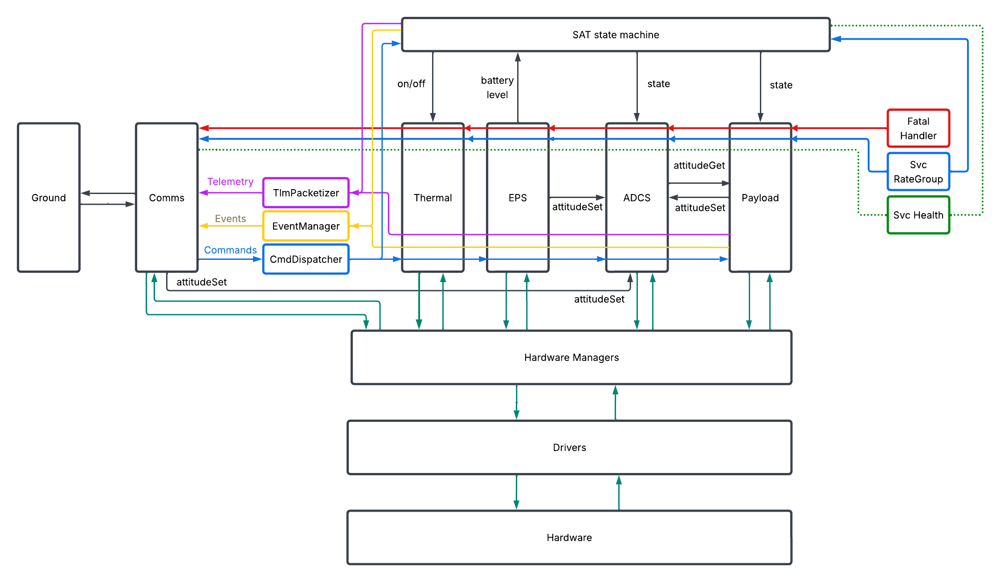

# Software Topology

The complete software topology is shown below as an abstraction stack. The Level 1 entries at the bottom provide operating-system and hardware access. Level 2 managers interpret those interfaces, Level 3 applications apply subsystem and mission policy, and the Level 4 components coordinate satellite-wide behavior and fatal responses.

The diagram is a software dependency view rather than a literal list of every FPP connection. Individual component pages define the ports and behavior; subsystem topology pages will add the final instances and connections when those designs are complete.

The following diagram shows the planned top-level software integration. It complements the abstraction stack by showing the major application boundaries, shared system services, fatal-event path, command and telemetry services, and the connections between software layers.

{#fig-high-level-software-topology width=100%}

```{mermaid}
%%{init: {'theme': 'base', 'themeVariables': {'fontSize': '12px'}}}%%
flowchart TB
    subgraph L4["Level 4 - System Services and Control"]
        SS["SatStateMachine"]
        FH["Svc::FatalHandler"]
        SYS["Svc::CmdDispatcher, Svc::EventManager, Svc::TlmChan<br/>Svc::TlmPacketizer, Svc::Health, Svc::RateGroupDriver<br/>Svc::ActiveRateGroup, Svc::Version, Svc::AssertFatalAdapter"]
    end

    subgraph L3["Level 3 - Applications"]
        APP["AdcsApplication, DataCollectionApplication, ComApplication<br/>EPSApplication, ScienceInferenceApplication, ThermalApplication<br/>ADCS algorithms and F' communications/data services"]
    end

    subgraph L2["Level 2 - Hardware Managers"]
        MGR["ImmuManager, SunSensorManager, MagnetorquerManager, TmtcRadioManager<br/>GnssManager, CurrentSensorManager, DeployPanelsManager, MpptManager<br/>WatchdogPinger, HeaterManager, TemperatureSensorManager"]
    end

    subgraph L1["Level 1 - Drivers and OSAL"]
        DRV["LinuxPwmDriver, LinuxUartDriver, LinuxI2cDriver, LinuxSpiDriver, LinuxGpioDriver<br/>F' OSAL: FileSystem, Task, Queue, Mutex, Time"]
    end

    SS --> APP
    FH -->|application-specific fatal command ports| APP
    SYS --> APP
    APP --> MGR
    MGR --> DRV
```
