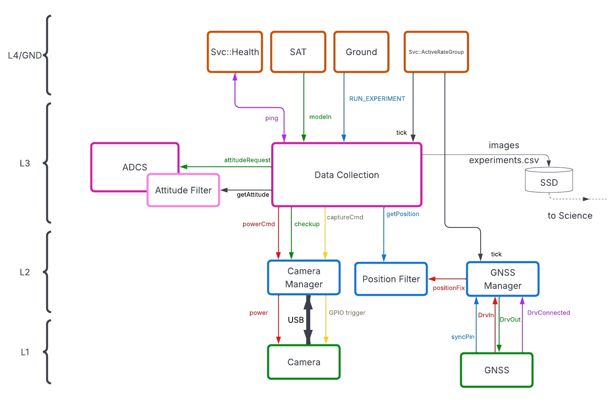
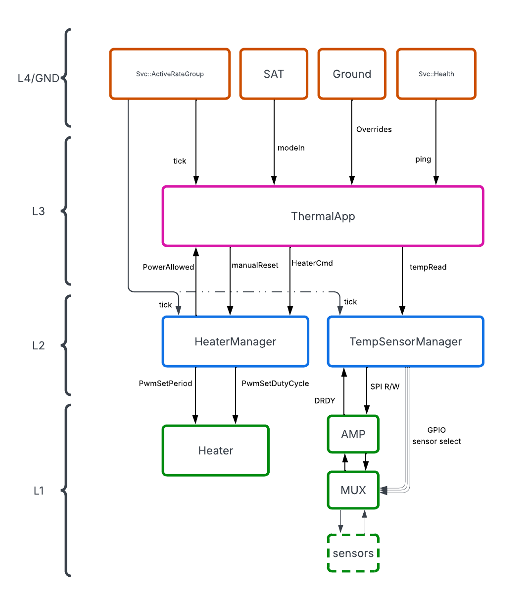

# Subtopology Decomposition

Each subsystem is assembled as an F' subtopology containing its application, hardware managers, and driver connections. The sections below describe each application or top-level service area independently. Detailed FPP instances, ports, and connections remain subject to the corresponding component designs.

## ADCS Subtopology

```{mermaid}
flowchart TB
    AdcsApp["AdcsApplication"]
    Immu["ImmuManager"]
    SunSensor["SunSensorManager"]
    Mtq["MagnetorquerManager"]
    AdcsApp --> Immu
    AdcsApp --> SunSensor
    AdcsApp --> Mtq
```

The ADCS subtopology contains the application-level attitude-control logic and the hardware managers for the IMU, sun sensors, and magnetorquers. The application coordinates these managers and exposes the subsystem's control and telemetry interfaces to the rest of the flight software.

## Data Collection Subtopology

{width=0.8\linewidth}

The Data Collection subtopology owns the camera and GNSS data paths. The Camera Manager controls the two USB-connected cameras, LOST and FOUND, while `GnssManager` provides position data to the application and the position filter. The application also coordinates image capture, experiment execution, health monitoring, and interactions with ADCS and the top-level command and scheduling services.

## Science Inference Subtopology

```{mermaid}
flowchart TB
    ScienceApp["ScienceApplication"]
    Lost["LOST image data"]
    Found["FOUND image data"]
    ScienceApp --> Lost
    ScienceApp --> Found
```

`ScienceApplication` runs the science and optical-navigation processing chain. It consumes image and experiment data produced by the Data Collection subtopology and coordinates the external science libraries described in its component design.

## Communications Subtopology

```{mermaid}
flowchart TB
    CommsApp["ComApplication"]
    Radio["TmtcRadioManager"]
    CommsApp --> Radio
```

The Communications subtopology contains `ComApplication` and `TmtcRadioManager`. The application selects the communications mode, while the radio manager owns the hardware-facing transmit and receive path. Shared F' framing, packet, event, telemetry, and file services connect to this subtopology at the top-level topology.

## EPS Subtopology

```{mermaid}
flowchart TB
    EPSApp["EPSApplication"]
    Mppt["MpptManager"]
    Current["CurrentSensorManager"]
    Watchdog["WatchdogPinger"]
    Deploy["DeployPanelsManager"]
    Mppt --> EPSApp
    Current --> EPSApp
    Watchdog --> EPSApp
    EPSApp --> Deploy
```

The EPS subtopology contains power-generation, current-sensing, deployment, and watchdog components. `EPSApplication` coordinates the subsystem, while the hardware managers own their respective device protocols and recovery behavior.

## Thermal Subtopology

{width=0.8\linewidth}

The Thermal subtopology contains `ThermalApplication`, `HeaterManager`, and `TemperatureSensorManager`. The application evaluates temperature and power conditions, commands heater operation, and coordinates the sensor readout path through the SPI, GPIO, multiplexer, and amplifier interfaces shown in the diagram.

## Top-Level Shared Infrastructure

```{mermaid}
flowchart TB
    Cmd["Svc::CmdDispatcher"]
    Events["Svc::EventManager"]
    Health["Svc::Health"]
    Fatal["Svc::FatalHandler"]
    Rate["Svc::ActiveRateGroup"]
    Cmd --> Events
    Events --> Fatal
    Rate --> Health
```

These deployment-wide services provide command dispatch, event reporting, health monitoring, fatal-event handling, and rate-group scheduling for the subsystem applications and hardware managers. F' communications, file-handling, and data-product services are connected alongside these services in the top-level topology.

## Satellite-Mode Command Fan-Out

```{mermaid}
flowchart TB
    SSM["SatStateMachine<br/>(Level 4)"]
    subgraph APPS["Application Layer"]
        direction TB
        AdcsApp["AdcsApplication"]
        DCApp["DataCollectionApplication"]
        SIApp["ScienceApplication"]
        CommsApp["ComApplication"]
        ThermApp["ThermalApplication"]
        AdcsApp ~~~ DCApp
        DCApp ~~~ SIApp
        SIApp ~~~ CommsApp
        CommsApp ~~~ ThermApp
    end
    SSM --> AdcsApp
    SSM --> DCApp
    SSM --> SIApp
    SSM --> CommsApp
    SSM --> ThermApp
```

The state machine sends each application its own typed mode enum. Applications do not need to understand the satellite-wide state or communicate directly with the Level 4 mode coordinator beyond that interface.
