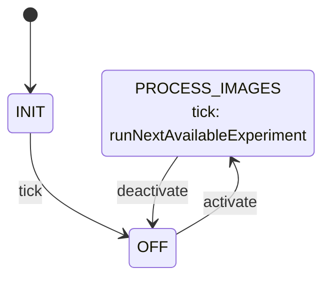

# Science::ScienceApplication

ScienceApplication is the Layer 3 active component for the Science subtopology. On a schedule, it
reads a manifest of imaging opportunities logged on the external disk, finds the first one that
has every image type a ground-configured algorithm chain needs, and runs that chain against it.

The component is driven by two synchronous input ports:

- `schedIn` (`Svc.Sched`) — a rate-group tick. All manifest scanning and processing happens here.
- `modeIn` (`Sat.ScienceModePort`, carrying `Science.Mode`) — mode commands from `SatStateMachine`. `Off` holds the component idle; `ProcessImages` starts the per-tick scanning loop.

**File system**\
The partition holds two things: a manifest, and one subdirectory per `Science.ImageType` integer value. `<imagePartitionDir>/experiments.csv` logs imaging opportunities.

Each experiment opportunity has:

- `timeRequested` as `YYYY:MM:DD:HH:MM:SS`, 
- `timeDataCollected` as `YYYY:MM:DD:HH:MM:SS`, 
- `timeScienceStarted` as `YYYY:MM:DD:HH:MM:SS`, 
- `timeScienceFinished` as `YYYY:MM:DD:HH:MM:SS`, 
-  `positionKnown` as `bool`,
-  `position` as `x:y:z`
-  `attidue` as `x:y:z:w` (quaternion),
-  `availableImageTypes` a `U16` bitmask representing `Science.ImageType`
-  `experimentID` as a `U16`

`<imagePartitionDir>/1/` holds `STARS` images,
`<imagePartitionDir>/2/` holds `HORIZON` images, etc.\
`fileName` is the experiment ID

## Requirements

| ID | Requirement | Verification |
|---|---|---|
| HS2-SIA-001 | ScienceApplication shall process at most one `experiments.csv` opportunity per `schedIn` tick while in `ProcessImages` mode | Unit test |
| HS2-SIA-002 | Ground shall be able to set and clear individual algorithm-topology slots (0-9) via `SET_ALGORITHM`/`CLEAR_ALGORITHM`, rejecting an out-of-range index with `VALIDATION_ERROR`, and clear the whole topology at once via `CLEAR_SCIENCE_TOPOLOGY` | Unit test |
| HS2-SIA-003 | ScienceApplication shall find the first `experiments.csv` line whose `availableImageTypes` bitmask covers every configured algorithm's `inputImage`, and run the configured chain, in slot order, against it | Unit test |
| HS2-SIA-004 | ScienceApplication shall preserve a copy of an algorithm's image content in `processed/` *before* running it, since the algorithm may overwrite that same path in place | Unit test |
| HS2-SIA-005 | ScienceApplication shall log/telemeter each processed image's outcome (path, algorithm name, flagged) as part of the downlinked record | Unit test |
| HS2-SIA-006 | ScienceApplication shall request compression for images the algorithm flags (external-process exit code 2) | Unit test |
| HS2-SIA-007 | ScienceApplication shall emit `WARNING_HI` and leave the manifest line in `experiments.csv` if any algorithm in the chain fails | Unit test |
| HS2-SIA-008 | ScienceApplication shall emit `WARNING_HI` and leave the file in place if it cannot preserve the pre-run image content in `processed/`, retrying on a later tick | Unit test |
| HS2-SIA-009 | ScienceApplication shall switch between `Off` and `ProcessImages` on command from `SatStateMachine`, logging `StateChanged` on every mode command | Unit test |
| HS2-SIA-010 | ScienceApplication shall respond to `pingIn` immediately on `pingOut` with the same key | Unit test |
| HS2-SIA-011 | Once every configured algorithm has succeeded against an experiment, ScienceApplication shall move that experiment's manifest line from `experiments.csv` to `completeExperiments.csv`, tagged with the ordered list of algorithms that ran | Unit test |

## Design

### Ports

| Port | Kind | Direction | Type | Usage |
|---|---|---|---|---|
| `modeIn` | sync | input | `Sat.ScienceModePort` | Mode command from `SatStateMachine`. |
| `schedIn` | sync | input | `Svc.Sched` | Rate-group tick; sends `tick` to the state machine on every call. |
| `compressRequestOut` | — | output | `Science.CompressRequest` | Requests compression of a flagged image, by its (single, shared) image path. |
| `pingIn` / `pingOut` | sync / — | in / out | `Svc.Ping` | Health monitoring; every `pingIn` is echoed immediately on `pingOut`. |
| `timeCaller`, `Fw.Command`, `Fw.Event`, `Fw.Channel` | standard AC ports | — | — | Boilerplate command/event/telemetry/time wiring. |

### Commands

| Name | Arguments | Effect |
|---|---|---|
| `SET_ALGORITHM` | `index: U8`, `algorithm: Science.Algorithm` | Sets topology slot `index` to `algorithm` |
| `SET_ALGORITHM_PRESET` | `index: U8`, `preset: Science.AlgorithmPreset`, `inputImage: Science.ImageType`, `camera: Science.Camera` | Sets topology slot `index` to a named predefined algorithm |
| `CLEAR_ALGORITHM` | `index: U8` | Resets topology slot `index` to an unconfigured `Science.Algorithm`. |
| `CLEAR_SCIENCE_TOPOLOGY` | — | Resets every one of the 10 topology slots to a default `Science.Algorithm` |

### State Machine

`sciAppStateMachine` (`Science_ScienceApplicationStateMachine_t`, defined in
`ScienceApplicationStateMachine.fpp`) tracks operating mode.

| State | Meaning | On `tick` |
|---|---|---|
| `INIT` | Idle until the first `schedIn` tick, which transitions out immediately without touching any output port. | (transitions to `OFF`) |
| `OFF` | Idle: `experiments.csv` is never read, no images processed. | ignored |
| `PROCESS_IMAGES` | Steady state: at most one experiment is found and its full algorithm chain processed per tick. | `runNextAvailableExperiment` |

