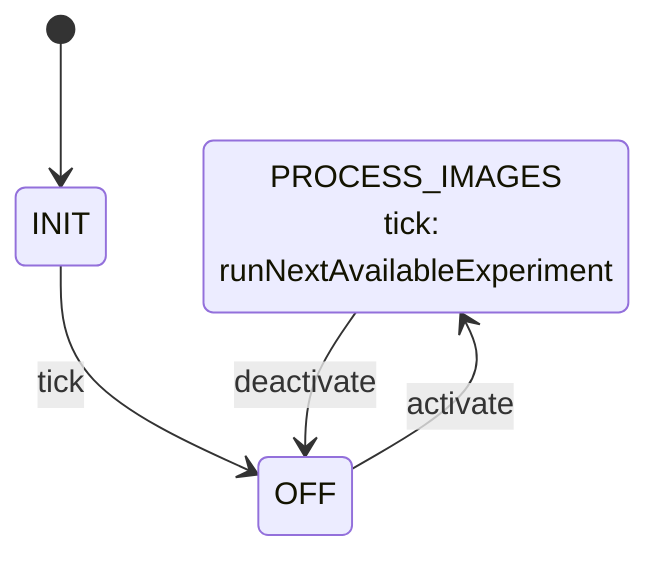

# Science::ScienceApplication

ScienceApplication is the Layer 3 active component for the Science subtopology. On a schedule, it
reads a manifest of imaging opportunities logged on the external disk, finds the first one that
has every image type a ground-configured algorithm chain needs, and runs that chain against it —
logging/telemetering results for downlink and requesting compression for flagged images.

## Introduction

The component is driven by two synchronous input ports:

- `schedIn` (`Svc.Sched`) — a rate-group tick. All manifest scanning and processing happens here.
- `modeIn` (`Sat.ScienceModePort`, carrying `Science.Mode`) — mode commands from `SatStateMachine`. `Off` holds the component idle; `ProcessImages` starts the per-tick scanning loop.

Ground configures **which algorithms run** via `SET_ALGORITHM`/`CLEAR_ALGORITHM`/
`CLEAR_SCIENCE_TOPOLOGY` commands, which set/clear slots of an internal `Science.AlgorithmTopology`
(defined in `FlightComputer/Types/Science/ScienceApplicationTypes.fpp` — a fixed-size array of up
to 10 `Science.Algorithm` entries). Each `Algorithm` names the algorithm, the external-disk path
to its executable, and a `Science.ImageType` value: `inputImage`, the image type it reads *and
writes* — **an algorithm's output is always the same image type as its input; there is no
separate output-type field.** There is no storage component or port to query for the next image —
ScienceApplication reads the image partition and its manifest on disk directly via
`Os::Directory`/`Os::File`/`Os::FileSystem`. The partition root is `imagePartitionDir` (defaults
to the `IMAGE_PARTITION_DIR` constant, `/mnt/science_images`; public so unit tests/demos can point
it at a scratch directory instead of a real mount point).

**The partition holds two things: a manifest, and one subdirectory per `Science.ImageType` raw
value.** `<imagePartitionDir>/experiments.csv` logs imaging opportunities — one line per
opportunity, `#`-prefixed lines are comments/header and skipped — with columns `time, date,
positionKnown, position, attitude, availableImageTypes` (`time` as `HH:MM:SS`, `date` as
`DD:MM:YYYY`, `availableImageTypes` a `U16` bitmask where bit *n* means `Science.ImageType` raw
value *n* is available for that opportunity). `<imagePartitionDir>/1/` holds `STARS` images,
`<imagePartitionDir>/2/` holds `HORIZON` images, etc. An algorithm reads and overwrites its image
**in place** at `<imagePartitionDir>/<inputImage>/<fileName>`, where `fileName` is derived from
the experiment's `time`/`date` (`:` replaced with `-`, the two fields joined with `_` — e.g.
`time=10:00:00, date=01:01:2026` → `10-00-00_01-01-2026`, no extension) and shared by every
algorithm in the chain. Ground chains algorithms together by configuring successive topology slots
with the *same* `inputImage`: they process that one file, one after another, in slot order — slot
order doesn't affect which image type is used (that's fixed per algorithm), but it *does* set
execution order, which is what makes chaining meaningful. Before running, the algorithm's current
image content is preserved in `processed/` (see `processImage` below) — this happens on every run,
not just the first, so each algorithm's own `processed/` snapshot reflects exactly what it read,
even if an earlier algorithm in the same chain already overwrote the file once.

**The satellite has two cameras, LOST and FOUND, and an algorithm's image file carries a
`"L_"`/`"F_"` filename prefix identifying which one captured it** — e.g.
`<imagePartitionDir>/<inputImage>/L_10-00-00_01-01-2026`. Each `Algorithm` has a `camera:
Science.Camera` field (`ANY`/`LOST`/`FOUND`) that's *optional*: `LOST`/`FOUND` require that exact
prefixed file to exist (a missing one fails the same way any other missing image would — see
`MarkProcessedFailed`), while the default, `ANY`, means "whichever is actually there" —
ScienceApplication probes for `"L_"` first, then `"F_"`, falling back to an unprefixed path (a
camera-agnostic image, e.g. a test fixture predating camera-awareness) if neither exists. The
resolved prefix applies to *both* the image path and its `processed/` backup, so two algorithms
in the same chain that specify different concrete cameras never collide on the same file. See
`resolveCameraPrefix` below.

**Every algorithm also has its own `results/` subdirectory for raw (not necessarily image) data
hand-off to later configured algorithms** — `<imagePartitionDir>/<inputImage>/results/<fileName>`
for an algorithm with a real image, or `<imagePartitionDir>/results/<fileName>` for one with
`inputImage=NONE` (no image identity at all, so no `Science.ImageType` directory to anchor to).
This is independent of, and in addition to, the image file: it's the *only* way an
`inputImage=NONE` algorithm receives or produces anything, and it's also available to ordinary
image-processing algorithms that want to pass along something that isn't itself an image (e.g.
`average_color_cli`'s computed RGB triple).

**Which results an algorithm actually receives is decided by a separate "input type" negotiation,
unrelated to `Science.ImageType`.** Each `Algorithm` has `outputTypes: U32` (a bitmask declaring
which input-type bits its own results represent) and `requiredInputCombinations: [8] U32` (a
ranked list — index 0 most preferred — of bitmask *combinations* it can work with; an all-zero
entry is a stop code, and at index 0 means "needs nothing"). "Input type" bit numbering has no FPP
enum of its own for bits beyond the five below — it's purely an application-level convention
documented here: bit 5 might mean "some algorithm-specific thing," and so on, however ground and
the algorithm authors agree to number them from there. Bits 0-4, though, *are* predefined (backed
by `Science.InputType`, added purely for readability — the runtime representation is still just a
`U32` bitmask, `1 << InputType raw value`): `TIME`(0), `DATE`(1), `POSITION`(2),
`SATELLITE_ATTITUDE`(3), `CAMERA_ATTITUDE`(4). Before running each algorithm, ScienceApplication
ORs together every *earlier* configured algorithm's `outputTypes` **plus whichever of these five
bits it can derive directly from the matched experiments.csv row** (`fallbackAvailableTypes` —
see below) and walks the current algorithm's `requiredInputCombinations` for the first entry
that's fully covered by that OR — the first (most preferred) satisfiable combination wins, so if
a producer can serve multiple consumers' preferences, whichever combination the consumer ranks
highest is what gets used. For every bit in the winning combination, ScienceApplication walks
*backward* through the topology for the most recent earlier algorithm whose `outputTypes` has
that bit — not necessarily the immediately preceding one — so an algorithm needing (say) both
position and attitude gets both, from whichever earlier algorithms most recently produced each,
even across several intervening algorithms that produced neither; **if no earlier algorithm
supplies one of the five predefined bits, ScienceApplication falls back to writing that bit's
value straight from the experiments.csv row** (`writeFallbackValue`) rather than treating it as
missing. Those gathered (or synthesized) results paths are written to a manifest file and handed
to the algorithm; if no combination is satisfiable, `NoMatchingInputCombination` is logged and the
algorithm is **not** run — the whole experiment is left in `experiments.csv` for a later tick's
retry, same as any other algorithm failure in the chain. See
`resolveInputCombination`/`writeInputManifest` below for the mechanics.

`TIME`/`DATE`/`SATELLITE_ATTITUDE` fall back to their experiments.csv field text verbatim;
`POSITION` only if that row's `positionKnown` is true. `CAMERA_ATTITUDE` is different: there's no
"camera attitude" column in experiments.csv at all, so it's *computed* — the row's satellite
attitude quaternion (`SATELLITE_ATTITUDE`'s field, parsed as `"x:y:z:w"`) composed (Hamilton
product) with the *requesting algorithm's own resolved camera*'s constant mounting-orientation
quaternion (`LOST_CAMERA_ORIENTATION`/`FOUND_CAMERA_ORIENTATION`, defined in
`FlightComputer/Types/Science/CameraOrientations.hpp` — plain C++, since FPP `constant` only
accepts scalar expressions, not a struct-typed quaternion). This only makes sense for an algorithm
that itself has a real image and a concretely resolved camera (`LOST`/`FOUND`, whether explicitly
configured or resolved from `ANY` — see above); an `inputImage=NONE` algorithm has no camera
context of its own, so `CAMERA_ATTITUDE`'s fallback is never available to it (though it could
still come from an earlier algorithm's `outputTypes`, same as any other bit).

On each tick while in `ProcessImages` mode, the component walks the configured topology slots in
order (an empty `name` marks the end of the configured list — slots are meant to be packed with
no gaps) to compute the bitwise-OR of every configured algorithm's `1 << inputImage` (skipping
algorithms whose `inputImage` is `NONE` — they need no manifest image at all). It then scans
`experiments.csv` top to bottom for the first line whose `availableImageTypes` bitmask has every
one of those bits set (logging `NoExperimentReady` if none is found), and — if one is found — runs
**every configured algorithm, in slot order, against that one experiment, all within the same
tick**: each algorithm's input image (if any) is expected to already exist (either logged as
available at that opportunity, or produced by an earlier algorithm sharing the same `inputImage`
in the same chain within the same tick) under that shared directory. "Running" an algorithm means
launching `algorithm.path` as an external process (`posix_spawn`, not `fork`+`exec`, and not a
shell — see Design below) with its image/results paths as arguments, and interpreting its exit
code. On each algorithm's success, its pre-run image content is preserved in `processed/` (see
above); if flagged, `compressRequestOut` is called with the image's path. If any algorithm in the
chain fails, the whole experiment is abandoned for this tick — no manifest rewrite happens, so
it's retried (from the start of the chain) on a later tick. Once every configured algorithm has
succeeded, the experiment's manifest line is removed from `experiments.csv` and appended to
`completeExperiments.csv`, tagged with a bracketed, colon-separated list of which algorithms ran
(e.g. `[Invert:AverageColor]`) — this is the downlinked record that the experiment completed,
since there's no separate storage component to report to. At most one experiment's worth of
processing happens per tick, bounding the rate-group's per-cycle work regardless of manifest
backlog size.

`pingIn`/`pingOut` provide the standard health-monitoring round trip.

## Requirements

| ID | Requirement | Verification |
|---|---|---|
| HS2-SIA-001 | ScienceApplication shall process at most one `experiments.csv` opportunity per `schedIn` tick while in `ProcessImages` mode | Unit test |
| HS2-SIA-002 | Ground shall be able to set and clear individual algorithm-topology slots (0-9) via `SET_ALGORITHM`/`CLEAR_ALGORITHM`, rejecting an out-of-range index with `VALIDATION_ERROR`, and clear the whole topology at once via `CLEAR_SCIENCE_TOPOLOGY` | Unit test |
| HS2-SIA-003 | ScienceApplication shall find the first `experiments.csv` line whose `availableImageTypes` bitmask covers every configured algorithm's `inputImage`, and run the configured chain, in slot order, against it | Unit test |
| HS2-SIA-004 | An algorithm's output shall always be the same image type as its input - overwritten in place at the same path it read from | Unit test |
| HS2-SIA-005 | ScienceApplication shall preserve a copy of an algorithm's image content in `processed/` *before* running it, since the algorithm will overwrite that same path in place | Unit test |
| HS2-SIA-006 | ScienceApplication shall log/telemeter each processed image's outcome (path, algorithm name, flagged) as part of the downlinked record — there is no separate storage component to report to | Unit test |
| HS2-SIA-007 | ScienceApplication shall preserve the pre-algorithm image content in its `inputImage` directory's `processed/` subdirectory (never deleting it) before every run, even for the second and later algorithms sharing that `inputImage` in the same chain | Unit test |
| HS2-SIA-008 | ScienceApplication shall request compression for images the algorithm flags (external-process exit code 2) | Unit test |
| HS2-SIA-009 | ScienceApplication shall emit `WARNING_HI` and leave the manifest line in `experiments.csv` if any algorithm in the chain fails (any exit code other than 0 or 2, or a failed launch), retrying the whole chain on a later tick without blocking further ticks | Unit test |
| HS2-SIA-010 | ScienceApplication shall emit `WARNING_HI` and leave the file in place if it cannot preserve the pre-run image content in `processed/`, retrying on a later tick | Unit test (currently unreachable in test — see Open Items) |
| HS2-SIA-011 | ScienceApplication shall switch between `Off` and `ProcessImages` on command from `SatStateMachine`, logging `StateChanged` on every mode command | Unit test |
| HS2-SIA-012 | ScienceApplication shall respond to `pingIn` immediately on `pingOut` with the same key | Unit test |
| HS2-SIA-013 | While `Off`, or while no algorithm topology slot is configured, ScienceApplication shall scan `experiments.csv` and process no images | Unit test |
| HS2-SIA-014 | Once every configured algorithm has succeeded against an experiment, ScienceApplication shall move that experiment's manifest line from `experiments.csv` to `completeExperiments.csv`, tagged with the ordered list of algorithms that ran | Unit test |
| HS2-SIA-015 | ScienceApplication shall emit a low-severity warning and skip (without aborting the scan) any non-comment `experiments.csv` line it cannot parse | Unit test (not yet covered — see Open Items) |
| HS2-SIA-016 | ScienceApplication shall pick, for each algorithm, the most-preferred `requiredInputCombinations` entry that's fully covered by the OR of every earlier configured algorithm's `outputTypes`, and emit `NoMatchingInputCombination` and skip running the algorithm (leaving the experiment for a later tick's retry) if none is satisfiable | Unit test |
| HS2-SIA-017 | For each bit in the chosen combination, ScienceApplication shall gather results from the *most recent* earlier configured algorithm whose `outputTypes` provides that bit — which may be several slots back, not just the immediately preceding one — and pass all gathered paths to the algorithm | Unit test |
| HS2-SIA-018 | An algorithm whose `inputImage` is `NONE` shall not require any `experiments.csv` image type to be available, and shall receive no image path at all - only the incoming-results-manifest and outgoing-results paths | Unit test |
| HS2-SIA-019 | An algorithm with a concretely-configured `camera` (`LOST`/`FOUND`) shall read/write only that camera's `"L_"`/`"F_"`-prefixed image file, never a coexisting file with a different or no prefix | Unit test |
| HS2-SIA-020 | An algorithm with `camera=ANY` (the default) shall use whichever of `"L_"`-prefixed, `"F_"`-prefixed, or unprefixed image file actually exists on disk, tried in that order | Unit test |
| HS2-SIA-021 | If no earlier configured algorithm's `outputTypes` supplies a `TIME`/`DATE`/`POSITION`/`SATELLITE_ATTITUDE` bit an algorithm requires, ScienceApplication shall derive it directly from the matched experiments.csv row (`POSITION` only if `positionKnown`) rather than treating the combination as unsatisfiable | Unit test |
| HS2-SIA-022 | If no earlier configured algorithm's `outputTypes` supplies the `CAMERA_ATTITUDE` bit an algorithm requires, and that algorithm has a real image with a concretely resolved camera, ScienceApplication shall derive it by composing the matched row's satellite attitude with that camera's constant mounting-orientation quaternion | Unit test |
| HS2-SIA-023 | `SET_ALGORITHM_PRESET` shall configure the named slot with the selected preset's identity fields (`name`/`path`/`supportsOutputSelection`/`requiredInputCombinations`/`outputTypes`/`chosenOutput`) plus the command's own `inputImage`/`camera` arguments, applying the same index range check as `SET_ALGORITHM` | Unit test |

## Design

### Ports

| Port | Kind | Direction | Type | Usage |
|---|---|---|---|---|
| `modeIn` | sync | input | `Sat.ScienceModePort` | Mode command from `SatStateMachine`. |
| `schedIn` | sync | input | `Svc.Sched` | Rate-group tick; sends `tick` to the state machine on every call. |
| `compressRequestOut` | — | output | `Science.CompressRequest` | Requests compression of a flagged image, by its (single, shared) image path. |
| `pingIn` / `pingOut` | sync / — | in / out | `Svc.Ping` | Health monitoring; every `pingIn` is echoed immediately on `pingOut`. |
| `timeCaller`, `Fw.Command`, `Fw.Event`, `Fw.Channel` | standard AC ports | — | — | Boilerplate command/event/telemetry/time wiring. |

### Commands

| Name | Arguments | Effect |
|---|---|---|
| `SET_ALGORITHM` | `index: U8`, `algorithm: Science.Algorithm` | Sets topology slot `index` to `algorithm`. `VALIDATION_ERROR` (and `AlgorithmIndexInvalid`) if `index >= 10`; otherwise logs `AlgorithmSet` and responds `OK`. |
| `SET_ALGORITHM_PRESET` | `index: U8`, `preset: Science.AlgorithmPreset`, `inputImage: Science.ImageType`, `camera: Science.Camera` | Sets topology slot `index` to a named predefined algorithm (`PREDEFINED_ALGORITHMS[preset]`, in `ScienceApplication.cpp`) with `inputImage`/`camera` overlaid from this command's own arguments. Same range check, event, and response as `SET_ALGORITHM` (they share `setAlgorithmSlot`, below). |
| `CLEAR_ALGORITHM` | `index: U8` | Resets topology slot `index` to a default (unconfigured, empty-name) `Science.Algorithm`. Same range check as `SET_ALGORITHM`; logs `AlgorithmCleared` on success. |
| `CLEAR_SCIENCE_TOPOLOGY` | — | Resets every one of the 10 topology slots to a default `Science.Algorithm`; logs `TopologyCleared`. |

Split `SET_ALGORITHM`/`CLEAR_ALGORITHM` into single-slot commands (rather than one
`SET_ALGORITHM_TOPOLOGY(topology: Science.AlgorithmTopology)` command taking the whole struct)
because a full `AlgorithmTopology` — 10 `Algorithm` entries, each with a 160-byte path and 50-byte
name — serializes to roughly 2.5 KB, well past `FW_CMD_ARG_BUFFER_MAX_SIZE` (506 bytes in this
deployment's config). A single `Algorithm` comfortably fits. Slots are meant to be packed with no
gaps: `buildNeededImageMask` stops walking the array at the first slot with an empty `name`, so a
later slot behind a gap is invisible to processing (though `SET_ALGORITHM` itself doesn't enforce
packing — ground is responsible for it).

`SET_ALGORITHM_PRESET` exists so ground doesn't have to fully specify every `Algorithm` field —
`name`, `path`, `supportsOutputSelection`, `requiredInputCombinations`, `outputTypes`, and
`chosenOutput` — for an algorithm that's already known, by name, via `Science.AlgorithmPreset`
(currently `INVERT`, `AVERAGE_COLOR`; see `PREDEFINED_ALGORITHMS` in `ScienceApplication.cpp`,
which must stay in the same order as the enum). It deliberately does *not* bake in `inputImage`/
`camera`: those are still supplied as separate command arguments, because which image type/camera
a topology slot targets is a per-deployment choice about *this particular run*, not a fixed
property of what the algorithm *is* — baking a specific `ImageType` into "Invert," for instance,
would make the preset useless for any chain that wants to invert a different image type. Ground
can still fall back to the full `SET_ALGORITHM` for an algorithm that isn't (yet) in
`PREDEFINED_ALGORITHMS`, or that needs `requiredInputCombinations`/`outputTypes` different from
its preset's defaults.

### State Machine

`sciAppStateMachine` (`Science_ScienceApplicationStateMachine_t`, defined in
`ScienceApplicationStateMachine.fpp`) tracks operating mode.

| State | Meaning | On `tick` |
|---|---|---|
| `INIT` | Idle until the first `schedIn` tick, which transitions out immediately without touching any output port. | (transitions to `OFF`) |
| `OFF` | Idle: `experiments.csv` is never read, no images processed. | ignored |
| `PROCESS_IMAGES` | Steady state: at most one experiment is found and its full algorithm chain processed per tick. | `runNextAvailableExperiment` |

The `INIT` boot state exists so the state machine's very first transition — which runs during
the component's `init()`, before topology port connection — never touches an output port. (An
earlier draft entered `OFF` directly and called an entry action that commanded a port at
construction time; that asserts in both real deployment and unit tests, since ports aren't wired
yet at `init()` time. `OFF` itself has no entry action, so this is largely defense in depth here,
but the pattern is kept for consistency with the other Layer 3/2 applications in this codebase
and to guard against a future entry action being added unsafely.)

`modeIn_handler` logs `StateChanged` for every mode command it receives (not just ones that
change state) and forwards `activate`/`deactivate` to the state machine.

Action:

- **runNextAvailableExperiment** — calls `buildNeededImageMask` to OR together `1 << inputImage` for every configured algorithm with a real (non-`NONE`) `inputImage` (stopping at the first slot with an empty `name`); if nothing is configured, returns immediately. Calls `findReadyExperiment` to scan `experiments.csv` for the first non-comment line whose `availableImageTypes` covers that mask; if none is found, logs `NoExperimentReady` and returns. Otherwise runs `processImage` for each configured algorithm in slot order (passing its slot index, so it can look at earlier slots for input-combination resolution), stopping at the first failure (leaving `experiments.csv` untouched, so the whole chain retries from the start on a later tick). If every algorithm succeeds, builds the ordered `algo1:algo2:...` list and calls `completeExperiment`, then increments/telemeters `ExperimentsCompleted` and logs `ExperimentCompleted`. (Named for what it does rather than the original `processNextImage`, which predates the experiments.csv/multi-algorithm-per-tick design.)

`SET_ALGORITHM`/`SET_ALGORITHM_PRESET` share a private helper:

- **setAlgorithmSlot(opCode, cmdSeq, index, algorithm)** — the range check (`index >=
  NUM_ALGORITHM_SLOTS` → `AlgorithmIndexInvalid` + `VALIDATION_ERROR`), slot assignment,
  `AlgorithmSet` log, and `OK` response common to both commands. `SET_ALGORITHM_PRESET`'s handler
  builds its `Algorithm` by copying `PREDEFINED_ALGORITHMS[preset]` and calling `set_inputImage`/
  `set_camera` on the copy before handing it to this helper — `preset`'s raw value is already
  validated by its own command-argument deserialization (same `isValid()` mechanism as
  `Science.ImageType`/`Science.Camera`), so an `FW_ASSERT` (not an event) guards
  `PREDEFINED_ALGORITHMS` indexing: reaching it would mean the array and `Science.AlgorithmPreset`
  have drifted out of sync, a code defect rather than bad ground input.

Helpers (not state machine actions, called from `runNextAvailableExperiment`):

- **buildNeededImageMask** — walks the topology array from slot 0, ORing in `1 << inputImage` for each configured algorithm whose `inputImage` isn't `NONE` (a `NONE`-input algorithm reads no manifest image at all - see `processImage` - so it contributes no bit and doesn't gate which experiments are "ready"). `inputImage` is trusted valid without a runtime check: `SET_ALGORITHM`'s command-argument deserialization already rejects an out-of-range `Science.ImageType` (`ImageType::deserializeFrom` calls `isValid()` and fails the deserialize) before this component's command handler ever runs, so an invalid value can never actually reach the topology array.
- **findReadyExperiment** — reads the whole `experiments.csv` file into a fixed-size stack buffer (bounded by `MAX_EXPERIMENTS_FILE_SIZE`), then hand-parses it line by line (no line-based text I/O utility exists elsewhere in this codebase): skips `#`-prefixed lines, extracts the `time`/`date`/`availableImageTypes` fields of each candidate via a small comma-field-extraction helper (logging `MalformedExperimentLine` and skipping any non-comment line that doesn't parse), and returns the first line whose mask satisfies `(availableImageTypes & neededMask) == neededMask`, along with the raw matched line text (for `completeExperiment`) and the derived shared filename.
- **completeExperiment** — rewrites `experiments.csv` with the matched line's exact byte range omitted (opened with `Os::File::Mode::OPEN_CREATE` **and** `OverwriteType::OVERWRITE` — the 2-arg `open()` overload defaults to `NO_OVERWRITE`, which would silently fail to truncate a file that already exists), then appends the matched line plus `, [algorithmList]` to `completeExperiments.csv` (`OPEN_APPEND`, which creates the file if missing).
- **resolveCameraPrefix(stageDir, fileName, configuredCamera, resolvedCamera)** — a free function (not a member; needs no component state), called from `processImage` for any algorithm with a real image. `LOST`/`FOUND` return their fixed prefix (`"L_"`/`"F_"`) directly, setting `resolvedCamera` to match. `ANY` probes the filesystem: `Os::FileSystem::exists` on the `"L_"`-prefixed path, then the `"F_"`-prefixed one, returning the first prefix found; if neither exists, returns an empty prefix and `resolvedCamera = ANY` (an unresolved camera) — the caller then proceeds with an unprefixed path exactly as before camera-awareness existed (e.g. for a test fixture or other camera-agnostic image), rather than failing outright. A concretely-configured camera does *not* probe for existence — if that exact prefixed file is missing, the existing `MarkProcessedFailed` path (the subsequent `copyFile` failing) reports it, same as any other missing image.
- **resolveInputCombination(slotIndex, matchedLine, resolvedCamera, chosenCombination)** — ORs together `outputTypes` from every slot before `slotIndex`, plus `fallbackAvailableTypes(matchedLine, resolvedCamera)` (see below), into `availableTypes`, then walks `algorithms[slotIndex].requiredInputCombinations` from index 0 for the first entry fully covered by `availableTypes` (`(combination & availableTypes) == combination`). An all-zero entry is the stop code: at index 0 it means "no requirements" (returns `true` with `chosenCombination = 0`); reached after some non-zero entries means none of them matched (returns `false`). Since combinations are tried in preference order and the first satisfiable one wins, this is also how "the option the algorithm prefers most, among what's actually available" gets chosen — there's no separate producer-side selection step.
- **fallbackAvailableTypes(matchedLine, resolvedCamera)** — determines which of the five predefined `InputType` bits are derivable straight from the matched experiments.csv row, without needing any earlier configured algorithm: `TIME`/`DATE` if their fields are non-empty; `POSITION` only if `positionKnown` parses `true`/`1` *and* the position field is non-empty; `SATELLITE_ATTITUDE` if the attitude field parses as a `"x:y:z:w"` quaternion; `CAMERA_ATTITUDE` only if `SATELLITE_ATTITUDE` is available *and* `resolvedCamera` is a concrete `LOST`/`FOUND` (it's meaningless without a camera to compose against — see the Introduction).
- **resultsDirFor(slotIndex, resultsDir)** — computes `"<imagePartitionDir>/<algorithms[slotIndex].inputImage>/results"` if that slot has a real (non-`NONE`) `inputImage`, else `"<imagePartitionDir>/results"` — there's no per-`ImageType` directory to anchor a `NONE`-input algorithm's results to. Used by `processImage` (for a slot's own outgoing results), `writeInputManifest` (for a supplier slot's results), and `writeFallbackValue` (for a synthesized fallback value file), so the formula lives in exactly one place.
- **writeFallbackValue(slotIndex, fileName, bit, matchedLine, resolvedCamera, valuePath)** — writes one predefined `InputType` bit's fallback value to a small text file at `"<resultsDirFor(slotIndex)>/<fileName>.fallback<bit>"`, returning that path in `valuePath`. `TIME`/`DATE`/`POSITION`/`SATELLITE_ATTITUDE` are written verbatim from their experiments.csv field text (re-checked the same way as `fallbackAvailableTypes`, so a caller that only checked availability via that function can rely on this one succeeding). `CAMERA_ATTITUDE` parses the attitude field into a `Quaternion`, composes it (Hamilton product, via `Science::compose`) with `resolvedCamera`'s constant orientation, and formats the result back to `"x:y:z:w"` text. Returns `false` for any other bit, or if the value genuinely isn't available (mirrors `fallbackAvailableTypes` exactly, so the two never disagree). The manifest-line format is unchanged by this — it still just points at a file to read, so no CLI needed updating for this feature.
- **writeInputManifest(slotIndex, fileName, chosenCombination, matchedLine, resolvedCamera, manifestPath)** — for each bit set in `chosenCombination` (0 through 31), scans slots `slotIndex - 1` down to `0` for the most recent one whose `outputTypes` has that bit, calls `resultsDirFor` on *that* slot to recompute its results path, and appends a `"<bit> <path>"` line to a manifest file written under `resultsDirFor(slotIndex)`. If no earlier algorithm supplies a bit, falls back to `writeFallbackValue` before giving up on that bit entirely (silently omitting it from the manifest if even the fallback fails — which shouldn't happen, since `resolveInputCombination` only chose this combination because `fallbackAvailableTypes` already confirmed it). Returns `false` (and leaves `manifestPath` untouched) if `chosenCombination == 0`, since there's nothing to gather.
- **processImage** — if `algorithm.inputImage` is `NONE`, there's no image at all for this algorithm (and no camera to resolve). Otherwise calls `resolveCameraPrefix` to pick the `"L_"`/`"F_"`/unprefixed image path (`<inputImage-dir>/<prefix><fileName>`) and, *before* running (since the algorithm will overwrite this same path in place — output is always the same image type as input), preserves the current content in that directory's `processed/` subdirectory under the *same* prefix: removes any stale `processed/<prefix><fileName>` first (`Os::FileSystem::copyFile` opens its destination with `OPEN_WRITE`, which lacks `O_TRUNC`, so a second, possibly-shorter copy over an existing file could otherwise leave stale trailing bytes past the new EOF — this matters now because the *same* `processed/<prefix><fileName>` path can be written more than once per chain, once per algorithm sharing that `inputImage` and camera), then copies; if that copy fails, processing fails immediately without running the algorithm. Computes `resultsDirFor(slotIndex)` (creating it) for this algorithm's own outgoing-results path. Calls `resolveInputCombination` (passing `matchedLine` and the resolved camera); if unsatisfied, logs `NoMatchingInputCombination` and fails immediately without running the algorithm (same as the copy-failure case above). Otherwise calls `writeInputManifest` to get the incoming-results-manifest path, then `runAlgorithm()` (below) is called. On success: increments and telemeters `ImagesProcessed`, logs `ImageProcessed` (the image path if there was one, else the outgoing-results path, since there's nothing else to identify the run by). If the algorithm flagged the image (and there is one), calls `compressRequestOut` with its path. On algorithm failure: increments and telemeters `ImagesFailed`, logs `ProcessingFailed` (`WARNING_HI`), and leaves any image in place (any partial/incomplete output the failed algorithm process may have written is not cleaned up — the image may itself be partially overwritten, but the `processed/` copy taken just before running remains a pristine backup of what the algorithm actually saw). Only the telemetry channel that actually changed is written on any given call.
- **runAlgorithm** — launches `algorithm.path` directly via `posix_spawn()`, not `fork()`+`exec()`: `fork()` is unsafe to call from a thread in a multi-threaded process (ScienceApplication's active-component thread is one of several in this deployment) — only the calling thread survives `fork()` in the child, so a lock another thread happened to be holding at that instant (e.g. inside `malloc`) stays locked forever in the child. `posix_spawn` launches and execs the child directly without duplicating this process's full multi-threaded state; it still takes a plain `argv` array rather than a shell command string, so there's no quoting/injection risk from any path either way. If `hasImageInput`, passes `imagePath`, `incomingResultsManifestPath`, and `outgoingResultsPath` as `argv[1..3]`; otherwise (`inputImage` was `NONE`, so there's no image at all) omits `imagePath`, passing the other two as `argv[1..2]`. `incomingResultsManifestPath` names a manifest of `"<bit> <path>"` lines (see `writeInputManifest`) - it may not exist (no `requiredInputCombinations` entry was satisfiable, or this is the first algorithm in a chain), which the algorithm is expected to treat as "no incoming data," not a failure. Writing to `outgoingResultsPath` is optional - not every algorithm has raw data to contribute beyond its image (e.g. `invert_cli` doesn't write there; `average_color_cli` writes its computed `"R G B\n"` there). Exit code `0` → success, not flagged. Exit code `2` → success, flagged for compression. Anything else — a different exit code, a signal, or a failed spawn (e.g. `algorithm.path` doesn't exist) — is treated as failure. This convention (a handful of file-path args plus the exit-code protocol) is this iteration's placeholder for "a generic algorithm interface"; there's no real HS2 algorithm library yet (see Open Items).

### Telemetry

| Name | Type | Notes |
|---|---|---|
| `ImagesProcessed` | `U32` | Algorithm runs that succeeded since boot (including `inputImage=NONE` ones, which have no image). |
| `ImagesFailed` | `U32` | Algorithm runs that failed since boot. |
| `ExperimentsCompleted` | `U32` | Experiments (every configured algorithm run against one manifest opportunity) fully completed and moved to `completeExperiments.csv` since boot. |

### Events

| Name | Severity | Purpose |
|---|---|---|
| `StateChanged` | activity high | Emitted on every `modeIn` command, carrying the commanded mode. |
| `AlgorithmSet` | activity high | `SET_ALGORITHM` accepted; carries the slot index and the algorithm's name. |
| `AlgorithmCleared` | activity high | `CLEAR_ALGORITHM` accepted; carries the slot index. |
| `TopologyCleared` | activity high | `CLEAR_SCIENCE_TOPOLOGY` accepted; every slot reset. |
| `AlgorithmIndexInvalid` | warning high | `SET_ALGORITHM`/`CLEAR_ALGORITHM` given an index outside `[0, 9]`; command rejected with `VALIDATION_ERROR`. |
| `ImageProcessed` | activity high | An algorithm ran successfully; carries `path` (the image path, or the results path if the algorithm had no image), `algorithmName`, `flagged`. |
| `ProcessingFailed` | warning high | The algorithm process exited with a code other than 0 or 2, or failed to launch; carries `path`, `algorithmName`. The experiment retries on a later tick. |
| `MarkProcessedFailed` | warning high | An image's pre-run content couldn't be copied into `processed/`; carries `path`. The experiment retries on a later tick. |
| `ExperimentCompleted` | activity high | Every configured algorithm ran successfully against one `experiments.csv` opportunity; carries the experiment's derived filename. Also serves as the downlinked record of the outcome — there is no separate storage component to report results to. |
| `NoExperimentReady` | activity low | No logged opportunity currently covers every configured algorithm's `inputImage`; scanning will retry on a later tick. Expected to be routine/frequent, not a fault. |
| `MalformedExperimentLine` | warning low | A non-comment `experiments.csv` line couldn't be parsed (too few fields, a non-numeric `availableImageTypes`, or a time/date field that doesn't fit the derived filename); carries the raw line. The line is skipped; scanning continues. |
| `NoMatchingInputCombination` | warning high | None of the algorithm's `requiredInputCombinations` entries could be satisfied by earlier configured algorithms' `outputTypes`; carries the slot index. The algorithm is not run; the experiment is left in `experiments.csv` for a later tick's retry, same as any other algorithm failure. |

## Open Items / Known Deviations

- **Output is always the same image type as input; there is no cross-type conversion via the image-file mechanism anymore.** The original design allowed one algorithm's `outputImage` to differ from its `inputImage`, so ground could route an image from one `Science.ImageType` directory to another purely by field configuration. That's gone: `Science.Algorithm` has only `inputImage`, and an algorithm's image output is always written back to that same directory/path. A pipeline that used to chain STARS → HORIZON → GROUND by setting each stage's `outputImage` to the next stage's `inputImage` is now expressed as several algorithms all configured with the *same* `inputImage`, processing that one file in slot order. Genuinely different-typed data now flows only through the `outputTypes`/`requiredInputCombinations` results mechanism (see below), which was already independent of `Science.ImageType`.
- **A multi-algorithm chain on one `inputImage` only preserves the *most recent* algorithm's pre-run snapshot in `processed/`.** Since every algorithm sharing an `inputImage` reads/writes the same `<fileName>` path, and each one's `processed/<fileName>` copy is taken (and overwrites any earlier one) immediately before it runs, the *very first* algorithm's snapshot of the pristine, pre-pipeline original is not retrievable once a second algorithm in the same chain has run — only the intermediate state right before the last algorithm ran survives. This is an accepted consequence of collapsing input/output into one directory, not a bug.
- **`Science.Algorithm`'s `supportsOutputSelection`/`chosenOutput` fields remain unused** — only `inputImage` (the file-based image identity) and `outputTypes`/`requiredInputCombinations` (the input-type negotiation) are implemented. `chosenOutput` is a distinct, still-unimplemented idea: per its own doc comment in the types file, it's meant to be "decided by the science application and passed as a flag to the executable library if it supports multiple outputs" (i.e. which specific output *variant* a multi-output-capable algorithm should produce) — unrelated to which directory the output lives in (there's only ever one now) or to the input-type bits. `requiredInputCombinations` was originally a flat ranked list of *individual* acceptable input types (`inputTypes: [32] U8`, one type per rank); it was redesigned to rank *combinations* (bitmasks) instead, specifically so an algorithm can require several input types simultaneously (e.g. "position AND attitude") rather than only ever choosing among single alternatives.
- **The original doc's ports (`storageQuery`/`imageRead`/`resultWrite`/`imageWrite`, written as `Fw.Dp`/`Fw.Cmd`) don't exist.** Neither type is usable as a generic request/response port in this F´ version — `Fw.Dp*` is a family of specific ports (`DpGet`/`DpRequest`/`DpResponse`/`BufferSend`) tied to a `DpManager`/`DpCatalog` pair, and `Fw.Cmd` is specifically the command-dispatch port. No `DpManager`/`DpCatalog` instance is wired up for Science, and no flash/image-storage component exists in this repo (no `DataCollectionApplication` either). Rather than invent a storage-component interface with nothing on the other end, this implementation reads the partition and its manifest directly with `Os::Directory`/`Os::File`/`Os::FileSystem` (see `lib/fprime/Svc/DpCatalog/DpCatalog.cpp` for the same directory-reading primitives used the same way) and reports outcomes via events/telemetry instead of a result port — F´'s EVR/telemetry pipeline already *is* the downlink mechanism, so a dedicated "store for downlink" port would have been redundant. `compressRequestOut` remains a port since the sibling `ImageProcessor::ImageCompressor` component is real and already operates on file paths (via a command, not Data Products) — this is the one place a future topology actually has something to wire up to.
- **No topology wiring yet.** `compressRequestOut` isn't connected to anything in `FlightComputer/Top/topology.fpp`, and neither is `modeIn` — there's nothing to connect them to until `SatStateMachine`'s `Sat.ScienceModePort` sender and a real `ImageCompressor` adapter exist. `imagePartitionDir`'s real value (vs. the `/mnt/science_images` placeholder) also depends on the actual disk partitioning, which isn't finalized. Nothing populates `experiments.csv` yet either — it's expected to be written by whatever onboard process logs imaging opportunities (out of scope here), and is hand-written by tests and the `ExampleSSD` demo content in the meantime.
- **Hierarchical/nested state machine substates are not used.** No component in this repository or the vendored F´ framework demonstrates FPP substates or inherited transitions working, so this implementation uses a flat two-signal state machine (`OFF`/`PROCESS_IMAGES`) — the same idiom every other component here uses (see `Thermals::ThermalApplication`, `Thermals::HeaterManager`).
- **Module renamed from `ScienceInference` to `Science`.** The original doc names the component `ScienceInferenceApplication` in module `ScienceInference`; the actual scaffolded component (and this implementation) is `ScienceApplication` in module `Science`, matching the existing directory/CMake layout. No behavior changes from this, just naming.
- **One experiment per tick, not a per-tick backlog drain.** This implementation processes at most one `experiments.csv` opportunity (its whole algorithm chain) per tick to keep rate-group timing bounded; a large manifest backlog drains over multiple ticks rather than in one.
- **A chain that fails partway through retries from the start.** There's no per-algorithm "already done for this experiment" bookkeeping — the whole chain is all-or-nothing per tick, and a chain that never fully succeeds in one tick will never complete. Since every algorithm sharing an `inputImage` re-derives the same path each time, a retry naturally picks up wherever the file currently is (there's no "moved away" state to get stuck on, unlike the old cross-directory design) - but if an earlier stage's transform is not idempotent, re-running it on a later stage's already-transformed content on retry could still produce a different result than a clean run. This is a known limitation rather than a bug fixed in this iteration.
- **`MalformedExperimentLine` is implemented but not yet covered by a unit test** (HS2-SIA-015) — the parser's failure paths (too few fields, a non-numeric `availableImageTypes`, an oversized time/date field) are exercised by inspection, not a dedicated fixture.
- **No size bound is enforced on a `results/` file**, and `requiredInputCombinations` is fixed at 8 ranked entries (`MAX_INPUT_COMBINATIONS`) with bits numbered 0-31 (a `U32`) — both arbitrary choices for this iteration, not requirements. An algorithm can write an arbitrarily large outgoing-results file; the next algorithm reading it is responsible for however much (or little) of it makes sense to read. The test-only CLIs read at most 4096 bytes as a simple example limit, not a component-enforced contract.
- **A real algorithm is expected to look for a *specific* bit in the incoming-results manifest, not just take the first entry.** The test-only `results_echo_cli` (single-entry) and `manifest_concat_cli` (all entries, concatenated) are deliberately generic stand-ins; neither actually inspects the bit numbers the way a real "position vs. attitude" consumer would.
- **`LOST_CAMERA_ORIENTATION`/`FOUND_CAMERA_ORIENTATION` (`CameraOrientations.hpp`) are placeholder quaternions, not real as-built calibration data.** `LOST` is the identity rotation; `FOUND` is a 180-degree rotation about Z (an arbitrarily-chosen "opposite-facing camera" placeholder). Both need replacing with real mounting-orientation values once they're known; nothing else about the `CAMERA_ATTITUDE` fallback mechanism (parsing, composition, formatting) needs to change when that happens — only the two constants.
- **`Camera::ANY`'s filesystem probe (try `"L_"`, then `"F_"`, then unprefixed) is a heuristic, not a guarantee of correctness** — if *both* a `"L_"` and a `"F_"` file happen to exist for the same experiment and `inputImage`, `ANY` always picks `LOST`'s, silently ignoring `FOUND`'s. An algorithm that must run against a specific camera should configure that camera explicitly rather than relying on `ANY`; `ANY` exists mainly to keep pre-camera-aware fixtures/algorithms working unprefixed, and as a convenience default.
- **`PREDEFINED_ALGORITHMS`'s two entries (`INVERT`, `AVERAGE_COLOR`) use placeholder deployment paths** (`/opt/science_algorithms/...`), not real installed-executable locations — same caveat as `runAlgorithm`'s Open Items note above: there's no real HS2 algorithm install location finalized yet. `SET_ALGORITHM_PRESET` against either preset will fail to launch until these are updated to real paths.
- **`Science.AlgorithmPreset` only covers the two example algorithms that exist in this repo.** Adding a new preset means adding both an enum value (`ScienceApplicationTypes.fpp`) and a matching `PREDEFINED_ALGORITHMS` entry, in the same order — there's no compile-time check tying the two together (the runtime `FW_ASSERT` in `SET_ALGORITHM_PRESET_cmdHandler` only catches a mismatch when actually exercised, not at build time).
- **The `"L_"`/`"F_"`/unprefixed filename convention has no camera-availability signal in `experiments.csv`** — `availableImageTypes` only says an `ImageType` is available, not which camera(s) captured it, or under which prefix. `buildNeededImageMask`/`findReadyExperiment` are entirely unaware of cameras; an experiment is "ready" purely by `ImageType` bit, and it's only at `processImage` time (per algorithm, per its own `camera` field) that a concrete file gets resolved and might turn out to be missing. This is a deliberate minimal-surface choice for this iteration, not a requirement.

## Testing

Unit tests (`test/ut/ScienceApplicationTester.*`) point `imagePartitionDir` at a scratch
directory under this repo's `ExampleSSD/` (`ExampleSSD/sciapp_test`, recursively removed before
and after each test via a small `Os::Directory`-based `removeTree` helper) rather than `/tmp` or
a real mount point, so fixture content stays inspectable alongside `ExampleSSD`'s other example
content.

Rather than stand-in shell scripts, the algorithm slots under test point at real compiled
binaries: `sciapp_invert_cli`, `sciapp_average_color_cli`, and the test-only
`sciapp_results_echo_cli`/`sciapp_manifest_concat_cli`/`sciapp_image_manifest_echo_cli`, built by
this directory's `CMakeLists.txt` directly from `ExampleAlgorithmFolder`'s sources (plain
`add_executable` targets, not F´ modules) and located via `$<TARGET_FILE:...>` generator
expressions injected into the test binary as the `INVERT_CLI_PATH`/`AVERAGE_COLOR_CLI_PATH`/
`RESULTS_ECHO_CLI_PATH`/`MANIFEST_CONCAT_CLI_PATH`/`IMAGE_MANIFEST_ECHO_CLI_PATH` compile
definitions. `sciapp_image_manifest_echo_cli` is `results_echo_cli`'s logic (copy the first
manifest entry to the outgoing-results file) but accepting — and ignoring — an image-path
argument too, since `results_echo_cli`/`manifest_concat_cli` are hardcoded to the
`inputImage=NONE` argv contract (no image arg) and can't be used by a test that needs a real image
input (e.g. to exercise `CAMERA_ATTITUDE`'s fallback, which requires a resolved camera). Test
fixture images are real PNGs written with libpng directly in `ScienceApplicationTester.cpp` (solid
4x4 colors) rather than arbitrary bytes, so the real algorithms can actually decode them.
`appendExperimentRow(time, date, availableImageTypes)` appends one real `experiments.csv` row
(with fixed placeholder `positionKnown=true, position="0:0:0", attitude="0:0:0:1"`) and returns
the filename an image fixture should be written under, matching production's own
time/date-to-filename convention; an overload taking explicit `positionKnown`/`position`/
`attitude` arguments exists for tests exercising the `requiredInputCombinations` experiments.csv
fallback, where the exact field values matter.
`experimentsCsvContains`/`completeExperimentsCsvContains` substring-check the manifest files to
confirm a row moved (or didn't). `setAlgorithmWithInputCombination` extends the base
`setAlgorithm` helper with `outputTypes`/`requiredInputCombinations` arguments (the latter passed
as a single scalar, which the FPP-generated constructor broadcasts to all 8 entries - harmless for
these tests, since `resolveInputCombination` stops at the first match); both helpers take an
optional trailing `camera` argument defaulting to `ANY`, so none of the pre-camera-aware tests
needed updating — their unprefixed fixture images are exactly what `ANY`'s fallback-to-unprefixed
step was designed to keep working.

`testInvertAlgorithmProcessesImage` covers the core in-place mechanic: `invert_cli` configured
with `inputImage=STARS` overwrites the same path it reads from. The test confirms both that the
pristine pre-run pixels survive in `processed/` (copied there before the overwrite) and that the
working file at the original path now holds the algorithm's output (a genuinely inverted image) —
the same file serves simultaneously as "the processed record" (via its `processed/` copy) and
"the next stage's input" (at its original, now-overwritten path).

`testTwoStageChainInvertThenAverageColor` is the chaining test proper: `Invert` and `AverageColor`
both configured with `inputImage=STARS` (output is always the same type as input now, so a chain
shares one `inputImage` instead of wiring `outputImage` to the next stage's `inputImage`). Both
algorithms run within a single tick, processing the shared file in slot order: `Invert`'s output
(verified genuinely inverted, `200,200,200` → `55,55,55`) is written back to `STARS`, then
`AverageColor` — reading `STARS` again — sees that inverted image, not the original. This is
confirmed via `AverageColor`'s *own* `processed/` snapshot (which overwrote `Invert`'s snapshot at
the same path, since both stages copy their pre-run content to the identical `processed/<fileName>`
location): it holds the inverted pixels, proving `AverageColor` read `Invert`'s output rather than
the pristine bright original. The inverted (dark) image also no longer crosses the brightness-flag
threshold the original bright image would have, corroborating the same point independently.

`testResultsHandOffToNoneInputAlgorithm` covers the single-source `results/` file hand-off:
`AverageColor` (`inputImage=STARS`, `outputTypes=0x1`) writes its computed `"R G B\n"` to
`<STARS>/results/<filename>` on success (real behavior in `average_color_cli.cpp`, not test-only),
and `Echo` (`sciapp_results_echo_cli`, `inputImage=NONE`, `requiredInputCombinations[0]=0x1`) has
no image identity of its own at all; `resolveInputCombination` finds `AverageColor`'s `outputTypes`
satisfies `Echo`'s requirement, so `writeInputManifest` gathers that one results file and `Echo`
copies it to its own results file, written at the partition root (`<imagePartitionDir>/results/`)
since it has no `ImageType` directory to anchor to. Confirms: the manifest gets exactly the right
content; `NoMatchingInputCombination` does *not* fire (the combination was satisfied); both
algorithms count toward `ImagesProcessed`/`ImageProcessed` even though `Echo` has no image (it's
logged under its results path instead); the experiment completes normally.

`testNoMatchingInputCombinationEmitsWarning` configures `Echo` to require a bit
(`requiredInputCombinations[0]=0x400`, deliberately outside the five predefined `InputType` bits
so no experiments.csv fallback can rescue it) that nothing in the topology's `outputTypes` ever
provides. Confirms `NoMatchingInputCombination` fires exactly once, carrying the correct slot index, and
that this is fatal for the experiment (matching every other algorithm-failure path): `Echo` is
never run, `ExperimentsCompleted` does not increment, and the manifest line stays in
`experiments.csv` for a later tick's retry — even though `Invert` (slot 0, earlier in the same
chain) already succeeded.

`testInputCombinationGathersFromOlderAlgorithm` is the multi-source lookback test — the concrete
"position and attitude, from two different earlier algorithms" scenario: `AttitudeDet` (slot 0,
`inputImage=STARS`, a dark image, `outputTypes=0x2`) and `PositionDet` (slot 1, `inputImage=GROUND`,
a bright image, `outputTypes=0x1`) each tag their results with a different bit; `Fuser` (slot 2,
`inputImage=NONE`, `requiredInputCombinations[0]=0x3`) needs *both*. `PositionDet` — the
immediately preceding algorithm — only supplies bit `0x1`; satisfying the full combination
requires reaching back past it to `AttitudeDet` for bit `0x2`. `Fuser` is
`sciapp_manifest_concat_cli` (test-only), which reads *every* manifest entry (not just the first)
and concatenates their contents into its own results file (at the partition root, since it too has
no image identity); the test confirms that file contains both `AttitudeDet`'s ("10 10 10", the
dark-image average) and `PositionDet`'s ("200 200 200", the bright-image average) results, proving
both were genuinely gathered rather than just the nearer one.

`testExplicitCameraPrefixesImageFile` configures `Invert` with `camera=LOST` and writes *two*
fixture images for the same experiment/`inputImage` — a bright `"L_"`-prefixed one and a dark
`"F_"`-prefixed one. Confirms `Invert` operated on (inverted, and backed up to `processed/`) only
the `"L_"` file, leaving the coexisting `"F_"` file completely untouched — proving the configured
camera, not just whichever file happens to exist, determines which one gets used.

`testAnyCameraPicksAvailableFoundFile` leaves `camera` at its default (`ANY`) and writes only a
`"F_"`-prefixed fixture (no `"L_"`, no unprefixed). Confirms `Invert` still finds and correctly
processes it — proving `ANY`'s probe order actually falls through to `"F_"` when `"L_"` isn't
there, not just when nothing else exists either.

`testInputCombinationFallsBackToExperimentsCsv` configures a single `inputImage=NONE` algorithm
(`Fuser`, `sciapp_manifest_concat_cli`) requiring `TIME|DATE|POSITION|SATELLITE_ATTITUDE` with no
earlier algorithm in the topology at all — every bit must come from the matched experiments.csv
row via `writeFallbackValue`. Confirms `NoMatchingInputCombination` doesn't fire and `Fuser`'s
concatenated results file contains all four raw field values from the row (`appendExperimentRow`'s
explicit-fields overload sets a distinctive, non-default `position="1:2:3"`), proving each bit was
genuinely synthesized from the CSV row rather than the combination having been silently dropped.

`testAlgorithmIndexValidation` also covers `SET_ALGORITHM_PRESET`'s index check (extended in this
phase) — confirming it fires the same `AlgorithmIndexInvalid` event and `VALIDATION_ERROR`
response as `SET_ALGORITHM`/`CLEAR_ALGORITHM` for an out-of-range slot, since all three share
`setAlgorithmSlot`.

`testSetAlgorithmPresetConfiguresPredefinedAlgorithm` sends `SET_ALGORITHM_PRESET` with
`preset=INVERT`, `inputImage=STARS`, `camera=ANY`. Confirms the resulting `AlgorithmSet` event
carries the name `"Invert"` — proving the identity really came from `PREDEFINED_ALGORITHMS`, not
a blank default `Algorithm` — and that the configured slot's `inputImage` took effect by checking
the experiment actually gets picked up as STARS-ready on a later tick (its placeholder path
doesn't exist on the test machine, so the run itself fails the same way
`testAlgorithmFailsWhenBinaryMissing`'s nonexistent path does; that's expected and orthogonal to
what this test is checking).

`testCameraAttitudeFallbackComposesQuaternion` configures a single `inputImage=STARS,
camera=FOUND` algorithm (`sciapp_image_manifest_echo_cli`, which accepts an image path but ignores
it) requiring only `CAMERA_ATTITUDE`, with a `"F_"`-prefixed fixture image and an experiments.csv
row whose `attitude` field is `"0:1:0:0"` (a 180-degree rotation about Y). Since
`FOUND_CAMERA_ORIENTATION` is `0:0:1:0` (180 degrees about Z), the Hamilton product of these two
specific quaternions works out to exactly `"1:0:0:0"` — a result distinct from *both* inputs, so
the test asserting that exact string in the results file is confirming a real quaternion
composition happened, not just one operand or the other being echoed through verbatim.

One real bug this design caught during development: `completeExperiment`'s manifest rewrite
originally opened `experiments.csv` with the 2-arg `Os::File::Mode::OPEN_CREATE` overload, whose
default `OverwriteType::NO_OVERWRITE` silently fails to truncate a file that already exists (the
common case, since `findReadyExperiment` just read it) — the open would return `FILE_EXISTS` and
`completeExperiment` would return early, leaving both `experiments.csv` unmodified and
`completeExperiments.csv` unwritten. Fixed by passing `OverwriteType::OVERWRITE` explicitly.
`testPartialChainFailureLeavesExperimentForRetry` also caught a telemetry bug: `processImage`
used to write *both* `ImagesProcessed` and `ImagesFailed` unconditionally on every call
regardless of which one actually changed, so a two-algorithm chain where only the second stage
failed produced two `ImagesProcessed` telemetry points for a single real increment. Fixed by only
writing the channel that changed on a given call. A third bug surfaced when output stopped being a
separate directory from input: `Os::FileSystem::copyFile` opens its destination with
`Os::File::Mode::OPEN_WRITE`, which maps to `O_WRONLY | O_CREAT` on POSIX - no `O_TRUNC` - so
copying a second, possibly-shorter snapshot over an already-existing `processed/<fileName>` (now a
real scenario, since multiple algorithms sharing one `inputImage` all write their own snapshot to
the *same* `processed/<fileName>` path in turn) could leave stale trailing bytes past the new EOF.
Fixed by explicitly removing any existing `processed/<fileName>` before each copy.

`testAlgorithmFailsWhenBinaryMissing` and `testPartialChainFailureLeavesExperimentForRetry` force
algorithm failure by pointing `algorithm.path` at a nonexistent executable (`posix_spawn` itself
fails, `runAlgorithm` returns false) rather than by configuring an invalid `Science.ImageType`
value — `inputImage` is typed `Science.ImageType`, so `SET_ALGORITHM`'s own command-argument
deserialization rejects an out-of-range value before it can ever reach the component (see
`buildNeededImageMask`'s doc comment above); a missing binary is the realistic failure this
component can actually see.

Tests cover: boot-safe `INIT`→`OFF`; `Off` mode never scanning `experiments.csv`; an unconfigured
topology being a no-op even with a ready experiment logged; `SET_ALGORITHM`/`CLEAR_ALGORITHM`
rejecting an out-of-range slot index; `invert_cli` reading and overwriting its image in place,
preserving the original in `processed/` first, and moving the manifest line to
`completeExperiments.csv`; `average_color_cli` flagging a bright image (triggering
`compressRequestOut`) and not flagging a dark one; an algorithm failing on a file it can't decode
as a PNG and leaving the manifest line in `experiments.csv` for retry; an algorithm whose binary
doesn't exist failing without touching the file or completing the experiment; the two-algorithm
same-`inputImage` chaining scenario above; a second, later-logged experiment being picked up on a
following tick once the first is done; `ProcessImages`→`Off` stopping further scans; a later
algorithm in a chain failing after an earlier one already succeeded, leaving the manifest line for
retry rather than partially completing it; the single-source `results/` hand-off,
unsatisfiable-combination warning, and multi-source lookback scenarios above; the explicit-camera,
`ANY`-camera-probing, experiments.csv-fallback, and `CAMERA_ATTITUDE`-composition scenarios above;
`SET_ALGORITHM_PRESET`'s index validation and predefined-algorithm configuration; and the
`pingIn`/`pingOut` health check.
