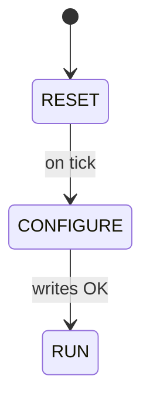
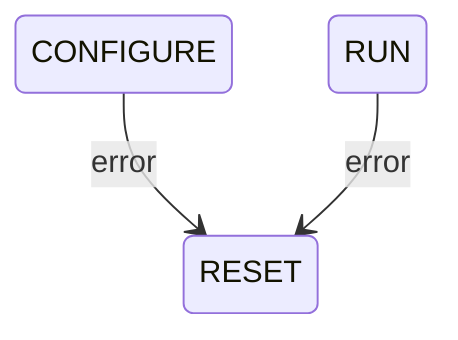

# HeaterManager SDD

## 1. Overview

`HeaterManager` is a Layer 2 Queued worker component in the Thermal subtopology. It owns the PWM-driven heater output channel, managing its initialization via `LinuxPwmDriver`. In `RUN` state it accepts duty cycle commands from `ThermalApplication` and writes the corresponding nanosecond value to the PWM channel. In any non-`RUN` state all heater commands are clamped to zero, ensuring the heater defaults off during initialization and error recovery.

The PWM period is fixed at topology assembly time as a C++ constructor argument. It is not a runtime parameter.

---

## 2. Requirements

| ID | Requirement | Verification |
|----|-------------|-------------|
| HS2-HTM-001 | HeaterManager shall set the configured PWM period and zero the duty cycle during CONFIGURE | Inspection |
| HS2-HTM-002 | HeaterManager shall enable the PWM channel at the end of CONFIGURE | Inspection |
| HS2-HTM-003 | HeaterManager shall serve heaterCmdIn requests by writing the commanded duty cycle to LinuxPwmDriver in RUN state | Inspection |
| HS2-HTM-004 | HeaterManager shall clamp heater output to zero in all non-RUN states | Inspection |
| HS2-HTM-005 | HeaterManager shall emit WARNING_HI, disable the PWM channel, and self-heal to RESET on any PWM write failure | Inspection |

---

## 3. Design

### 3.1 Component Type

Queued component. No dedicated thread. All sync input port handlers execute on the calling thread, guarded by the component mutex.

### 3.2 Ports

| Port | Direction | Type | Purpose |
|------|-----------|------|---------|
| `schedIn` | Input (sync) | `Svc.Sched` | Rate group tick; drives SM transitions |
| `heaterCmdIn` | Input (sync) | `Thermal.HeaterCmd` | Receive duty cycle command from `ThermalApplication`; clamped to zero in non-RUN states |
| `pwmSetPeriodOut` | Output | `Drv.PwmSetPeriod` | Set PWM channel period in nanoseconds during CONFIGURE |
| `pwmSetDutyCycleOut` | Output | `Drv.PwmSetDutyCycle` | Set PWM duty cycle in nanoseconds on each heater command |
| `pwmEnableOut` | Output | `Drv.PwmEnable` | Enable channel at end of CONFIGURE; disable on error before signalling → RESET |
| `logOut` | Output | `Fw.Log` | Event logging (SM transitions, PWM errors) |
| `tlmOut` | Output | `Fw.Tlm` | Telemetry (current duty cycle, SM state) |
| `timeGetOut` | Output | `Fw.Time` | Timestamps |

No command ports. No health monitoring. No PrmDb parameters. PWM period is a topology constant passed as a constructor argument.

---

## 4. State Machine

Three-state flat state machine (`RESET → CONFIGURE → RUN`, any error loops back to `RESET`). `WAIT_RESET` and `ENABLE` are omitted because `LinuxPwmDriver` handles channel export and open at topology init time. There is no chip boot delay to wait for and no power rail to assert.

```
RESET
  entry: clear internal state and error counters
  on tick → CONFIGURE

CONFIGURE
  entry: call pwmSetPeriod with the configured period
         call pwmSetDutyCycle(0) to zero the output
         call pwmEnable(HIGH) to activate the channel
  on tick:
    if all writes OK → RUN
    if any PWM error → RESET

RUN
  on heaterCmdIn: convert duty percent to nanoseconds; call pwmSetDutyCycleOut
                  clamped to zero if not in RUN
  on PWM_WRITE_ERR: log WARNING_HI, call pwmEnable(LOW) → RESET

# Global signal - reachable from any state:
on error signal → RESET
```



**Error recovery:** either `CONFIGURE` or `RUN` return directly to `RESET` on a PWM write error.



---

## 5. Notes

- Duty cycle conversion: `dutyCycleNs = (dutyPercent / 100.0) * periodNs`. Per the `LinuxPwmDriver` contract (HS2-PWM-005), `dutyCycleNs` must not exceed the current period; `HeaterManager` enforces the [0%, 100%] clamp before conversion.
- The PWM channel is exported and opened by `LinuxPwmDriver` at topology init via `open(chipNum, channelNum)` before any port calls are made. `HeaterManager` does not need to perform the sysfs export itself.
- Excluded from health monitoring.
- Wired to `RateGroup2` (1 Hz) and to the single `LinuxPwmDriver` instance for the heater channel.
