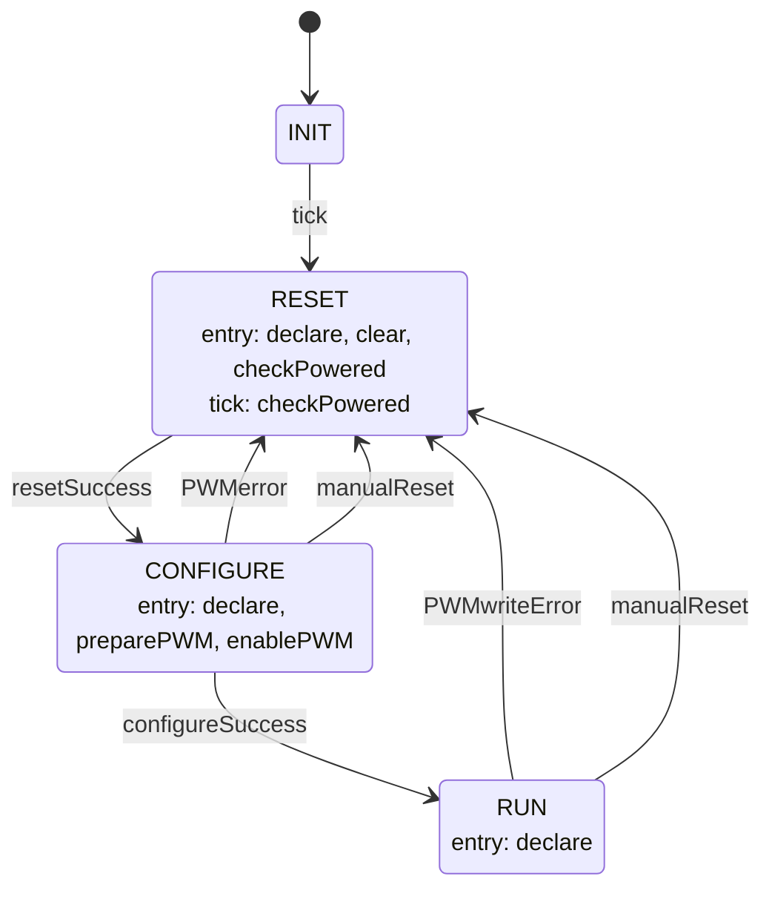

# Thermals::HeaterManager

HeaterManager is a Layer 2 Queued worker component in the Thermal subtopology. It owns the PWM-driven heater output channel, bringing the channel up through an internal state machine and translating duty-cycle commands from `Thermals::ThermalApplication` into PWM waveforms.

## Introduction

The component is driven by three synchronous input ports:

- `schedIn` (`Svc.Sched`) — a rate-group tick
- `heaterCmdIn` (`Thermals.HeaterCmd`) — a duty-cycle command in percent. Commands are dropped (logging `HeaterCmdDropped`) unless the state machine is in `RUN`.
- `manualReset` (`Thermals.ManualReset`) — forces an immediate return to `RESET` from `CONFIGURE`/`RUN`, which disables the PWM channel as part of `RESET`'s own entry actions. Lets the owning application request a fresh `powerAllowed` check without waiting for a PWM fault.

The channel itself is a Linux sysfs PWM channel owned by `Drv::LinuxPwmDriver` (`FlightComputer/Drivers/LinuxPwm`), reached over three synchronous output ports: `pwmSetPeriodOut`, `pwmSetDutyCycleOut`, and `pwmEnableOut` (all `Drv.Pwm*`, returning `Drv.PwmStatus`). The driver writes `period`, `duty_cycle`, and `enable` sysfs files under `pwmchip<N>/pwm<N>`.

Before start-up can proceed past `RESET`, the component asks the owning application for permission via `powerAllowed`.

## Requirements

| ID | Requirement | Verification |
|---|---|---|
| HS2-HTM-001 | HeaterManager shall set the configured PWM period during CONFIGURE | Unit test |
| HS2-HTM-002 | HeaterManager shall enable the PWM channel at the end of CONFIGURE | Unit Test |
| HS2-HTM-003 | HeaterManager shall serve heaterCmdIn requests by writing the commanded duty cycle to LinuxPwmDriver in RUN state | Unit test |
| HS2-HTM-004 | HeaterManager shall clamp heater output to zero in all non-RUN states | Unit test |
| HS2-HTM-005 | HeaterManager shall emit WARNING_HI, disable the PWM channel, and self-heal to RESET on any PWM write failure | Unit test |
| HS2-HTM-006 | HeaterManager shall log `HeaterCmdDropped` and take no other action when `heaterCmdIn` is received outside `RUN` | Unit test |
| HS2-HTM-007 | HeaterManager shall force an immediate transition to `RESET` when `manualReset` is invoked from `CONFIGURE` or `RUN` | Unit test |
| HS2-HTM-008 | HeaterManager shall zero the duty cycle (both the PWM driver write and its telemetry) on every entry to RESET - the only place this happens | Unit test |
| HS2-HTM-009 | HeaterManager shall disable the PWM channel on every entry to RESET - the only place this happens | Unit test |

## Design

### Ports

| Port | Kind | Direction | Type | Usage |
|---|---|---|---|---|
| `schedIn` | sync | input | `Svc.Sched` | Rate-group tick; sends `tick` to the state machine on every call. |
| `heaterCmdIn` | sync | input | `Thermals.HeaterCmd` | Duty-cycle command in percent. |
| `pwmSetPeriodOut` | sync | output | `Drv.PwmSetPeriod` | Sets the channel period in nanoseconds; called once, during `CONFIGURE`. |
| `pwmSetDutyCycleOut` | sync | output | `Drv.PwmSetDutyCycle` | Sets duty cycle in nanoseconds; called to zero the output on every entry to `RESET` and on every accepted `RUN` command. |
| `pwmEnableOut` | sync | output | `Drv.PwmEnable` | Enables (`HIGH`, in `CONFIGURE`) or disables (`LOW`, on every entry to `RESET`, via `clear`) the channel. |
| `powerAllowed` | sync | output | `Thermals.PowerAllowed` | Queries whether the application currently allows the heater to power on; polled once per `tick` while in `RESET`. |
| `manualReset` | sync | input | `Thermals.ManualReset` | Forces the state machine back to `RESET` immediately (which disables the PWM channel as part of `RESET`'s own entry actions, if not already there); lets the owning application request a fresh `powerAllowed` check without waiting for a PWM fault. |
| `timeCaller`, `Fw.Event`, `Fw.Channel` | standard AC ports | — | — | Boilerplate event/telemetry/time wiring. No `Fw.Command` import — this component defines no commands. |

### State Machine

`heaterManagerSM` (`Thermals_HeaterManagerStateMachine_t`, defined in `HeaterManagerStateMachine.fpp`) owns start-up and fault recovery. Its current state mirrors the `State` telemetry channel via the `HeaterManagerState` enum.



Each state's behavior, in the order things actually happen (`declare` — updating the cached
`SMstate` member, the `State` telemetry channel, and logging `StateChanged` — runs on entry to
every state and is omitted below to avoid repeating it four times; it also logs `SMsignalInvalid`
if handed an unexpected/initial-transition signal):

```
INIT
  on tick → RESET

RESET
  entry: clear — disable the PWM channel (pwmEnableOut(0, LOW)); the only place this
           happens (there's no separate "bail" action - every path back to RESET,
           whatever the cause, disables the channel right here as part of arriving)
           on failure → log PwmDisableFailed (channel may still be enabled; no retry)
         then zero the duty cycle (pwmSetDutyCycleOut(0, 0)) and its telemetry
           (DutyCycleNs/DutyPercent); also the only place this happens
           on failure → log PwmGeneralFailure (stay in RESET either way)
  on tick: checkPowered — ask the owning application via powerAllowed
             if ON → CONFIGURE
             otherwise stay in RESET; ask again next tick

CONFIGURE
  entry: preparePWM — set the period (pwmSetPeriodOut(0, PERIOD_NS))
           on failure → log PwmGeneralFailure → RESET
         enablePWM — enable the channel (pwmEnableOut(0, HIGH))
           on failure → log PwmGeneralFailure → RESET
           on success → RUN
  on manualReset → RESET

RUN
  on heaterCmdIn(dutyPercent):
    clamp dutyPercent to [0, 100] (log DutyClamped if clamped)
    write pwmSetDutyCycleOut
      on failure → log PwmWriteFailed, re-zero locally, → RESET
  on manualReset → RESET
```

Every `→ RESET` transition above disables the channel as a side effect of arriving there (via
`clear`, above)

**Dropped commands:** `heaterCmdIn` received outside `RUN` is dropped, not queued or replayed —
logs `HeaterCmdDropped` (`activity low`) and takes no other action.

`schedIn_handler` sends `tick` unconditionally on every call.

### Telemetry

| Name | Type | Notes |
|---|---|---|
| `State` | `Thermals.HeaterManagerState` | Mirrors the state machine's current state. |
| `DutyPercent` | `F32` | Last accepted (possibly clamped) duty cycle, in percent. Reset to `0` on every entry to `RESET`, then updated on each accepted `RUN` command. |
| `DutyCycleNs` | `U32` | Last accepted duty cycle, in PWM nanoseconds (`dutyPercent/100 * PERIOD_NS`). |


### Events

| Name | Severity | Purpose |
|---|---|---|
| `StateChanged` | activity high | Emitted on every state-machine transition. |
| `DutyClamped` | activity high | A `heaterCmdIn` command was clamped to `[0, 100]`%. |
| `PwmWriteFailed` | warning high | The `RUN`-state duty-cycle write failed. |
| `PwmGeneralFailure` | warning high | A PWM call failed either zeroing the duty cycle on entry to `RESET` or during `CONFIGURE` start-up; carries the state it happened in. (Not emitted for a channel-disable failure — see `PwmDisableFailed`.) |
| `PwmDisableFailed` | warning high | The channel-disable write, attempted on every entry to `RESET` (via `clear`), itself failed — the channel may still be enabled. |
| `SMsignalInvalid` | warning high | An unrecognized or initial-transition signal reached the state machine — indicates a state-machine bug, not a PWM fault. |
| `HeaterCmdDropped` | activity low | A `heaterCmdIn` command arrived while not in `RUN` and was dropped. |

