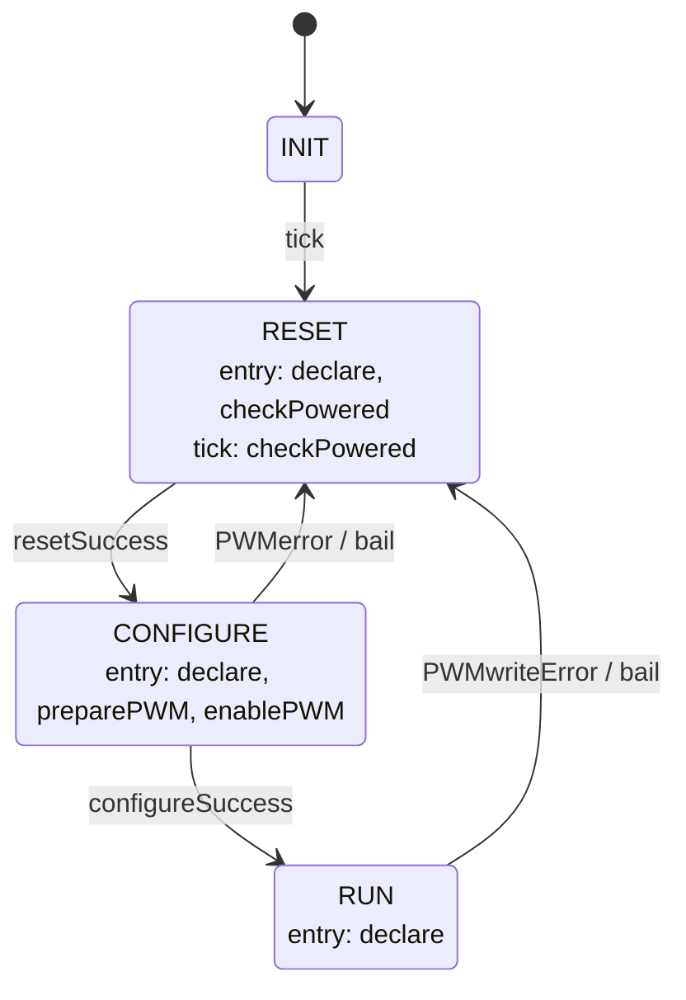

# Thermals::HeaterManager

HeaterManager is a Layer 2 Queued worker component in the Thermal subtopology. It owns the PWM-driven heater output channel, bringing the channel up through an internal state machine and translating duty-cycle commands from `Thermals::ThermalApplication` into PWM writes.

## Introduction

The component is driven by two synchronous input ports:

- `schedIn` (`Svc.Sched`) — a rate-group tick
- `heaterCmdIn` (`Thermals.HeaterCmd`) — a duty-cycle command in percent. Commands are dropped unless the state machine is in `RUN`. (Maybe we should store these)

Before bring-up can proceed past `RESET`, the component asks the owning application for permission via `powerAllowed`.

## Requirements

| ID | Requirement | Verification |
|---|---|---|
| HS2-HTM-001 | HeaterManager shall set the configured PWM period and zero the duty cycle during CONFIGURE | Unit test |
| HS2-HTM-002 | HeaterManager shall enable the PWM channel at the end of CONFIGURE | Unit Test |
| HS2-HTM-003 | HeaterManager shall serve heaterCmdIn requests by writing the commanded duty cycle to LinuxPwmDriver in RUN state | Unit test |
| HS2-HTM-004 | HeaterManager shall clamp heater output to zero in all non-RUN states | Unit test |
| HS2-HTM-005 | HeaterManager shall emit WARNING_HI, disable the PWM channel, and self-heal to RESET on any PWM write failure | Unit test |

## Design

### Ports

| Port | Kind | Direction | Type | Usage |
|---|---|---|---|---|
| `schedIn` | sync | input | `Svc.Sched` | Rate-group tick; sends `tick` to the state machine on every call. |
| `heaterCmdIn` | sync | input | `Thermals.HeaterCmd` | Duty-cycle command in percent. |
| `pwmSetPeriodOut` | sync | output | `Drv.PwmSetPeriod` | Sets the channel period in nanoseconds; called once, during `CONFIGURE`. |
| `pwmSetDutyCycleOut` | sync | output | `Drv.PwmSetDutyCycle` | Sets duty cycle in nanoseconds; called to zero the output during `CONFIGURE` and on every accepted `RUN` command. |
| `pwmEnableOut` | sync | output | `Drv.PwmEnable` | Enables (`HIGH`, in `CONFIGURE`) or disables (`LOW`, in `bail`) the channel. |
| `powerAllowed` | sync | output | `Thermals.PowerAllowed` | Queries whether the application currently allows the heater to power on; polled once per `tick` while in `RESET`. |
| `timeCaller`, `Fw.Event`, `Fw.Channel` | standard AC ports | — | — | Boilerplate event/telemetry/time wiring. No `Fw.Command` import — this component defines no commands. |

### State Machine

`heaterManagerSM` (`Thermals_HeaterManagerStateMachine_t`, defined in `HeaterManagerStateMachine.fpp`) owns bring-up and fault recovery. Its current state mirrors the `State` telemetry channel via the `HeaterManagerState` enum.

| State | Meaning | Entry actions | On `tick` |
|---|---|---|---|
| `INIT` | Idle until the first `schedIn` tick, which sends `tick` and immediately transitions out. | — | transitions to `RESET` |
| `RESET` | Polls the application every tick until it allows power-on; holds here indefinitely otherwise. | `declare`, `checkPowered` | `checkPowered` |
| `CONFIGURE` | Zeroes the output, sets the period, and enables the channel. | `declare`, `preparePWM`, `enablePWM` | ignored |
| `RUN` | Steady state: `heaterCmdIn` commands are accepted and written to the PWM driver. | `declare` | ignored |

`schedIn_handler` sends `tick` unconditionally on every call 

Actions:

- **declare** — updates the cached `SMstate` member from the signal being handled, writes the `State` telemetry channel, and logs `StateChanged`. Also logs `SMsignalInvalid` if handed an unexpected/initial-transition signal.
- **checkPowered** — calls `powerAllowed_out(0)`; if the answer is `Fw.On.ON`, signals `resetSuccess` (advancing to `CONFIGURE`). Otherwise does nothing and stays in `RESET` — the next `tick` will ask again.
- **preparePWM** — calls `pwmSetDutyCycleOut(0, 0)` to zero the output; if that fails, signals `PWMerror`, logs `PwmGeneralFailure`, and returns without attempting to set the period. Otherwise calls `pwmSetPeriodOut(0, PERIOD_NS)`; on failure, same `PWMerror`/`PwmGeneralFailure` response. On success, telemeters `DutyCycleNs`/`DutyPercent` as `0`.
- **enablePWM** — calls `pwmEnableOut(0, HIGH)`. On failure, signals `PWMerror` and logs `PwmGeneralFailure`. Otherwise signals `configureSuccess`.
- **bail** — calls `pwmEnableOut(0, LOW)`. If that write also fails, logs `PwmDisableFailed`.

### Telemetry

| Name | Type | Notes |
|---|---|---|
| `State` | `Thermals.HeaterManagerState` | Mirrors the state machine's current state. |
| `DutyPercent` | `F32` | Last accepted (possibly clamped) duty cycle, in percent. Reset to `0` during `CONFIGURE` bring-up, then updated on each accepted `RUN` command. |
| `DutyCycleNs` | `U32` | Last accepted duty cycle, in PWM nanoseconds (`dutyPercent/100 * PERIOD_NS`). |

### Events

| Name | Severity | Purpose |
|---|---|---|
| `StateChanged` | activity high | Emitted on every state-machine transition |
| `DutyClamped` | activity high | A `heaterCmdIn` command was clamped to `[0, 100]`% |
| `PwmWriteFailed` | warning high | The `RUN`-state duty-cycle write failed |
| `PwmGeneralFailure` | warning high | A PWM call failed either during `CONFIGURE` bring-up or while disabling the channel on the way back to `RESET`; carries the state it happened in |
| `PwmDisableFailed` | warning high | The channel-disable write, attempted while recovering to `RESET`, itself failed — the channel may still be enabled |
| `SMsignalInvalid` | warning high | An unrecognized or initial-transition signal reached the state machine |

