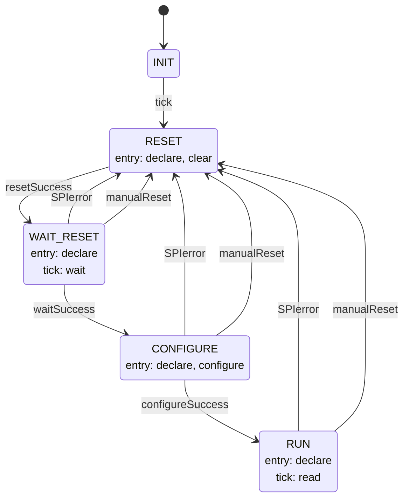

# Thermals::TemperatureSensorManager

TemperatureSensorManager is a Layer 2 Queued worker component in the Thermal subtopology. It owns all onboard temperature sensors, sequencing their power-up and configuration through an internal state machine, polling them once per rate-group tick.

## Introduction

The component is driven by two synchronous input ports:

- `schedIn` (`Svc.Sched`) — a rate-group tick. All state-machine progression and sensor polling happens here.
- `tempReadIn` (`Thermals.TempRead`, sized `[NUM_TEMPERATURE_SENSORS]`) — lets other components pull the most recently cached readings without waiting on the bus.

Sensor hardware is accessed over `spiWriteRead` (`Drv.SpiWriteRead`); the shared bus is addressed per-transaction via the `sensorSelect` GPIO mux. Each sensor is optionally paired with a `sensorDRDY` GPIO input; when connected it gates reads. The owning application can also mark individual sensors skipped at runtime via `setSensorSkip`. A skipped sensor is not configured on reset; the same port can additionally force the state machine back through `RESET` so a skip change (or any other reconfiguration) takes effect immediately, without waiting for a bus error. Two async commands allow adjustment of per-sensor over/under-temperature thresholds at runtime.

## Requirements

| Name | Description | Validation |
|---|---|---|
| TSM-001 | While in `WAIT_RESET`, the component shall wait `WAIT_TICKS` scheduler ticks before signaling `waitSuccess` and advancing to `CONFIGURE`.  | Unit Test |
| TSM-002 | While in `RUN`, the component shall poll all `NUM_TEMPERATURE_SENSORS` sensors once per `schedIn` tick and publish the results as the `temepereture` telemetry channel. | Unit Test |
| TSM-003 | The component shall serve the last cached readings on `tempReadIn` regardless of state, invalidating all entries whenever the state machine (re-)enters any state other than `RUN`. | Unit Test |
| TSM-004 | On any bus error, the component shall log a warning, invalidate all cached readings, and return to `RESET`. | Unit Test |
| TSM-005 | The component shall accept `SET_SENSOR_LOWER_THRESHOLD` and `SET_SENSOR_UPPER_THRESHOLD` commands to set per-sensor fault thresholds at runtime. | Unit Test |
| TSM-006 | While in `RUN`, the component shall compare each sensor's reading against its configured thresholds and emit `Overheating`, `Cold`, or `Nominal` events on state transitions (not every tick). | Unit Test |
| TSM-007 | While in `CONFIGURE`, the component shall write each sensor's Configuration Register 0 (Automatic Conversion mode) and Configuration Register 1 (Type K, no averaging) over SPI. | Unit Test |
| TSM-008 | While in `RUN`, for any sensor with a connected `sensorDRDY` port, the component shall skip that sensor's SPI read on ticks where `DRDY` reports not-ready. A sensor with no connected `sensorDRDY` port shall be read every tick. | Unit Test |
| TSM-009 | A sensor marked skipped via `setSensorSkip` shall receive no SPI writes during `CONFIGURE` and no SPI reads during `RUN`, and its cached reading shall be immediately invalidated when skip is set. | Unit Test |
| TSM-010 | `setSensorSkip` with `resetComponent` set shall drive the state machine back to `RESET` (from any of `WAIT_RESET`, `CONFIGURE`, `RUN`) without logging `SMsignalInvalid`, invalidating all cached readings in the process. | Unit Test |

## Design

### Ports

| Port | Kind | Direction | Type | Usage |
|---|---|---|---|---|
| `schedIn` | sync | input | `Svc.Sched` | Rate-group tick; drives state-machine progression and sensor polling. |
| `tempReadIn` | sync | input, array `[NUM_TEMPERATURE_SENSORS]` | `Thermals.TempRead` | Returns the last cached `TemperatureReadings` to a caller |
| `spiWriteRead` | — | output | `Drv.SpiWriteRead` | SPI transaction (address byte + data byte(s)) used to read/write each sensor's registers. |
| `sensorSelect` | — | output, array `[NUM_SENSOR_SELECT_PINS]` | `Drv.GpioWrite` | Binary-encoded GPIO select lines addressing which sensor is active on the shared SPI bus for the current transaction. |
| `sensorDRDY` | — | output, array `[NUM_TEMPERATURE_SENSORS]` | `Drv.GpioRead` | Signal from multiplexer for whether the selected sensor is safe to read |
| `setSensorSkip` | sync | input | `Thermals.SensorSkip` | Lets the owning application enable/disable configuration and reads for one sensor at runtime, and optionally (`resetComponent`) force the state machine back to `RESET` immediately. |
| `SET_SENSOR_LOWER_THRESHOLD` / `SET_SENSOR_UPPER_THRESHOLD` | async command | input | `I8` | Set a sensor's fault threshold. |
| `timeCaller`, `Fw.Command`, `Fw.Event`, `Fw.Channel`, `Drv.Spi` | standard AC ports | — | — | Boilerplate command/event/telemetry/time and SPI helper wiring. |

### State Machine

`tempSenseManagerSM` (`Thermals_TemperatureSensorManagerStateMachine_t`, defined in `TemperatureSensorManagerStateMachine.fpp`) owns the bring-up and fault-recovery sequence. Its current state mirrors the `theStateOfTheStateMachineForTemperatureSensorManager` telemetry channel via the `TemperatureSensorManagerState` enum.

`manualReset` is sent internally by `setSensorSkip` when called with `resetComponent = true`; it's handled identically to `SPIerror` by every state that has it (immediate transition to `RESET`, no distinct recovery path).

| State | Meaning | Entry actions | On `tick` |
|---|---|---|---|
| `INIT` | Idle until the first `schedIn` tick | — | proceed to `RESET` |
| `RESET` | Internal state/error counters cleared, all cached readings marked invalid. | `declare`, `clear` | ignored |
| `WAIT_RESET` | Holding for `WAIT_TICKS` ticks to let sensor hardware settle. | `declare` | `wait` |
| `CONFIGURE` | Writes each sensor's Configuration Register 0 (Automatic Conversion mode) and Configuration Register 1 (Type K, no averaging) over SPI. | `declare`, `configure` | ignored |
| `RUN` | Steady state: sensors are polled (subject to `DRDY`) and readings published on every `tick`. Emits `Overheating`/`Cold`/`Nominal` events | `declare` | `read` |

Actions:

- **declare** — updates the cached `SMstate` member from the signal being handled (`SPIerror` and `manualReset` both map to `RESET`), writes the state telemetry channel, logs `StateChanged`, and invalidates all cached `temperature` entries whenever the newly-entered state is not `RUN`.
- **clear** — resets the wait-tick counter to 0, logs `cleared`, and immediately signals `resetSuccess`
- **wait** — increments the wait-tick counter, telemeters `ticksWaited`, and signals `waitSuccess` once the counter reaches `WAIT_TICKS`.
- **configure** — for each sensor not marked skipped (via `setSensorSkip`), writes Configuration Register 0 (`CMODE=1`, Automatic Conversion mode) and Configuration Register 1 (`TC_TYPE=0011`, Type K; `AVGSEL=000`, no averaging) in a single multi-byte SPI transaction, then logs `configured` and signals `configureSuccess`. An SPI error on any sensor logs `SPIError` and signals `SPIerror` immediately, without configuring the remaining sensors. A skipped sensor receives no SPI traffic at all.
- **read** — runs once per `tick` received while in `RUN`: sensors marked skipped are ignored entirely (no select, no SPI). Of the rest, any sensor with a connected `sensorDRDY` port has `DRDY` checked first and its SPI transaction skipped if it reports not-ready; a sensor with no connected `sensorDRDY` port is always read. Sensors skipped for either reason (via `setSensorSkip` or a not-ready `DRDY`) are left out of the `temepereture` telemetry channel for that tick — their entry publishes as invalid rather than repeating a stale value. Sensors that are read update cached readings and per-sensor nominality, and emit `Overheating`/`Cold`/`Nominal` events.

### Commands

| Name | Arguments | Effect |
|---|---|---|
| `SET_SENSOR_LOWER_THRESHOLD` | `sensor: Thermals.Sensor`, `temp: I8` | Sets `sensorUnderheatValues[sensor]`. Responds `OK` unconditionally. |
| `SET_SENSOR_UPPER_THRESHOLD` | `sensor: Thermals.Sensor`, `temp: I8` | Sets `sensorOverheatValues[sensor]`. Responds `OK` unconditionally. |

### Telemetry

| Name | Type | Notes |
|---|---|---|
| `ticksWaited` | `U32` | Ticks elapsed in `WAIT_RESET`; only meaningful while waiting. |
| `temepereture` | `Thermals.TemperatureReadings` | Per-sensor `{temperatureC: I8, valid: bool}` array. Published only for `schedIn` ticks handled while in `RUN` — not every `schedIn` call. Integer Celsius only — sensor error is >±2°C, so sub-degree resolution isn't meaningful |
| `theStateOfTheStateMachineForTemperatureSensorManager` | `Thermals.TemperatureSensorManagerState` | Mirrors the state machine's current state. |

### Events

| Name | Severity | Purpose |
|---|---|---|
| `StateChanged` | activity high | Emitted on every state-machine transition. |
| `SPIError` | warning high | Bus transaction failed; carries `Drv.SpiStatus`. |
| `Overheating` | warning high | Sensor reading exceeded its upper threshold (edge-triggered). |
| `Cold` | warning high | Sensor reading fell below its lower threshold (edge-triggered). |
| `Nominal` | activity high | Sensor reading returned within thresholds (edge-triggered). |
| `SMsignalInvalid` | warning high | An unrecognized or initial-transition signal reached the state machine — indicates a state-machine bug, not a sensor/bus fault. |
| `SensorSkipChanged` | activity high | A sensor was marked skipped or un-skipped via `setSensorSkip`. |
| `configured` | activity high | Unit-test aid; every sensor has been configured and `CONFIGURE` is complete. |
| `cleared` | activity high | Unit-test aid; internal state/error counters have been reset on entry to `RESET`. |
