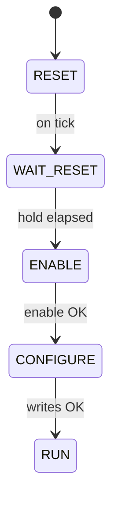
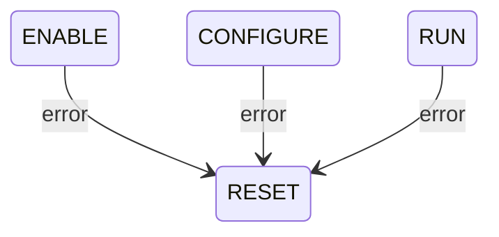

# TemperatureSensorManager SDD

## 1. Overview

`TemperatureSensorManager` is a Layer 2 Queued worker component in the Thermal subtopology. It owns all onboard temperature sensors, managing their initialization and configuration via `LinuxI2cDriver`. On each rate group tick it advances its flat state machine. In `RUN` state it serves synchronous temperature read requests from `ThermalApplication`, returning an array of temperature values and validity flags cached from the most recent I2C reads.

---

## 2. Requirements

| ID | Requirement | Verification |
|----|-------------|-------------|
| HS2-TSM-001 | TemperatureSensorManager shall initialize all configured temperature sensors via LinuxI2cDriver during CONFIGURE | Inspection |
| HS2-TSM-002 | TemperatureSensorManager shall read all sensor values each rate group tick in RUN state and cache the results | Inspection |
| HS2-TSM-003 | TemperatureSensorManager shall return cached temperature readings and validity flags for all sensors on tempReadIn | Inspection |
| HS2-TSM-004 | TemperatureSensorManager shall return valid=false for all sensors when not in RUN state | Inspection |
| HS2-TSM-005 | TemperatureSensorManager shall emit WARNING_HI and self-heal to RESET on any I2C bus error | Inspection |
| HS2-TSM-006 | TemperatureSensorManager shall emit telemetry for all sensor readings each rate group tick in RUN state | Inspection |

---

## 3. Design

### 3.1 Component Type

Queued component. No dedicated thread. All sync input port handlers execute on the calling thread, guarded by the component mutex.

### 3.2 Ports

| Port | Direction | Type | Purpose |
|------|-----------|------|---------|
| `schedIn` | Input (sync) | `Svc.Sched` | Rate group tick; drives SM transitions and sensor reads |
| `tempReadIn` | Input (sync) | `Thermal.TempRead` | Serve temperature read request from `ThermalApplication`; returns cached readings and validity flags; returns all-invalid if not in RUN state |
| `i2cOut` | Output | `Drv.I2c` | I2C transactions to `LinuxI2cDriver` |
| `logOut` | Output | `Fw.Log` | Event logging (SM transitions, bus errors) |
| `tlmOut` | Output | `Fw.Tlm` | Telemetry (per-sensor temperature values, SM state) |
| `timeGetOut` | Output | `Fw.Time` | Timestamps |

---

## 4. State Machine

Single flat state machine following the hardware manager pattern (`RESET → WAIT_RESET → ENABLE → CONFIGURE → RUN`, error from any state loops back to `RESET`).

```
RESET
  entry: clear cached readings; mark all sensors invalid; reset error counters
  on tick → WAIT_RESET

WAIT_RESET
  on tick: count ticks
           if hold period elapsed → ENABLE
           (no bus operations)

ENABLE
  entry: assert any required power or enable GPIO for the sensor bus
  on tick:
    if enable OK → CONFIGURE
    if enable error → RESET

CONFIGURE
  entry: write initialization sequence to each sensor over I2C
         (resolution, conversion rate, one-shot vs. continuous mode)
  on tick:
    if all writes OK → RUN
    if any I2C error → RESET

RUN
  on tick: read all sensors over I2C; update cache and validity flags
           on I2C error: log WARNING_HI, mark all readings invalid → RESET
  on tempReadIn: serve cached readings and validity flags from RUN;
                 return all-invalid if not in RUN

# Global signal - reachable from any state:
on error signal → RESET
```



**Error recovery:** any of `ENABLE`, `CONFIGURE`, or `RUN` return directly to `RESET` on an I2C bus error.



---

## 5. Notes

- Need to re-check thermocouple amplifier datasheet to determine whether the full 5 states is necessary. We may be able to get away with a somewhat simpler state machine.
- Sensor count N is a compile-time constant. The `Thermal.TempRead` port carries arrays of length N.
- `tempReadIn` returns the cache from the most recent tick. `ThermalApplication` always receives the freshest available data without stalling on a live I2C transaction.
- Excluded from health monitoring.
- Wired to `RateGroup2` (1 Hz).
