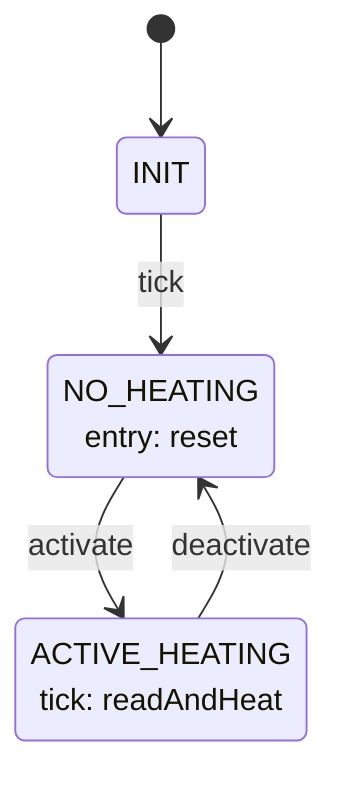

# Thermals::ThermalApplication

ThermalApplication is the Layer 3 active component for the Thermal subtopology. On a 1 Hz rate-group
tick, it reads all onboard temperature sensors (via `TemperatureSensorManager`), runs a PID control
loop against a commanded setpoint, and commands the resulting duty cycle to the heater (via
`HeaterManager`) — clamping to zero whenever a sensor reading is invalid or heating isn't active.

## Introduction

The component is driven by two synchronous input ports:

- `schedIn` (`Svc.Sched`) — a 1 Hz rate-group tick. All sensor polling and PID computation happens here.
- `modeIn` (`Sat.ThermalModePort`, carrying `Thermals.Mode`) — mode commands from `SatStateMachine`. `NoHeating` holds the heater at 0% duty; `ActiveHeating` starts the per-tick control loop.

There is no direct hardware access here — `ThermalApplication` talks to the two Layer 2 hardware
managers entirely through their own ports: `tempReadOut` (`Thermals.TempRead`) synchronously pulls
`TemperatureSensorManager`'s most recently cached readings (it never blocks on the SPI bus itself),
and `heaterCmdOut` (`Thermals.HeaterCmd`) commands `HeaterManager`'s duty cycle. Both managers own
their own bring-up/fault-recovery state machines independently — `ThermalApplication` doesn't know
or care whether either one is mid-reset; it just reads/writes their ports every tick and reacts to
whatever comes back (an invalid reading is handled the same way whether the sensor manager is
between reads or genuinely faulted).

Ground can override the control loop's output entirely via `SET_HEATER_OVERRIDE`/
`CLEAR_HEATER_OVERRIDE`, forcing a fixed duty cycle regardless of what the PID loop computes —
useful for bench testing the heater/PWM chain independently of sensor readings, or for a manual
override if the automatic control is misbehaving. An override does **not** suspend the PID's
proportional/derivative computation, but it does freeze the integral term specifically (see State
Machine, below) — only the *commanded output* is replaced.

Since the satellite runs hotter than it runs cold, the control loop is deliberately biased toward
*not* heating when it can't fully trust its inputs: fewer than `MIN_VALID_SENSORS` valid readings
holds duty at 0% for that tick (see `HS2-THA-003`) rather than trusting too small/unreliable a
sample to drive an average.

`pingIn`/`pingOut` provide the standard health-monitoring round trip.

## Requirements

| ID | Requirement | Verification |
|---|---|---|
| HS2-THA-001 | ThermalApplication shall hold the commanded heater duty cycle at 0% while in `NO_HEATING`, regardless of any active `SET_HEATER_OVERRIDE` | Unit test |
| HS2-THA-002 | While in `ACTIVE_HEATING`, ThermalApplication shall run a PID control loop each tick (error = `SetpointC` minus the average of all valid sensor readings; duty = `Kp`*error + `Ki`*accumulated error + `Kd`*(error - previous error)) and command the result, clamped to `[0, 100]`%, to `HeaterManager` | Unit test |
| HS2-THA-003 | On any invalid sensor reading, ThermalApplication shall log `SensorInvalid` for that sensor. If fewer than `MIN_VALID_SENSORS` readings remain valid, it shall additionally log `InsufficientValidSensors`, reset the PID integrator and derivative history, and command 0% duty (subject to override) for that tick — without leaving `ACTIVE_HEATING`. Otherwise (still `>= MIN_VALID_SENSORS` valid) the PID loop runs normally on the average of the readings that remain valid. | Unit test |
| HS2-THA-004 | ThermalApplication shall publish every sensor's raw reading and validity flag to the `TempC` telemetry channel each `ACTIVE_HEATING` tick | Unit test |
| HS2-THA-005 | ThermalApplication shall accept `SET_HEATER_OVERRIDE` to force a fixed, clamped duty cycle regardless of PID output or sensor validity, and `CLEAR_HEATER_OVERRIDE` to resume normal PID-driven control; the PID integral term shall not accumulate for any tick during which an override is engaged | Unit test |
| HS2-THA-006 | ThermalApplication shall switch between `NO_HEATING` and `ActiveHeating` on command from `SatStateMachine`, logging `StateChanged` on every mode command | Unit test |
| HS2-THA-007 | ThermalApplication shall respond to `pingIn` immediately on `pingOut` with the same key | Unit test |

## Design

### Ports

| Port | Kind | Direction | Type | Usage |
|---|---|---|---|---|
| `modeIn` | sync | input | `Sat.ThermalModePort` | Mode command from `SatStateMachine`. |
| `schedIn` | sync | input | `Svc.Sched` | 1 Hz rate-group tick; sends `tick` to the state machine on every call. |
| `tempReadOut` | sync | output | `Thermals.TempRead` | Synchronous read of `TemperatureSensorManager`'s cached readings (array of `{temperatureC, valid}`, one per sensor). |
| `heaterCmdOut` | sync | output | `Thermals.HeaterCmd` | Duty-cycle command (percent) to `HeaterManager`. |
| `pingIn` / `pingOut` | sync / — | in / out | `Svc.Ping` | Health monitoring; every `pingIn` is echoed immediately on `pingOut`. |
| `timeCaller`, `Fw.Command`, `Fw.Event`, `Fw.Channel`, `prmGetOut`, `prmSetOut` | standard AC ports | — | — | Boilerplate command/event/telemetry/time/parameter wiring. |

### Commands

| Name | Arguments | Effect |
|---|---|---|
| `SET_HEATER_OVERRIDE` | `dutyPercent: F32` | Clamps `dutyPercent` to `[0, 100]`, engages the override (stored, applied by every subsequent `commandHeaterDuty` call regardless of state), logs `OverrideEngaged` with the clamped value, responds `OK` unconditionally. |
| `CLEAR_HEATER_OVERRIDE` | — | Disengages the override; subsequent duty commands reflect the PID loop (or 0%, in `NO_HEATING`) again. Logs `OverrideCleared`, responds `OK` unconditionally. |

### State Machine

`thrmAppStateMachine` (`Thermals_ThermalApplicationStateMachine_t`, defined in
`ThermalApplicationStateMachine.fpp`) switches between idle and the per-tick control loop.



```
INIT
  on tick → NO_HEATING

NO_HEATING
  entry: reset — zero the PID integrator and the derivative term's previousError; command
           heaterCmdOut(0.0) directly, NOT through commandHeaterDuty (see below) - so an
           active SET_HEATER_OVERRIDE is bypassed and has no effect here; duty is
           unconditionally zero while not heating. Telemeters DutyCycleNs as 0.
  on activate → ACTIVE_HEATING

ACTIVE_HEATING
  on tick: readAndHeat — read all sensors via tempReadOut
             publish the full readings (Celsius + validity, straight from
               TemperatureSensorManager) to TempC telemetry, always
             log SensorInvalid for each individual invalid sensor
             if fewer than MIN_VALID_SENSORS readings are valid:
               log InsufficientValidSensors (carries the actual valid count)
               reset the PID integrator and previousError to 0 (a derivative computed
                 across this discontinuity would be meaningless)
               commandHeaterDuty(0%)
             else:
               avg = mean of whichever readings are valid (may be fewer than all of them)
               error = SetpointC - avg
               if no override is currently engaged: integral += error
                 (frozen while overridden - see the anti-windup note below)
               derivative = error - previousError
               commandHeaterDuty(Kp*error + Ki*integral + Kd*derivative)
               previousError = error   (always updates, override or not)
  on deactivate → NO_HEATING
```

`commandHeaterDuty(dutyPercent)` (not a state-machine action — a plain helper, called from both of
`readAndHeat`'s branches above; `reset` does *not* call it, which is why `NO_HEATING` bypasses the
override, as noted above): if `SET_HEATER_OVERRIDE` is currently engaged, `dutyPercent` is
replaced with the override value outright, discarding whatever was just computed; either way, the
result is then clamped to `[0, 100]`%, written to `heaterCmdOut`, and telemetered as `DutyCycleNs`
(`dutyPercent / 100 * PERIOD_NS`).

**The PID integral is frozen while an override is engaged (anti-windup).** Before accumulating
`error` into `pidIntegral`, `readAndHeat` checks whether `SET_HEATER_OVERRIDE` is currently active
and skips the accumulation entirely if so — the proportional and derivative terms are still
computed normally (and `previousError` still updates), only the integral's *accumulation* is
paused. So however many ticks an override is held for, clearing it resumes at the same duty a
single non-overridden tick would have produced from the current reading — there's no artificial
jump reflecting time spent under an override. (There's still no bound on the integral for
persistent error accumulated *outside* of an override — that's a separate, not-yet-addressed
scenario; see Open Items.)

`schedIn_handler` sends `tick` unconditionally on every call.

### Telemetry

| Name | Type | Notes |
|---|---|---|
| `DutyCycleNs` | `U32` | Last commanded duty cycle sent to `HeaterManager`, in PWM nanoseconds (`dutyPercent / 100 * PERIOD_NS`) — reflects an active override, if any. Written on entry to `NO_HEATING` (as 0) and on every `ACTIVE_HEATING` tick. |
| `TempC` | `Thermals.TemperatureReadings` | The exact readings (`{temperatureC: I8, valid: bool}` per sensor) most recently pulled from `TemperatureSensorManager`, published every `ACTIVE_HEATING` tick — the same type `TemperatureSensorManager` itself publishes as its own `temperature` channel, so validity is directly readable off this channel without needing to separately correlate `SensorInvalid` events. |

### Events

| Name | Severity | Purpose |
|---|---|---|
| `StateChanged` | activity high | Emitted on every `modeIn` command, carrying the commanded mode. |
| `SensorInvalid` | warning high | A sensor reading was invalid this tick; carries which sensor. Logged for every invalid sensor regardless of how many remain valid — does not by itself clamp duty or reset the PID state (see `InsufficientValidSensors`). |
| `InsufficientValidSensors` | warning high | Fewer than `MIN_VALID_SENSORS` sensor readings were valid this tick; carries the actual valid count. Heater duty was held at 0% (subject to override) and the PID integrator/derivative history reset. |
| `OverrideEngaged` | activity high | `SET_HEATER_OVERRIDE` accepted; carries the clamped duty percent actually engaged (not necessarily the requested value, if it was out of range). |
| `OverrideCleared` | activity high | `CLEAR_HEATER_OVERRIDE` accepted. |

### Parameters

| Name | Type | Default | Purpose |
|---|---|---|---|
| `Kp` | `F32` | `5.0` | Proportional gain for the heater control loop. |
| `Ki` | `F32` | `0.1` | Integral gain for the heater control loop. |
| `Kd` | `F32` | `0.0` | Derivative gain for the heater control loop. Defaults to `0.0` (a no-op) — not tuned against real hardware yet. |
| `SetpointC` | `F32` | `20.0` | Target temperature setpoint, in Celsius, that the control loop drives the sensor average toward. |

## Open Items / Known TODOs

- **None of `Kp`/`Ki`/`Kd`/`SetpointC` are tuned against real hardware** — `Kd` in particular
  defaults to `0.0` (a no-op) since there's no thermal-mass/response data yet to tune it from.
- **The integral term still has no bound for error accumulated *outside* of an override.** The
  anti-windup fix above (freezing accumulation while `SET_HEATER_OVERRIDE` is engaged) only
  addresses windup caused specifically by an override masking the output; a persistently large
  error with no override active at all (e.g. a genuinely broken heater, or a setpoint that's
  unreachable given ambient conditions) would still accumulate without limit. A general integral
  clamp (`docs/open-items-fix-plan.md`'s option (a)) or conditional integration (option (c)) would
  still need real tuned gains and an achievable-duty analysis to pick a sane bound — not something
  to guess at without that data.
- **`MIN_VALID_SENSORS = 2` (of `NUM_TEMPERATURE_SENSORS = 3`) was chosen without weighting by
  which specific sensor(s) are invalid** — a single stuck-but-plausible reading and a single
  cleanly-invalid reading are treated identically (both just count against the threshold), and
  there's no escalation distinguishing "briefly noisy" from "sensor genuinely gone." If sensor
  reliability data suggests one failure mode is meaningfully more likely/dangerous than the other,
  this may be worth revisiting (see `docs/open-items-fix-plan.md`'s option (c), confidence
  weighting, which was set aside in favor of this simpler hard-threshold approach).
- **No topology wiring described here** — `tempReadOut`/`heaterCmdOut` connect to
  `TemperatureSensorManager`/`HeaterManager` within the Thermal subtopology; `modeIn` connects to
  `SatStateMachine`. See the subtopology assembly, not this document, for the actual wiring.

## Testing

Unit tests (`test/ut/ThermalApplicationTester.*`) fake `tempReadOut`'s response via a member array
(`sensorReadings`, defaulted to whatever the test sets before ticking) rather than a real
`TemperatureSensorManager` instance, and default `Kp`/`Ki`/`Kd`/`SetpointC` to their documented
defaults via `paramSet_*`/`loadParameters()` in the fixture constructor, so per-test duty-cycle
math is directly predictable from the readings a test supplies. Since `Kd` defaults to `0.0`, the
existing pre-D-term tests didn't need updating when the derivative term was added — it contributes
nothing unless a test explicitly sets a nonzero `Kd`.

Tests cover: the initial `INIT`→`NO_HEATING` transition holding duty at 0% without ever touching
`tempReadOut` (`testInitialTickHoldsZeroDutyWithoutHeating`); a nominal `ACTIVE_HEATING` tick
computing and commanding the expected PID duty from three valid readings
(`testActiveHeatingCommandsPidDuty` — 10°C average against the 20°C default setpoint, with default
gains, works out to exactly 51%, hand-verified in the test's own comment); one invalid sensor (of
three) still leaving `>= MIN_VALID_SENSORS` valid, so heating continues on the average of the
readings that remain trusted (`testOneInvalidSensorStillHeatsUsingRemainingValid` — same 51% math,
since the invalid sensor's value was never part of the average either way); dropping *below*
`MIN_VALID_SENSORS` (2 of 3 invalid) actually halting heating and logging
`InsufficientValidSensors` with the correct valid count
(`testInsufficientValidSensorsHaltsHeating`); `NoHeating` forcing duty back to 0% immediately on
the mode command, before the next tick even runs (`testDeactivateHoldsZeroDuty`);
`SET_HEATER_OVERRIDE` forcing the commanded duty regardless of what the PID loop would have
computed (`testOverrideForcesDuty`); the override's own clamping to `[0, 100]` independent of the
PID path (`testOverrideClampsDuty`); `CLEAR_HEATER_OVERRIDE` resuming PID output at *exactly* the
same duty a single non-overridden tick would produce (51%, matching
`testActiveHeatingCommandsPidDuty`'s own math) rather than a windup-inflated value, since the
integral didn't accumulate during the overridden tick (`testClearOverrideResumesPid`); the same
anti-windup behavior held across *two* overridden ticks, not just one, to rule out the freeze only
coincidentally working for a single tick
(`testOverrideFreezesIntegralAcrossMultipleTicks`); and `testDerivativeTermRespondsToChangingError`
setting `Kd=2.0` and running two ticks with a changing average temperature (10°C then 15°C),
hand-verifying the full `Kp*error + Ki*integral + Kd*derivative` computation both ticks (71% then
16.5%) — the derivative term's sign flips between the two (the error is shrinking, so
`Kd*derivative` is negative on the second tick), which wouldn't show up in a test that only ever
ticked once. Plus the standard `pingIn`/`pingOut` health check.
