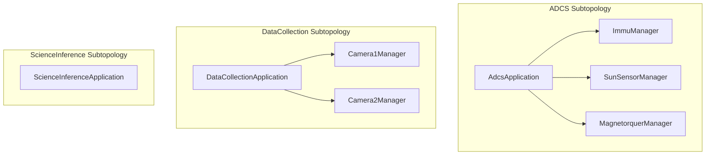
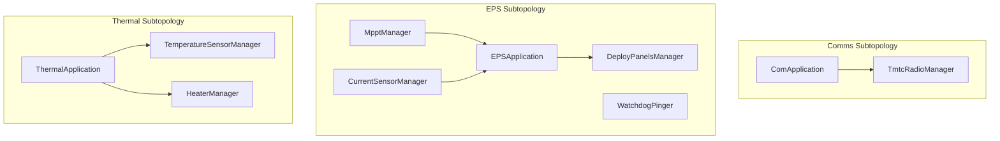
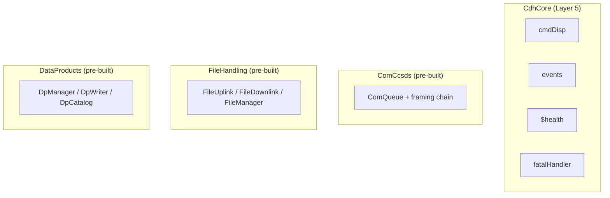
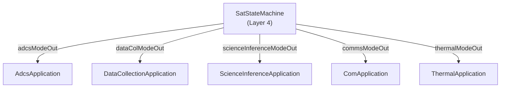
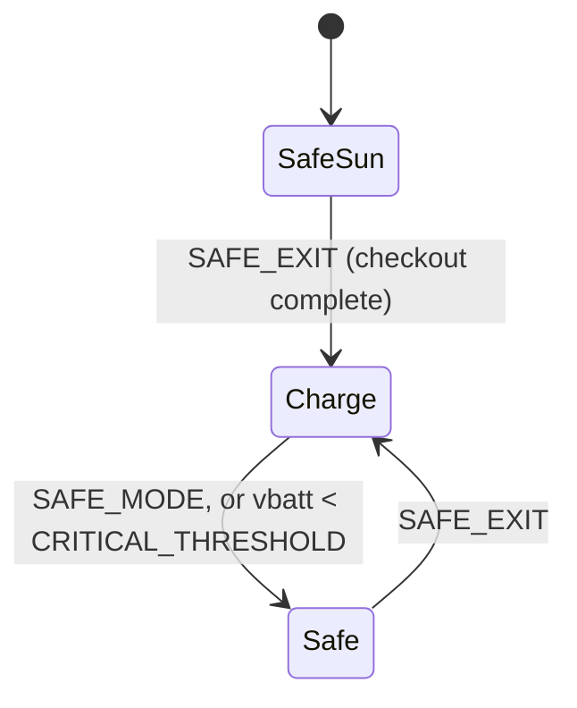
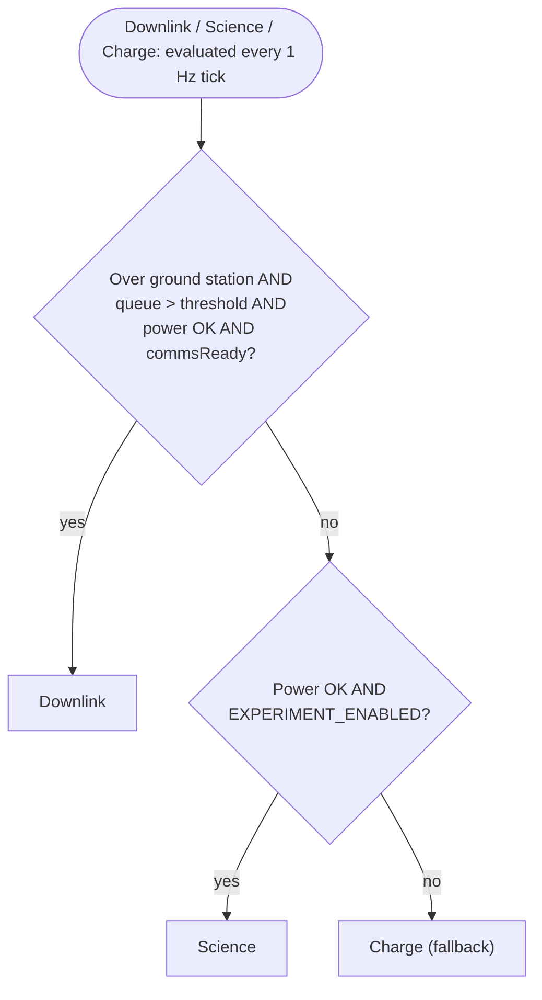

# HS2 Satellite Flight Software Design Document
**Date:** 2026-04-20
**Framework:** F' (F Prime), built on `nasa/fprime@devel`
**Platform:** 3U CubeSat, single flight computer

---

## 1. Mission Overview

HS2 is a 3U CubeSat scientific mission validating three optical navigation algorithms:
- **LOST** performs lost-in-space star identification and runs on Camera 1
- **FOUND** performs follow-up optical navigation and runs on Camera 2
- **SCOPE** performs star catalog optical processing, running LOST internally as a preprocessing stage, and is used for calibration experiments on Camera 1 + 2

All algorithms are included as external C++ libraries via CMake. Science results are always stored as F' data products. Raw images are stored to external flash when flagged by the science algorithms. The flight software is implemented in F' and organized into custom and pre-built subtopologies.

---

## 2. Hardware Inventory

| Hardware | Interface | Primary User |
|----------|-----------|--------------|
| Camera 1 | SPI/I2C | DataCollectionApplication (LOST, SCOPE) |
| Camera 2 | SPI/I2C | DataCollectionApplication (FOUND, SCOPE) |
| Star Tracker | UART | DataCollectionApplication (synchronized capture), AdcsApplication (precision pointing) |
| aGNSS Receiver | UART | DataCollectionApplication (synchronized capture), AdcsApplication (position/timing), SatStateMachine (orbital state) |
| IMU | SPI/I2C | AdcsApplication |
| Sun Sensors | I2C/GPIO | AdcsApplication, SatStateMachine (sun/eclipse detection) |
| Magnetorquers | PWM | AdcsApplication |
| EPS Board | I2C/UART | EPSApplication, MpptManager, CurrentSensorManager, SatStateMachine |
| EnduroSat S-band Radio | UART | ComApplication |
| External Flash | SPI | FileHandling subtopology |
| Temperature Sensors | I2C | ThermalApplication (via TemperatureSensorManager) |
| Heater | PWM | ThermalApplication (via HeaterManager) |

---

## 3. Operational Modes

The satellite operates in five flat top-level states managed by `SatStateMachine`: `SafeSun`, `Safe`, `Downlink`, `Science`, and `Charge`. There is no wrapping "Standby" state. Uplink commands are accepted in all modes via the always-active omni communications link.

| Mode | Description |
|------|-------------|
| **SafeSun** | Boot/first-deploy mode. Detumbles, then points at the sun, both via `AdcsApplication`. Entered on deploy/reboot and remains the only safe mode reachable until checkout completes. Omni comms always active. |
| **Safe** | Post-checkout emergency mode. Detumbles via `AdcsApplication`. Reached from `Downlink`/`Science`/`Charge` on a critical battery condition or ground command. Omni comms always active. |
| **Downlink / Science / Charge** | Full autonomous operations, entered after ground completes checkout. Evaluated each 1 Hz tick in priority order. |

### SafeSun and Safe

The satellite boots into `SafeSun` on deploy/reboot. `AdcsApplication` is commanded into `Detumble` on entry, then into `SunPointing` once `DETUMBLE_DURATION_TICKS` ticks have elapsed (approximating the mission's estimated detumble duration, ~110 minutes per CONOPS, TBR). `SafeSun` exits to `Charge` only on ground command `SAFE_EXIT`, and only once `CHECKOUT_COMPLETE` has been received at least once.

Once checkout has completed, `SafeSun` becomes unreachable (`checkoutComplete` is a one-way latch); any later critical battery condition (vbatt below `CRITICAL_THRESHOLD`, reported by `EPSApplication` via `powerState`) or ground command `SAFE_MODE` instead enters plain `Safe`, which commands `AdcsApplication` into `Detumble` for its entire duration and exits back to `Charge` unconditionally on `SAFE_EXIT`.

### Checkout

Checkout is a one-time ground-commanded commissioning sequence performed before the satellite enters autonomous Downlink/Science/Charge operations. Ground commands subsystem verification and sends `CHECKOUT_COMPLETE` to OK the transition. After checkout completes the satellite can reach `Downlink`/`Science`/`Charge` and no longer re-enters `SafeSun`.

### Downlink / Science / Charge Selection

Evaluated each 1 Hz tick by `SatStateMachine` in priority order. The highest-priority condition that is met determines the active state.

| Priority | State | Entry Condition |
|----------|---------|-----------------|
| 1 | **Downlink** | Over ground station AND downlink queue above `DOWNLINK_QUEUE_THRESHOLD` AND power OK AND `ComApplication` reports downlink readiness (`commsReadyIn`) |
| 2 | **Science** | Power OK AND `EXPERIMENT_ENABLED` parameter set AND not Downlink |
| 3 | **Charge** | Fallback - none of the above conditions met |

**Condition sources:**
- Power OK → `EPSApplication` (state of charge above `POWER_THRESHOLD` parameter)
- Over ground station → `GnssManager` (orbital position + ephemeris)
- In sun / in eclipse → sun sensors AND `GnssManager` orbital position calculation
- Downlink queue depth → `ComQueue` component
- Downlink readiness → `ComApplication` (`commsReadyIn`)
- `EXPERIMENT_ENABLED`, `POWER_THRESHOLD`, `DOWNLINK_QUEUE_THRESHOLD` → persisted via `PrmDb`

**Key parameters:**

| Parameter | Description |
|-----------|-------------|
| `POWER_THRESHOLD` | Minimum EPS state of charge (%) for Downlink or Science |
| `EXPERIMENT_ENABLED` | Ground-set boolean enabling the Science submode |
| `DOWNLINK_QUEUE_THRESHOLD` | Minimum queue depth (bytes) required to enter Downlink |

---

## 4. Architecture Overview

The flight software uses a **five-layer architecture**. Component names reflect their layer:

```
Layer 5, System Infrastructure
    CdhCore (CmdDispatcher, EventManager, Health, Version, AssertFatalAdapter, fatalHandler)
    HardwareResetManager [future]

Layer 4, Mission Orchestration
    SatStateMachine

Layer 3, Application components (*Application)
    DataCollectionApplication | ScienceInferenceApplication
    AdcsApplication | ComApplication | EPSApplication | ThermalApplication
    + pre-built subtopologies: ComCcsds | FileHandling | DataProducts

Layer 2, Hardware Managers (*Manager)
    Camera1Manager | Camera2Manager | StarTrackerManager | GnssManager
    ImmuManager | SunSensorManager | MagnetorquerManager
    MpptManager | CurrentSensorManager | WatchdogPinger | DeployPanelsManager
    TemperatureSensorManager | HeaterManager
    TmtcRadioManager

Layer 1, F' Native Bus Drivers (*Driver)
    LinuxI2cDriver | LinuxSpiDriver | LinuxUartDriver | LinuxGpioDriver
```

**System infrastructure** (Layer 5) provides the satellite-wide backbone: command routing (`CmdDispatcher`), event logging and FATAL escalation (`EventManager → fatalHandler`), component liveness monitoring (`Health`), and version reporting. All other layers depend on Layer 5 services. `HardwareResetManager` is reserved for future Layer 5 work alongside a general-purpose `FaultManager`.

**Mission orchestration** (Layer 4) is `SatStateMachine`, which evaluates submode conditions each 1 Hz tick and sends typed mode commands to all Layer 3 application components. It has no hardware knowledge and never talks to Layer 2 or below directly.

**Application components** (Layer 3) contain mission logic and dispatch work to hardware managers, never talking directly to drivers. Most receive mode-switch commands from `SatStateMachine` and use a hierarchical F' state machine (`Fw::Sm`) where mode is the top-level state and operational substates are nested inside. `EPSApplication` is the exception, having no mode port and no hierarchical SM, running continuously and responding only to rate group ticks and commands. See §9 for the standard pattern and §5.6 for the EPS exception.

**Hardware managers** (Layer 2) are Active or Queued components with a single flat F' state machine following the startup→operational→recovery pattern: `RESET → WAIT_RESET → ENABLE → CONFIGURE → RUN`. They have no satellite mode awareness. Reference implementation: `fprime-community/fprime-sensors` `ImuManager`.

**Drivers** (Layer 1) are passive bus drivers with no device knowledge.

`StarTrackerManager`, `GnssManager`, and `TmtcRadioManager` are instantiated at the **top-level topology** because they are shared across multiple subtopologies. All other hardware managers are instantiated inside their primary subtopology.

---

## 5. Subtopology Decomposition

### 5.1 CdhCore Subtopology (Layer 5)

`CdhCore` is the pre-built system infrastructure subtopology. It is the entry and exit point for all external communication and provides satellite-wide services consumed by every other layer.

| Component | Purpose |
|-----------|---------|
| `cmdDisp` (Svc.CmdDispatcher) | Routes uplink commands to all registered components |
| `events` (Svc.EventManager) | Collects and downlinks events; routes `FATAL`-severity events via `FatalAnnounce → fatalHandler` |
| `$health` (Svc.Health) | Ping-based liveness monitoring for all critical active components |
| `fatalHandler` (Svc.FatalHandler) | Resets the system on `FATAL` event; satellite reboots into Safe mode |
| `fatalAdapter` (Svc.AssertFatalAdapter) | Converts C++ assert failures to `FATAL` events |
| `version` (Svc.Version) | Reports software version |

### 5.2 Layer 3 Pre-Built Subtopologies

| Subtopology | Source | Purpose |
|-------------|--------|---------|
| `ComCcsds` | `Svc/Subtopologies/ComCcsds` | CCSDS communications stack; Space Packet and TM/TC frame framing, uplink/downlink pipeline |
| `FileHandling` | `Svc/Subtopologies/FileHandling` | FileUplink, FileDownlink, FileManager, PrmDb |
| `DataProducts` | `Svc/Subtopologies/DataProducts` | DpManager, DpWriter, DpCatalog for science results |

### 5.3 DataCollection Subtopology

**Purpose:** Executes data collection experiments by powering on cameras, acquiring synchronized images and navigation data, storing results to flash, and reporting outcome to `SatStateMachine`.

**Components:**

| Component | Type | Purpose |
|-----------|------|---------|
| `DataCollectionApplication` | Active (high priority) | Hierarchical SM; receives mode from `SatStateMachine`; orchestrates experiment execution |
| `Camera1Manager` | Active (worker) | State machine: RESET → WAIT_RESET → ENABLE → CONFIGURE → RUN / error→RESET |
| `Camera2Manager` | Active (worker) | State machine: RESET → WAIT_RESET → ENABLE → CONFIGURE → RUN / error→RESET |

**DataCollectionApplication modes (received via `Sat.DataColModePort`):**

| Mode | Behavior |
|------|----------|
| `Off` | Inactive. Cameras powered off. |
| `HealthCheck` | Powers on cameras, verifies operation, powers off. One-time checkout step. |
| `RunExperiment` | Full experiment: power on → capture → store → power off → report result |

**DataCollectionApplication hierarchical SM:**

```
OFF
HEALTH_CHECK
  └─ CHECKING
RUN_EXPERIMENT
  ├─ POWERING_ON
  ├─ CAPTURING      (simultaneous: Camera1, Camera2, StarTracker attitude, GNSS position)
  ├─ STORING
  └─ POWERING_OFF
```

Top-level `switchMode` signal inherited by all leaf states, so mode switches are valid from any substate.

**Synchronized capture requirement:** Within `CAPTURING`, `DataCollectionApplication` simultaneously requests images from Camera1Manager and Camera2Manager, attitude from `StarTrackerManager`, and position from `GnssManager`. All four must be acquired within a 10ms window before dispatching to `ScienceInferenceApplication`.

**Ports consumed from outside subtopology:**
- `StarTrackerManager` attitude port (top-level)
- `GnssManager` position/time port (top-level)
- `DpManager` / `DpWriter` (DataProducts subtopology)
- `FileDownlink` (FileHandling subtopology)
- `modeIn: Sat.DataColModePort` (from `SatStateMachine`)

**Health monitoring:** `DataCollectionApplication` is health-monitored. Camera managers excluded.

### 5.4 ScienceInference Subtopology

**Purpose:** Processes raw images stored on flash by running LOST, FOUND, or SCOPE. Operates on a scheduled polling cycle. Schedule-driven; receives no ground commands.

**Components:**

| Component | Type | Purpose |
|-----------|------|---------|
| `ScienceInferenceApplication` | Active | Hierarchical SM; receives mode from `SatStateMachine`; polls flash, invokes algorithms, stores results |

**ScienceInferenceApplication modes (received via `Sat.ScienceInferenceModePort`):**

| Mode | Behavior |
|------|----------|
| `Off` | Inactive. No flash polling. |
| `ProcessImages` | Polls flash for unprocessed images; invokes LOST, FOUND, or SCOPE per experiment metadata; stores results; compresses flagged images |

**External libraries invoked directly from `ScienceInferenceApplication` C++ implementation:**

| Library | Algorithm | Camera | Experiment Type |
|---------|-----------|--------|----------------|
| LOST | Lost-in-space star identification | Camera 1 | L&F |
| FOUND | Follow-up optical navigation | Camera 2 | L&F |
| SCOPE | Star catalog optical processing (runs LOST internally) | Camera 1 + 2 | Calibration |

**Health monitoring:** `ScienceInferenceApplication` is health-monitored.

### 5.5 ADCS Subtopology

**Purpose:** Attitude determination and control across all ADCS operating modes.

**Components:**

| Component | Type | Purpose |
|-----------|------|---------|
| `AdcsApplication` | Active (high priority) | Hierarchical SM; receives mode from `SatStateMachine`; runs attitude control loop |
| `ImmuManager` | Queued (worker) | State machine: RESET → WAIT_RESET → ENABLE → CONFIGURE → RUN / error→RESET |
| `SunSensorManager` | Queued (worker) | State machine: RESET → WAIT_RESET → ENABLE → CONFIGURE → RUN / error→RESET |
| `MagnetorquerManager` | Queued (worker) | State machine: RESET → WAIT_RESET → CONFIGURE → RUN / error→RESET; drives six `LinuxPwmDriver` channels (two per axis) |

**AdcsApplication modes (received via `Sat.AdcsModePort`):**

| Mode | Sensors | Actuators | Use |
|------|---------|-----------|-----|
| `Off` | None | None | Inactive |
| `Detumble` | IMU, Magnetorquers | Magnetorquers | Safe mode (B-dot algorithm) |
| `SunPointing` | IMU, Sun Sensors | Magnetorquers | Charge (point panels at sun); also commanded during SafeSun once detumble completes |
| `AntennaPointing` | IMU, GNSS | Magnetorquers | Downlink (point antenna at ground station) |
| `EarthLimbPointing` | IMU, Star Tracker | Magnetorquers | Science (point FOUND camera at lit Earth limb, optimize solar) |
| `AttitudeHold` | IMU | Magnetorquers | Reserved for holding current attitude. Not currently commanded by `SatStateMachine`'s translation table, and retained for a future state or ground-commanded use. |

**AdcsApplication hierarchical SM:**

```
OFF
DETUMBLE
  └─ RUNNING
SUN_POINTING
  ├─ ACQUIRING
  └─ TRACKING
ANTENNA_POINTING
  ├─ ACQUIRING
  └─ TRACKING
EARTH_LIMB_POINTING
  ├─ ACQUIRING
  └─ TRACKING
ATTITUDE_HOLD
  └─ HOLDING
```

Top-level `switchMode: Adcs.Mode` signal inherited by all leaf states.

**Ports consumed from outside subtopology:**
- `StarTrackerManager` attitude port (top-level, precision pointing)
- `GnssManager` position/time port (top-level, timing reference + antenna pointing)
- `modeIn: Sat.AdcsModePort` (from `SatStateMachine`)

**Health monitoring:** `AdcsApplication` is health-monitored. Hardware managers excluded.

### 5.6 Comms Subtopology

**Purpose:** Manages the EnduroSat S-band radio for omni telemetry (always active) and high-gain downlink (Downlink mode only).

**Components:**

| Component | Type | Purpose |
|-----------|------|---------|
| `CommsApplication` | Active | Hierarchical SM; receives mode from `SatStateMachine`; manages radio operating mode |
| `TmtcRadioManager` | Active (worker) | State machine: RESET → WAIT_RESET → ENABLE → CONFIGURE → RUN / error→RESET. Bridges ComCcsds to the S-band radio. |

**ComApplication modes (received via `Sat.CommsModePort`):**

| Mode | Behavior |
|------|----------|
| `Beacon` | Low-rate SOH telemetry only, transmitted at 1Hz. Minimum power draw; used when detumbling or outside a communication window. |
| `StandardDownlink` | Full-rate real-time telemetry, including payload experiment data. Requires `AntennaPointing` from `AdcsApplication`. |
| `StoredPlayback` | Downlinks stored telemetry and data products (priority) alongside real-time SOH telemetry at 1Hz. Ground-commanded only; requires `AntennaPointing` from `AdcsApplication`. |
| `NoDownlink` | Ceases all transmission. Ground-commanded only. |

**Health monitoring:** `CommsApplication` is health-monitored. `TmtcRadioManager` excluded.

### 5.7 EPS Subtopology

**Purpose:** Monitors battery and power-system health (battery/IC state from `MpptManager`, per-rail voltage and current from `CurrentSensorManager`), accepts panel deployment commands from ground, and publishes power state to `SatStateMachine` for submode decisions. BQ25756 register access is commanded directly on `MpptManager`. Runs continuously independent of satellite mode.

**Components:**

| Component | Type | Purpose |
|-----------|------|---------|
| `EPSApplication` | Active | Health monitor / state cache; reads battery state from `MpptManager` and rail state from `CurrentSensorManager`; exposes `powerStateGet` synchronous get port read by `SatStateMachine`; forwards deploy command to `DeployPanelsManager`. No mode interface. |
| `MpptManager` | Queued (worker) | Sole owner of BQ25756 IC over I2C; flat four-state SM: RESET → WAIT_RESET → CONFIGURE → RUN (ADC enabled in CONFIGURE); reads measurements/status/flags and publishes their telemetry each tick; receives the six `MPPT_*` register-access commands directly from ground |
| `CurrentSensorManager` | Queued (worker) | Sole owner of INA3221 triple-rail current/voltage monitor on the PDS board over I2C; flat four-state hardware-manager SM: RESET → WAIT_RESET → CONFIGURE → RUN; publishes per-rail voltage/current to `EPSApplication` and as telemetry each tick; receives the three `CURRENT_SENSOR_*` register-access commands directly from ground |
| `WatchdogPinger` | Passive | Toggles hardware watchdog GPIO pin on each rate group tick |
| `DeployPanelsManager` | Active | Two-state SM: NOT_DEPLOYED → DEPLOYED; executes burn wire sequence in both states; emits WARNING_HI on re-attempt in DEPLOYED state |

`SatStateMachine` retrieves the latest power state from `EPSApplication` each 1 Hz tick by invoking the `powerStateGet` synchronous get port; the returned struct drives submode activation decisions.

**Health monitoring:** `EPSApplication` is health-monitored. Hardware managers excluded.

### 5.8 Thermal Subtopology

| Component | Type | Purpose |
|-----------|------|---------|
| `ThermalApplication` | Active | Hierarchical SM (NoHeating / ActiveHeating); receives mode from `SatStateMachine`; reads all temperature sensor data each tick; runs PID control loop in ActiveHeating; commands duty cycle to `HeaterManager` |
| `TemperatureSensorManager` | Queued (worker) | State machine: RESET → WAIT_RESET → ENABLE → CONFIGURE → RUN / error→RESET; owns all temperature sensors via `LinuxI2cDriver` |
| `HeaterManager` | Queued (worker) | State machine: RESET → CONFIGURE → RUN / error→RESET; owns the PWM heater channel via `LinuxPwmDriver` |

---

### 5.9 Top-Level Topology Diagram

**Subtopology shape - sensing & science:**



**Subtopology shape - power & comms:**



**Subtopology shape - infrastructure:**



**Mode-command fan-out:**



---

## 6. Top-Level Standalone Components

`SatStateMachine` (Layer 4) is described in §8. The components below are instantiated at the top-level topology because they are shared across multiple subtopologies or provide satellite-wide scheduling and bus infrastructure.

| Component | Layer | Type | Purpose |
|-----------|-------|------|---------|
| `StarTrackerManager` | 2 | Active (worker) | Shared by DataCollectionApplication and AdcsApplication |
| `GnssManager` | 2 | Active (worker) | Shared by DataCollectionApplication, AdcsApplication, and SatStateMachine |
| `RateGroupDriver` | - | Passive | Divides hardware timer interrupt into multiple rate signals |
| `RateGroup1` | - | Active | 10 Hz scheduling |
| `RateGroup2` | - | Active | 1 Hz scheduling |
| `RateGroup3` | - | Active | 0.1 Hz scheduling |
| `LinuxI2cDriver` (×N) | 1 | Passive | One instance per I2C bus |
| `LinuxSpiDriver` (×N) | 1 | Passive | One instance per SPI bus |
| `LinuxUartDriver` (×N) | 1 | Passive | One instance per UART (star tracker, GNSS, radio) |
| `LinuxGpioDriver` (×N) | 1 | Passive | One instance per GPIO group (watchdog, deploy panels) |

---

## 7. Rate Group Scheduling

| Rate Group | Frequency | Scheduled Components |
|------------|-----------|---------------------|
| `RateGroup1` | 10 Hz | `AdcsApplication`, `ImmuManager`, `SunSensorManager`, `MagnetorquerManager`, `WatchdogPinger` |
| `RateGroup2` | 1 Hz | `SatStateMachine`, `EPSApplication`, `MpptManager`, `CurrentSensorManager`, `ThermalApplication`, `TemperatureSensorManager`, `HeaterManager`, `DataCollectionApplication` (availability check), `GnssManager`, `Health` |
| `RateGroup3` | 0.1 Hz | `StarTrackerManager`, `ScienceInferenceApplication`, `SystemResources`, `FileDownlink` |

---

## 8. SatStateMachine Design

`SatStateMachine` is an Active component. It evaluates all submode conditions each 1 Hz tick and sends the resulting mode to every application component via dedicated typed ports.

### Mode Output Ports

One typed output port per application component. Each port carries that application's own mode enum. `SatStateMachine` owns the translation table.

```fpp
module Sat {
    port AdcsModePort(mode: Adcs.Mode)
    port DataColModePort(mode: DataCollection.Mode)
    port ScienceInferenceModePort(mode: ScienceInference.Mode)
    port CommsModePort(mode: Comms.Mode)
    port ThermalModePort(mode: Thermal.Mode)
}
```

Application components have no knowledge of `Sat::Mode`. They only receive and act on their own mode enum.

### Condition Inputs

| Port | Direction | Source | Data |
|------|-----------|--------|------|
| `powerStateGet` | Output (sync get into `EPSApplication`) | `EPSApplication` | State of charge + above/below threshold (returned struct) |
| `sunEclipseIn` | Input | Sun sensors + `GnssManager` | In sun / in eclipse |
| `orbitStateIn` | Input | `GnssManager` | Over ground station flag |
| `downlinkQueueDepthIn` | Input | `ComQueue` | Current queue depth (bytes) |
| `commsReadyIn` | Input | `ComApplication` | Downlink readiness/permission flag; gates `Downlink` mode entry |

### Translation Table

`SafeSun`, `Safe`, `Downlink`, `Science`, and `Charge` are flat top-level sibling states; there is no `Standby` wrapper. `SafeSun` is the boot/first-deploy state, reached only before `CHECKOUT_COMPLETE` has ever been received; `Safe` is the plain post-checkout safe state. `SafeSun` commands `AdcsApplication` through two phases over its own lifetime, `Detumble` on entry and `SunPointing` once `DETUMBLE_DURATION_TICKS` have elapsed, using only `AdcsApplication`'s existing modes.

| Satellite State | `AdcsApplication` | `DataCollectionApplication` | `ScienceInferenceApplication` | `ComApplication` | `ThermalApplication` |
|----------------|-------------------|----------------------------|-------------------------------|-------------------|----------------------|
| SafeSun | Detumble, then SunPointing after `DETUMBLE_DURATION_TICKS` | Off | Off | Beacon | NoHeating |
| Safe | Detumble | Off | Off | Beacon | NoHeating |
| Downlink | AntennaPointing | Off | Off | StandardDownlink | ActiveHeating |
| Science | EarthLimbPointing | RunExperiment | ProcessImages | Beacon | ActiveHeating |
| Charge | SunPointing | Off | Off | Beacon | ActiveHeating |

### Mode Transitions

| From | To | Trigger |
|------|----|---------|
| SafeSun | Charge | Ground command `SAFE_EXIT` (only after checkout completed) |
| Safe | Charge | Ground command `SAFE_EXIT` (always succeeds; checkout is guaranteed complete to reach `Safe` at all) |
| Downlink / Science / Charge | Safe | Ground command `SAFE_MODE`; vbatt below `CRITICAL_THRESHOLD` in `powerState` from `EPSApplication` evaluated by `SatStateMachine` each 1 Hz tick. `EPSApplication` does not emit `FATAL`; the transition is a normal `SatStateMachine` mode change, not a `fatalHandler` reboot. Any `FATAL` from elsewhere (e.g. `AssertFatalAdapter`, health timeout) still routes through `EventManager.FatalAnnounce → fatalHandler` and reboots into `SafeSun`/`Safe` depending on checkout status. |
| Downlink / Science / Charge | Downlink / Science / Charge | Condition evaluation each 1 Hz tick, in priority order (Downlink, then Science, then Charge fallback) |

**Events emitted:** mode entry/exit events for every transition.

**Health checked:** Yes.

### Mode Diagram



`Downlink` and `Science` behave identically to `Charge` here: each independently returns to `Safe` on `SAFE_MODE` or a critical battery condition, evaluated on its own 1 Hz tick. Only `Charge` is drawn, to avoid three edges with identical labels overlapping.

**Downlink / Science / Charge selection, evaluated every 1 Hz tick:**



See `docs/Core/SatStateMachine.md` §4-5 for the full per-state entry/exit/tick logic, including the `SafeSun` detumble-then-sun-point timing.

---

## 9. Application Component State Machine Pattern

All application components use **hierarchical F' state machines** (`Fw::Sm`) where:

- **Mode is the top-level state**, meaning each mode is a parent state in the SM
- **Operational substates are nested inside** each mode
- **A single `switchMode` signal** is defined once at the top level and inherited by all leaf states (see FPP inherited transitions in `nasa/fpp` [`Defining-State-Machines.adoc#inherited-transitions`](https://github.com/nasa/fpp/blob/main/docs/users-guide/Defining-State-Machines.adoc#inherited-transitions))
- **Entry/exit actions** follow the FPP Least Common Ancestor rule automatically, so mode switches correctly unwind and re-enter
- **Each mode re-entry always starts from its `initial` substate**, with no history retained

Each parent state requires one `initial` specifier per FPP rules ([`#substates`](https://github.com/nasa/fpp/blob/main/docs/users-guide/Defining-State-Machines.adoc#substates)).

**Idempotency:** Application components ignore mode-switch calls for the mode already active.

**Exception:** `EPSApplication` does not follow this pattern. It has no mode port and no hierarchical SM. It operates continuously as a command-driven Active component with no satellite-mode-driven state transitions. See §5.6.

---

## 10. Hardware Manager State Machine Pattern

All hardware managers use a single flat F' state machine following the `fprime-community/fprime-sensors` `ImuManager` pattern:

```
RESET → WAIT_RESET → ENABLE → CONFIGURE → RUN
  ↑_____________ error from any state ___________|
```

**Error recovery:** any of `WAIT_RESET`, `ENABLE`, `CONFIGURE`, or `RUN` return directly to `RESET` on error.

This is the canonical pattern; per-manager pages show their specific deviations (omitted states, added `OFF` state, etc.) rather than repeating this diagram.

- Driven by rate group tick (`schedIn`)
- Each state action calls a helper function returning bus status (`Drv::I2cStatus` or equivalent)
- On error: log `WARNING_HI` (throttled), send `error` signal → back to RESET (self-healing)
- Configuration via F' parameters, where `parameterUpdated()` sends `reconfigure` signal → RUN → CONFIGURE
- No satellite mode awareness

Reference: [`fprime-community/fprime-sensors/ImuManager`](https://github.com/fprime-community/fprime-sensors/tree/devel/fprime-sensors/MpuImu/Components/ImuManager)

---

## 11. Key Cross-Subtopology Wiring

| Source | Destination | Data |
|--------|-------------|------|
| `StarTrackerManager` | `DataCollectionApplication` | Attitude reading (synchronized capture) |
| `StarTrackerManager` | `AdcsApplication` | Attitude reading (precision pointing) |
| `GnssManager` | `DataCollectionApplication` | Position + time (synchronized capture) |
| `GnssManager` | `AdcsApplication` | Position + timing reference |
| `GnssManager` | `SatStateMachine` | Orbital state (over ground station, sun/eclipse) |
| `GnssManager` | Time services | PPS timing signal |
| `EPSApplication.powerStateGet` (sync get) | `SatStateMachine` | Battery state of charge (pulled by `SatStateMachine` each 1 Hz tick) |
| `SatStateMachine.adcsModeOut` | `AdcsApplication` | Mode command (`Adcs.Mode`) |
| `SatStateMachine.dataColModeOut` | `DataCollectionApplication` | Mode command (`DataCollection.Mode`) |
| `SatStateMachine.scienceInferenceModeOut` | `ScienceInferenceApplication` | Mode command (`ScienceInference.Mode`) |
| `SatStateMachine.commsModeOut` | `ComApplication` | Mode command (`Comms.Mode`) |
| `SatStateMachine.thermalModeOut` | `ThermalApplication` | Mode command (`Thermal.Mode`) |
| `ComApplication.commsReadyOut` | `SatStateMachine.commsReadyIn` | Downlink readiness/permission flag |
| `TmtcRadioManager` | `ComCcsds` | Uplink/downlink byte stream |
| `DataCollection` | `DataProducts` | Science result data products |
| `DataCollection` | `FileHandling` | Flagged image files |

---

## 12. Health Monitoring Summary

| Component | Subtopology |
|-----------|-------------|
| `SatStateMachine` | Top-level |
| `DataCollectionApplication` | DataCollection |
| `ScienceInferenceApplication` | ScienceInference |
| `AdcsApplication` | ADCS |
| `ComApplication` | Comms |
| `EPSApplication` | EPS |
| `ThermalApplication` | Thermal |
| `cmdDisp` | CdhCore |
| `events` | CdhCore |

All hardware managers and workers excluded from health monitoring.

---

## 13. Design Pattern References

| Pattern | Applied To | F' Documentation |
|---------|-----------|-----------------|
| App-Manager-Driver | All subsystems | `docs/user-manual/design-patterns/app-man-drv.md` |
| Hierarchical State Machine | All application components | [`nasa/fpp Defining-State-Machines.adoc#substates`](https://github.com/nasa/fpp/blob/main/docs/users-guide/Defining-State-Machines.adoc#substates) |
| Hardware Manager SM (flat) | All hardware managers | [`fprime-sensors/ImuManager`](https://github.com/fprime-community/fprime-sensors/tree/devel/fprime-sensors/MpuImu/Components/ImuManager) |
| Subtopologies | DataCollection, ScienceInference, ADCS, Comms, EPS (Layer 3) + CdhCore (Layer 5) + 3 pre-built Layer 3 | `docs/user-manual/design-patterns/subtopologies.md` |
| Rate Groups | RateGroup1/2/3 | `docs/user-manual/design-patterns/rate-group.md` |
| Health Checking | All application-level components | `docs/user-manual/design-patterns/health-checking.md` |
| Callback Ports | Synchronized capture in DataCollectionApplication | `docs/user-manual/design-patterns/common-port-patterns.md` |
| Data Products | Science algorithm results | `docs/user-manual/framework/data-products.md` |

---

## 14. External Library Integration

| Library | Algorithm | Camera | Experiment Type | Integration |
|---------|-----------|--------|----------------|-------------|
| LOST | Optical navigation | Camera 1 | L&F | CMake; called from `ScienceInferenceApplication` |
| FOUND | Optical navigation | Camera 2 | L&F | CMake; called from `ScienceInferenceApplication` |
| SCOPE | Star catalog processing (runs LOST internally) | Camera 1 + 2 | Calibration | CMake; called from `ScienceInferenceApplication` |

All libraries are C++ and included as CMake dependencies. `ScienceInferenceApplication` selects the algorithm based on experiment type metadata stored with each image.
